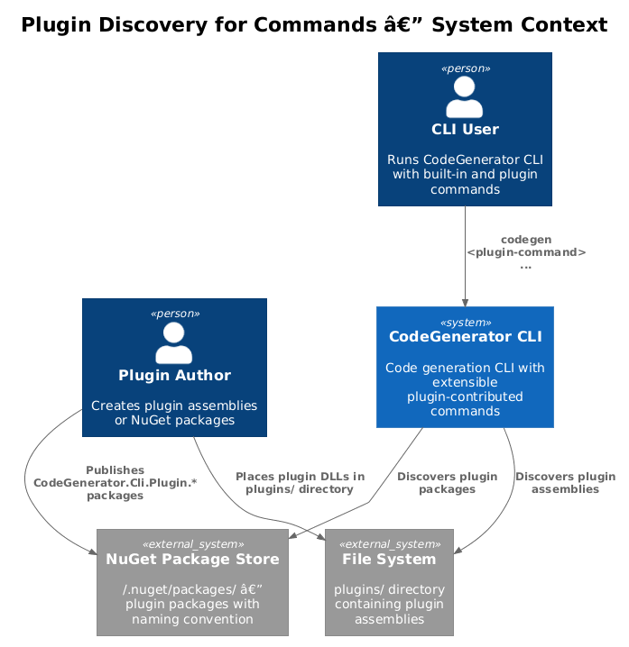
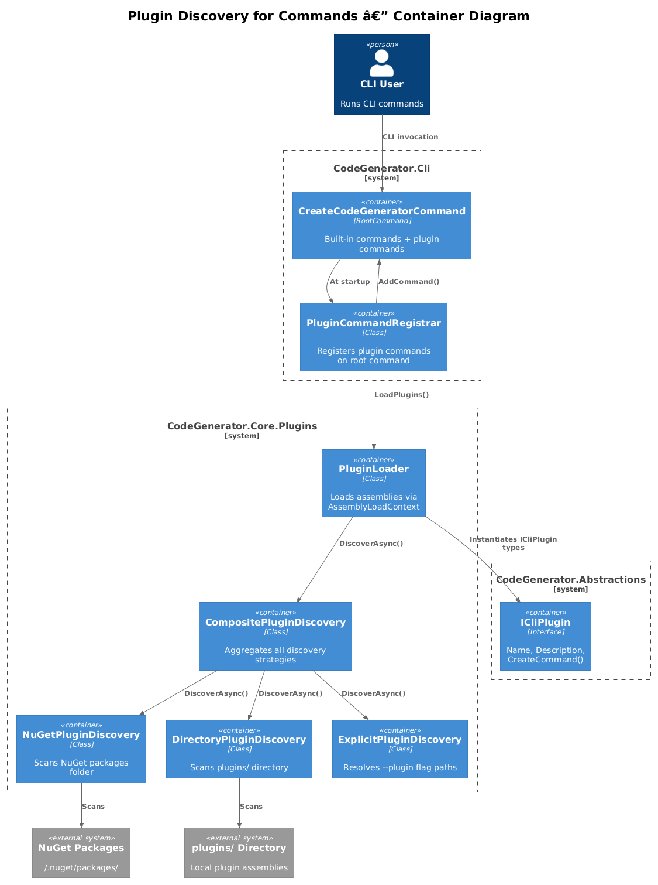
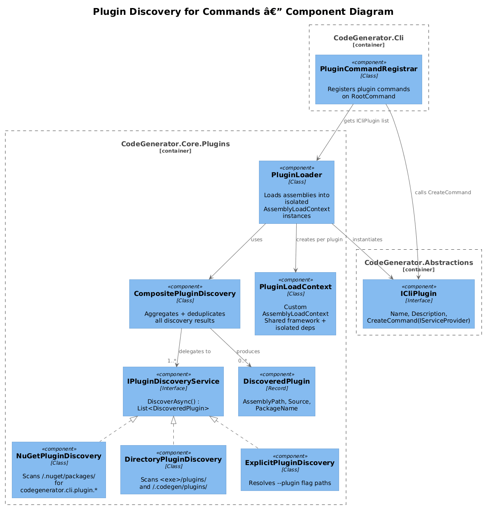
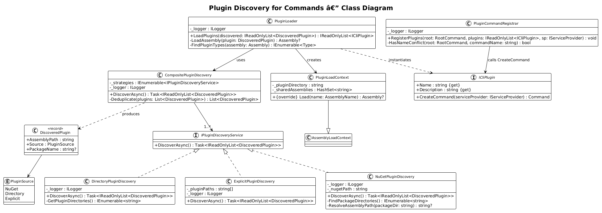
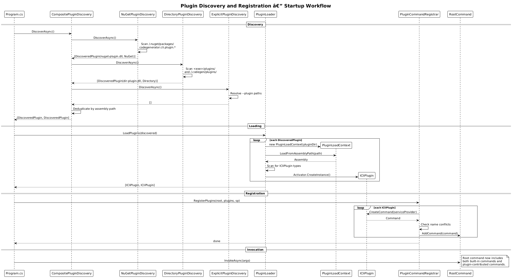
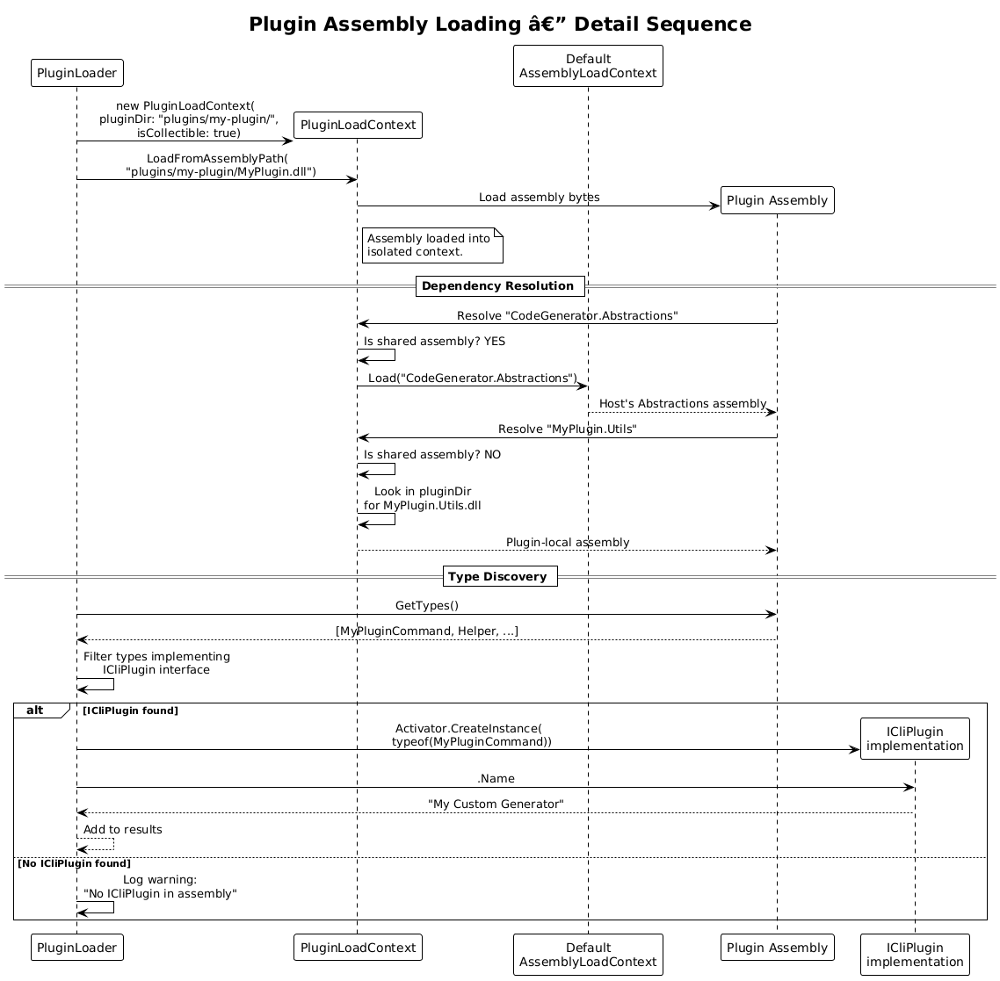
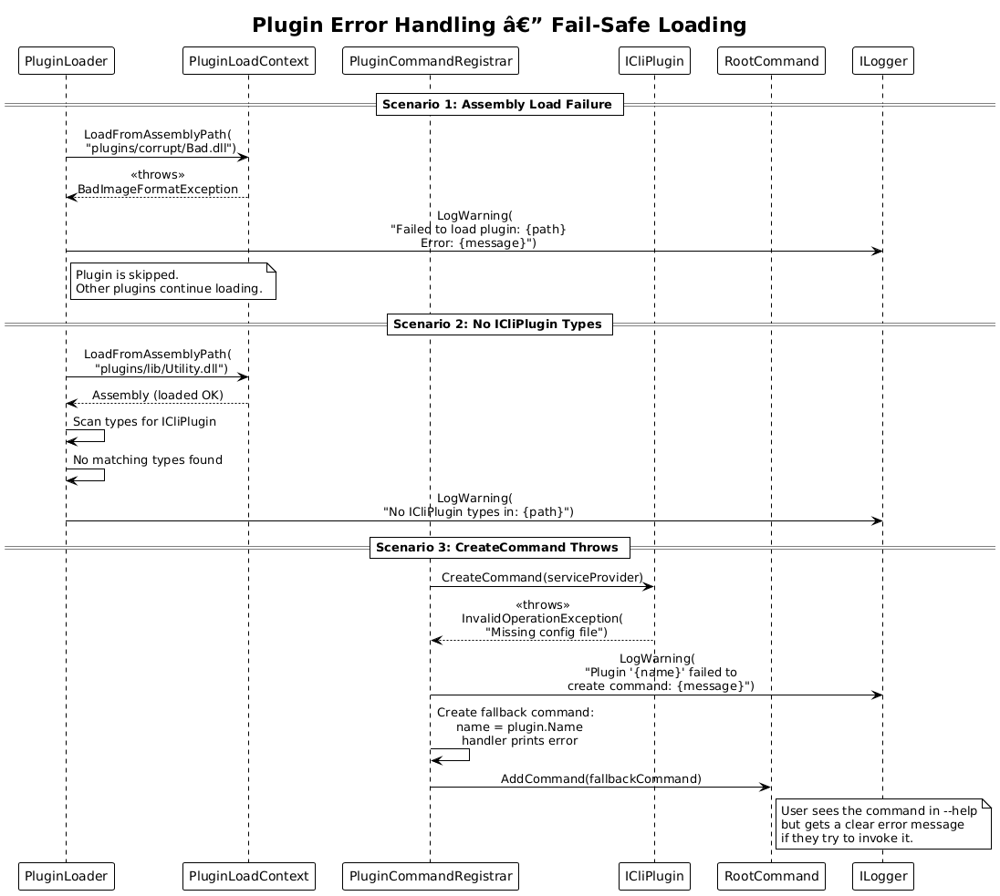

# Plugin Discovery for Commands — Detailed Design

**Feature:** 50-plugin-discovery (Vision 1.13)
**Status:** Implemented
**Requirements:** codegenerator-cli-vision.md section 1.13 — "Plugin Discovery for Commands"

---

## 1. Overview

The CodeGenerator CLI currently has a fixed set of commands compiled into the main assembly (`CreateCodeGeneratorCommand`, `InstallCommand`, `ScaffoldCommand`). Third-party developers or teams cannot extend the CLI with custom commands without forking the repository and modifying the source code.

### Problem

- All commands are hardcoded in the CLI assembly. Adding a new command requires modifying `CreateCodeGeneratorCommand` or `AppRootCommand` source code.
- The existing `IArtifactGenerationStrategy<T>` plugin pattern supports extensible generation strategies but not extensible CLI commands.
- Teams with domain-specific code generation needs (e.g., a custom microservice template, a company-specific project structure) have no way to distribute their commands as reusable packages.

### Goal

Enable external assemblies to contribute CLI commands via a plugin interface:

1. Define an `ICliPlugin` interface that plugins implement to register commands.
2. Support three discovery mechanisms: NuGet packages with naming convention, assemblies in a `plugins/` directory, and explicit `--plugin` flag paths.
3. Load discovered plugins safely using `AssemblyLoadContext` for isolation.
4. Register plugin commands as sub-commands on the root command.

### Actors

| Actor | Description |
|-------|-------------|
| **Plugin Author** | Creates a NuGet package or assembly implementing `ICliPlugin` to add custom commands |
| **CLI User** | Runs the CLI and sees plugin-contributed commands alongside built-in commands |
| **CLI Maintainer** | Manages the plugin discovery infrastructure and security boundaries |

### Scope

This design covers the `ICliPlugin` contract, the discovery service hierarchy, the assembly loading mechanism, and the integration with the `System.CommandLine` root command. It does not cover plugin versioning/compatibility negotiation, plugin configuration files, or a plugin marketplace/registry.

### Design Principles

- **Convention over configuration.** NuGet plugins are discovered by naming convention (`CodeGenerator.Cli.Plugin.*`), requiring zero configuration for the common case.
- **Isolation.** Each plugin is loaded in its own `AssemblyLoadContext` to prevent dependency conflicts between plugins and the host.
- **Fail-safe.** A broken plugin does not crash the CLI. Plugin loading errors are logged and the plugin is skipped.
- **Composable.** Multiple discovery strategies are aggregated by `CompositePluginDiscovery`, making it easy to add new discovery mechanisms.

---

## 2. Architecture

### 2.1 C4 Context Diagram

Shows how plugin discovery fits into the system landscape. External assemblies contribute commands to the CLI at startup.



### 2.2 C4 Container Diagram

The logical containers involved in plugin discovery, loading, and command registration.



### 2.3 C4 Component Diagram

Internal components: discovery strategies, the plugin loader, and the command registration integration point.



---

## 3. Component Details

### 3.1 ICliPlugin

- **Responsibility:** Contract that plugins implement to contribute commands to the CLI.
- **Namespace:** `CodeGenerator.Abstractions.Plugins`
- **Location:** Defined in `CodeGenerator.Abstractions` so plugins only depend on the abstractions package, not the full CLI.
- **Key members:**
  - `string Name { get; }` — unique human-readable plugin name (e.g., "MyCompany.Microservices")
  - `string Description { get; }` — brief description shown in help text
  - `Command CreateCommand(IServiceProvider serviceProvider)` — factory method that creates and returns a `System.CommandLine.Command` instance
- **Lifetime:** Instantiated once during plugin loading. `CreateCommand` is called once during CLI startup.
- **Contract rules:**
  - `Name` must be non-null, non-empty, and unique across all loaded plugins.
  - `CreateCommand` must not throw. If the plugin cannot initialize, it should return a command that prints an error when invoked.
  - The returned `Command` owns its own options, arguments, and handler. It participates in the standard `System.CommandLine` help and parsing.

### 3.2 IPluginDiscoveryService

- **Responsibility:** Discover plugin assemblies from a specific source.
- **Namespace:** `CodeGenerator.Core.Plugins`
- **Key members:**
  - `Task<IReadOnlyList<DiscoveredPlugin>> DiscoverAsync()` — scan the source and return discovered plugin metadata
- **Implementations:** Three concrete strategies (sections 3.3-3.5) plus one composite (section 3.6).

### 3.3 NuGetPluginDiscovery

- **Responsibility:** Discover plugins from installed NuGet packages matching the naming convention.
- **Namespace:** `CodeGenerator.Core.Plugins`
- **Discovery logic:**
  1. Scan the NuGet global packages folder (`~/.nuget/packages/` or `NUGET_PACKAGES` environment variable).
  2. Find directories matching `codegenerator.cli.plugin.*` (case-insensitive).
  3. For each match, locate the highest version directory, then find the `lib/<tfm>/` assembly.
  4. Return a `DiscoveredPlugin` with the assembly path and source type `NuGet`.
- **Fallback:** Also checks the local `.nupkg` cache in the solution's `packages/` directory if present.
- **Configuration:** The NuGet packages folder path can be overridden via `CODEGEN_NUGET_PATH` environment variable.

### 3.4 DirectoryPluginDiscovery

- **Responsibility:** Discover plugins from assemblies in a conventional `plugins/` directory.
- **Namespace:** `CodeGenerator.Core.Plugins`
- **Discovery logic:**
  1. Look for a `plugins/` directory relative to the CLI executable path (`AppContext.BaseDirectory`).
  2. Also check `~/.codegen/plugins/` for user-level plugins.
  3. Scan for `*.dll` files in each plugins directory.
  4. Return a `DiscoveredPlugin` for each DLL with source type `Directory`.
- **Subdirectory convention:** Each plugin should be in its own subdirectory (`plugins/my-plugin/MyPlugin.dll`) to keep dependencies isolated.

### 3.5 ExplicitPluginDiscovery

- **Responsibility:** Load a plugin from an explicit path provided via the `--plugin` flag.
- **Namespace:** `CodeGenerator.Core.Plugins`
- **Discovery logic:**
  1. Receive the path from the `--plugin` option value.
  2. Validate the path exists and ends with `.dll`.
  3. Return a `DiscoveredPlugin` with source type `Explicit`.
- **Multiple plugins:** The `--plugin` flag can be specified multiple times to load multiple explicit plugins.

### 3.6 CompositePluginDiscovery

- **Responsibility:** Aggregate results from all discovery strategies into a single unified list.
- **Namespace:** `CodeGenerator.Core.Plugins`
- **Behavior:**
  1. Call `DiscoverAsync()` on each registered `IPluginDiscoveryService`.
  2. Concatenate results, deduplicating by assembly path.
  3. Log the total number of discovered plugins and their sources.
- **Ordering:** Explicit plugins take precedence over directory plugins, which take precedence over NuGet plugins (in case of name conflicts).

### 3.7 DiscoveredPlugin

- **Responsibility:** Metadata about a discovered plugin before it is loaded.
- **Type:** `record`
- **Members:**
  - `string AssemblyPath` — full path to the plugin assembly
  - `PluginSource Source` — enum: `NuGet`, `Directory`, `Explicit`
  - `string? PackageName` — NuGet package name if source is NuGet

### 3.8 PluginLoader

- **Responsibility:** Load discovered plugin assemblies into isolated `AssemblyLoadContext` instances and instantiate `ICliPlugin` implementations.
- **Namespace:** `CodeGenerator.Core.Plugins`
- **Key members:**
  - `IReadOnlyList<ICliPlugin> LoadPlugins(IReadOnlyList<DiscoveredPlugin> discovered)` — load assemblies and find `ICliPlugin` implementations
- **Assembly loading:**
  1. For each `DiscoveredPlugin`, create a new `PluginLoadContext` (extends `AssemblyLoadContext`) with `isCollectible: true`.
  2. Load the assembly via `loadContext.LoadFromAssemblyPath(path)`.
  3. Scan the loaded assembly for types implementing `ICliPlugin`.
  4. Instantiate each `ICliPlugin` via `Activator.CreateInstance`.
- **Error handling:**
  - If assembly loading fails (`FileLoadException`, `BadImageFormatException`), log a warning and skip the plugin.
  - If `ICliPlugin` instantiation fails, log a warning and skip.
  - If `CreateCommand` throws, wrap the exception in a fallback command that displays the error.

### 3.9 PluginLoadContext

- **Responsibility:** Isolated `AssemblyLoadContext` for a single plugin, preventing dependency conflicts.
- **Namespace:** `CodeGenerator.Core.Plugins`
- **Behavior:**
  - Overrides `Load(AssemblyName)` to first check the plugin's directory for dependencies, then fall back to the default context.
  - Shared framework assemblies (`System.*`, `Microsoft.Extensions.*`, `CodeGenerator.Abstractions`) are resolved from the host context to ensure interface compatibility.
  - Plugin-specific dependencies are isolated within the plugin's load context.

### 3.10 PluginCommandRegistrar

- **Responsibility:** Register loaded plugin commands as sub-commands on the root command.
- **Namespace:** `CodeGenerator.Cli.Plugins`
- **Key members:**
  - `void RegisterPlugins(RootCommand root, IReadOnlyList<ICliPlugin> plugins, IServiceProvider serviceProvider)` — call `CreateCommand` on each plugin and add to root
- **Behavior:**
  1. For each `ICliPlugin`, call `CreateCommand(serviceProvider)`.
  2. Validate the returned `Command` has a non-empty name that does not conflict with built-in commands.
  3. Call `root.AddCommand(command)`.
  4. If a name conflict occurs, log a warning and skip the plugin (built-in commands always win).

---

## 4. Data Model

### 4.1 Class Diagram



### 4.2 Entity Descriptions

| Entity | Description |
|--------|-------------|
| `ICliPlugin` | Interface that plugins implement to contribute a command to the CLI |
| `IPluginDiscoveryService` | Interface for discovering plugin assemblies from a specific source |
| `NuGetPluginDiscovery` | Discovers plugins from installed NuGet packages matching naming convention |
| `DirectoryPluginDiscovery` | Discovers plugins from `plugins/` directory next to CLI executable or in user home |
| `ExplicitPluginDiscovery` | Discovers plugins from explicit `--plugin` flag paths |
| `CompositePluginDiscovery` | Aggregates all discovery strategies with deduplication |
| `DiscoveredPlugin` | Metadata record: assembly path, source type, package name |
| `PluginSource` | Enum: `NuGet`, `Directory`, `Explicit` |
| `PluginLoader` | Loads assemblies into isolated `AssemblyLoadContext` and instantiates `ICliPlugin` types |
| `PluginLoadContext` | Custom `AssemblyLoadContext` with shared framework resolution and plugin-local dependencies |
| `PluginCommandRegistrar` | Registers plugin commands as sub-commands on the root command |

---

## 5. Key Workflows

### 5.1 Plugin Discovery and Registration at Startup

When the CLI starts, it discovers, loads, and registers plugin commands before invoking the root command.



**Steps:**

1. CLI `Program.cs` builds the DI container and creates `CompositePluginDiscovery`.
2. `CompositePluginDiscovery.DiscoverAsync()` is called:
   a. `NuGetPluginDiscovery` scans `~/.nuget/packages/codegenerator.cli.plugin.*`.
   b. `DirectoryPluginDiscovery` scans `<exe-dir>/plugins/` and `~/.codegen/plugins/`.
   c. `ExplicitPluginDiscovery` resolves `--plugin` flag paths.
3. Results are aggregated and deduplicated.
4. `PluginLoader.LoadPlugins(discovered)` loads each assembly into an isolated `PluginLoadContext` and finds `ICliPlugin` implementations.
5. `PluginCommandRegistrar.RegisterPlugins(rootCommand, plugins, serviceProvider)` calls `CreateCommand` on each plugin and adds the returned `Command` to the root command.
6. `rootCommand.InvokeAsync(args)` proceeds with both built-in and plugin commands available.

### 5.2 Plugin Assembly Loading Detail



**Steps:**

1. `PluginLoader` receives a `DiscoveredPlugin` with assembly path.
2. Creates a new `PluginLoadContext(pluginDir)` with `isCollectible: true`.
3. Calls `loadContext.LoadFromAssemblyPath(assemblyPath)`.
4. `PluginLoadContext.Load(assemblyName)` resolves dependencies:
   a. If the assembly is a shared framework assembly (e.g., `CodeGenerator.Abstractions`), delegates to `AssemblyLoadContext.Default`.
   b. Otherwise, looks in the plugin's directory for the DLL.
5. Scans loaded assembly types for `ICliPlugin` implementations.
6. Calls `Activator.CreateInstance(pluginType)` for each found type.
7. Returns list of `ICliPlugin` instances.

### 5.3 Error Handling During Plugin Load



**Steps:**

1. `PluginLoader` attempts to load a plugin assembly.
2. Assembly loading throws `BadImageFormatException` (corrupt or wrong architecture).
3. `PluginLoader` catches the exception, logs a warning with the plugin path and error.
4. The plugin is skipped; other plugins continue loading.
5. Later, another plugin's `CreateCommand` throws an exception.
6. `PluginCommandRegistrar` catches the exception and creates a fallback command that, when invoked, prints the initialization error.
7. The fallback command is registered so the user sees it in help and gets a clear error if they try to use it.

---

## 6. API Contracts

### 6.1 ICliPlugin Contract

```csharp
namespace CodeGenerator.Abstractions.Plugins;

/// <summary>
/// Interface for CLI plugins that contribute commands to the CodeGenerator CLI.
/// </summary>
public interface ICliPlugin
{
    /// <summary>
    /// Unique human-readable name for this plugin.
    /// </summary>
    string Name { get; }

    /// <summary>
    /// Brief description shown in CLI help text.
    /// </summary>
    string Description { get; }

    /// <summary>
    /// Create the command contributed by this plugin.
    /// </summary>
    /// <param name="serviceProvider">
    /// Host service provider for resolving IArtifactGenerator, ICommandService, etc.
    /// </param>
    Command CreateCommand(IServiceProvider serviceProvider);
}
```

### 6.2 Plugin Example

```csharp
using CodeGenerator.Abstractions.Plugins;
using System.CommandLine;

public class MicroservicePlugin : ICliPlugin
{
    public string Name => "Microservice Generator";
    public string Description => "Generates microservice projects with Docker and K8s support";

    public Command CreateCommand(IServiceProvider serviceProvider)
    {
        var command = new Command("microservice", Description);

        var nameOption = new Option<string>(
            aliases: new[] { "-n", "--name" },
            description: "The microservice name")
        { IsRequired = true };

        command.AddOption(nameOption);
        command.SetHandler(async (string name) =>
        {
            // Use serviceProvider to resolve IArtifactGenerator, etc.
            var generator = serviceProvider.GetRequiredService<IArtifactGenerator>();
            // ... generate microservice project
        }, nameOption);

        return command;
    }
}
```

### 6.3 --plugin Flag

```csharp
var pluginOption = new Option<string[]>(
    aliases: new[] { "--plugin" },
    description: "Path to a plugin assembly to load")
{
    AllowMultipleArgumentsPerToken = true
};
```

The `--plugin` flag accepts one or more paths and must be parsed before plugin discovery runs (it is a pre-parse option).

### 6.4 NuGet Package Convention

Plugin NuGet packages must follow the naming convention:

- Package ID: `CodeGenerator.Cli.Plugin.<PluginName>` (e.g., `CodeGenerator.Cli.Plugin.Microservice`)
- The package must contain at least one type implementing `ICliPlugin`.
- The package must reference `CodeGenerator.Abstractions` as a dependency.

---

## 7. DI Registration

### 7.1 Discovery Services

```csharp
public static void AddPluginServices(this IServiceCollection services)
{
    services.AddSingleton<IPluginDiscoveryService, NuGetPluginDiscovery>();
    services.AddSingleton<IPluginDiscoveryService, DirectoryPluginDiscovery>();
    // ExplicitPluginDiscovery is added conditionally when --plugin flag is present
    services.AddSingleton<CompositePluginDiscovery>();
    services.AddSingleton<PluginLoader>();
    services.AddSingleton<PluginCommandRegistrar>();
}
```

### 7.2 Startup Integration

Plugin discovery and loading must occur before the root command is invoked. In `Program.cs`:

```csharp
// 1. Build initial service provider
var serviceProvider = services.BuildServiceProvider();

// 2. Discover and load plugins
var discovery = serviceProvider.GetRequiredService<CompositePluginDiscovery>();
var discovered = await discovery.DiscoverAsync();

var loader = serviceProvider.GetRequiredService<PluginLoader>();
var plugins = loader.LoadPlugins(discovered);

// 3. Create root command and register plugins
var rootCommand = new CreateCodeGeneratorCommand(serviceProvider);

var registrar = serviceProvider.GetRequiredService<PluginCommandRegistrar>();
registrar.RegisterPlugins(rootCommand, plugins, serviceProvider);

// 4. Invoke
return await rootCommand.InvokeAsync(args);
```

### 7.3 Plugin Access to Host Services

Plugins receive the host `IServiceProvider` in `CreateCommand`. This gives them access to:
- `IArtifactGenerator` — file generation
- `ICommandService` — shell command execution
- `IFileSystem` — file system abstraction
- `ILogger<T>` — logging
- All registered `IArtifactGenerationStrategy<T>` and `ISyntaxGenerationStrategy<T>` implementations

Plugins should not modify the host service collection. They can create their own internal services but should not register them in the host container.

---

## 8. Security Considerations

### 8.1 Assembly Loading Risks

Loading external assemblies is inherently risky. Plugin code runs with the same permissions as the host CLI process.

| Risk | Mitigation |
|------|------------|
| **Malicious code execution** | Plugins run in the same process. There is no sandboxing at the .NET level. Users must trust the plugin source (NuGet package author, assembly provider). |
| **Dependency conflicts** | `PluginLoadContext` isolates plugin dependencies. Shared framework assemblies are loaded from the host to ensure interface compatibility. |
| **Assembly version mismatches** | `ICliPlugin` is defined in `CodeGenerator.Abstractions` which follows semantic versioning. Plugins compiled against a compatible version will load; incompatible versions will fail with `TypeLoadException`. |
| **File system access** | Plugins have full file system access via the host's `IFileSystem`. There is no path restriction. |
| **Process execution** | Plugins can execute arbitrary commands via `ICommandService`. There is no command whitelist. |

### 8.2 Recommendations

- **NuGet plugins:** Only load packages from trusted NuGet sources. Consider supporting a package signing requirement in a future version.
- **Directory plugins:** The `plugins/` directory should have restricted write permissions. Document that users should only place trusted assemblies there.
- **Explicit plugins:** The `--plugin` flag is inherently an explicit trust decision by the user.
- **Future:** Consider an opt-in allowlist file (`~/.codegen/trusted-plugins.json`) that records SHA-256 hashes of trusted plugin assemblies.

### 8.3 AssemblyLoadContext Isolation

```
Host AssemblyLoadContext (Default)
  |
  +-- CodeGenerator.Abstractions (shared)
  +-- System.CommandLine (shared)
  +-- Microsoft.Extensions.* (shared)
  |
  +-- PluginLoadContext: "PluginA"
  |     +-- PluginA.dll
  |     +-- PluginA.Dependency.dll (isolated)
  |
  +-- PluginLoadContext: "PluginB"
        +-- PluginB.dll
        +-- PluginB.Dependency.dll (isolated)
```

If Plugin A and Plugin B both depend on `Newtonsoft.Json` but different versions, each gets its own copy loaded in its own context. The `ICliPlugin` interface and `Command` type are loaded from the shared (default) context so the host can consume them.

---

## 9. Limitations and Edge Cases

| Case | Handling |
|------|----------|
| **Plugin name conflicts** | If two plugins register commands with the same name, the first one wins. A warning is logged for the duplicate. Built-in commands always take precedence. |
| **Plugin depends on a different version of CodeGenerator.Abstractions** | `PluginLoadContext` loads `CodeGenerator.Abstractions` from the host context. If the plugin was compiled against an incompatible version, `TypeLoadException` occurs at load time and the plugin is skipped. |
| **Plugin needs async initialization** | `CreateCommand` is synchronous (returns `Command`). Plugins that need async init should defer it to the command handler. |
| **Plugin discovery performance** | NuGet package scanning could be slow with many packages installed. `NuGetPluginDiscovery` uses directory name prefix filtering (`codegenerator.cli.plugin.*`) to avoid scanning all packages. |
| **Collectible AssemblyLoadContext** | Using `isCollectible: true` allows unloading plugins, but requires careful handling of references. Initial implementation does not unload plugins during the CLI process lifetime. |
| **Plugin with no ICliPlugin types** | The assembly is loaded and scanned. If no `ICliPlugin` implementations are found, a warning is logged and the assembly is ignored. |

---

## 10. Testing Strategy

| Test Type | Description |
|-----------|-------------|
| **Unit: NuGetPluginDiscovery** | Create a temp directory simulating NuGet packages folder with `codegenerator.cli.plugin.test/` package. Verify discovery finds it. |
| **Unit: DirectoryPluginDiscovery** | Create a temp `plugins/` directory with a DLL. Verify discovery finds it. Verify empty directory returns empty list. |
| **Unit: ExplicitPluginDiscovery** | Provide a valid DLL path. Verify discovery returns it. Provide a non-existent path. Verify empty result with warning. |
| **Unit: CompositePluginDiscovery** | Mock three discovery services. Verify results are aggregated. Verify deduplication by path. |
| **Unit: PluginLoader** | Create a test assembly implementing `ICliPlugin`. Load it via `PluginLoader`. Verify the `ICliPlugin` instance is returned. |
| **Unit: PluginLoader error handling** | Attempt to load a corrupt DLL. Verify no exception is thrown and the plugin is skipped. |
| **Unit: PluginCommandRegistrar** | Mock `ICliPlugin` returning a test command. Verify it is added to the root command. Verify name conflict detection. |
| **Integration: End-to-end plugin** | Create a test plugin assembly, place it in `plugins/`. Run the CLI with `--help`. Verify the plugin command appears in help text. |

---

## 11. Open Questions

| # | Question | Context |
|---|----------|---------|
| 1 | Should `ICliPlugin` support contributing multiple commands from a single plugin? | Current design returns a single `Command`. A plugin could return a parent command with sub-commands, or the interface could return `IEnumerable<Command>`. |
| 2 | Should plugins be able to register their own DI services into the host container? | This would allow plugins to contribute `IArtifactGenerationStrategy<T>` implementations. Adds power but also risk (plugins could override host services). |
| 3 | Should there be a `--no-plugins` flag to disable all plugin loading? | Useful for debugging and for clean-room operation. Simple to implement. |
| 4 | Should plugin discovery results be cached? | Scanning NuGet packages on every CLI invocation adds startup latency. A cache file (invalidated by directory timestamps) could speed up repeated invocations. |
| 5 | Should the NuGet discovery use the NuGet client SDK (`NuGet.Protocol`) for proper package resolution, or is directory scanning sufficient? | Directory scanning is simpler but may miss packages installed in non-default locations or via package source mapping. NuGet SDK adds a dependency but is more robust. |
| 6 | Should plugins declare minimum/maximum compatible host versions? | Without version negotiation, a plugin compiled against host v2.0 might load into host v1.0 and crash. A `[PluginCompatibility(">=1.2.0")]` attribute could prevent this. |
| 7 | Should the `ICliPlugin` interface live in `CodeGenerator.Abstractions` or a dedicated `CodeGenerator.Plugin.Abstractions` package? | Putting it in `Abstractions` is simpler (one package to reference). A separate package minimizes plugin dependencies but adds a package to maintain. |
