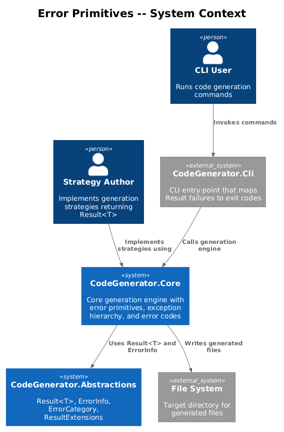
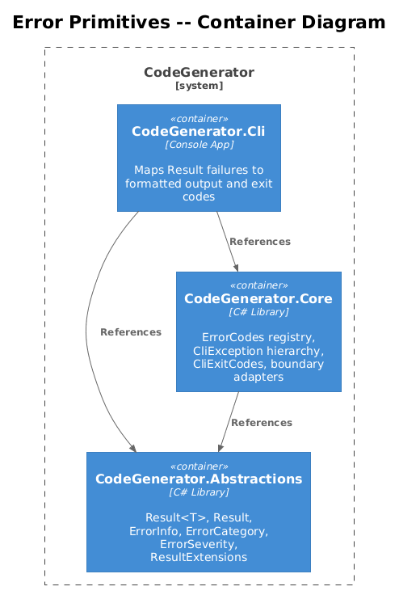
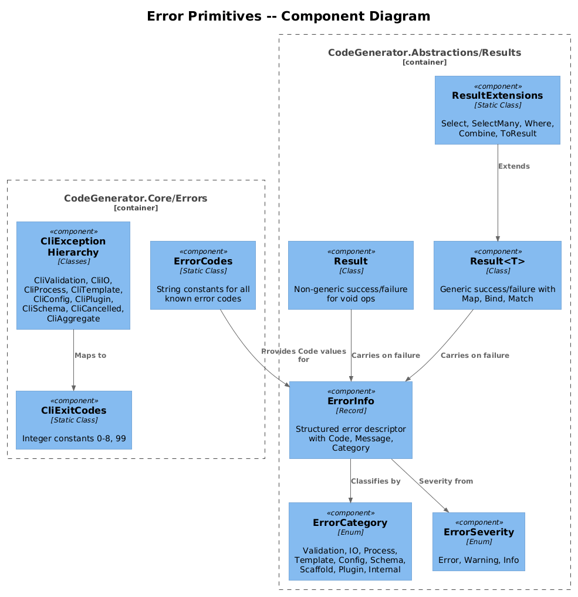
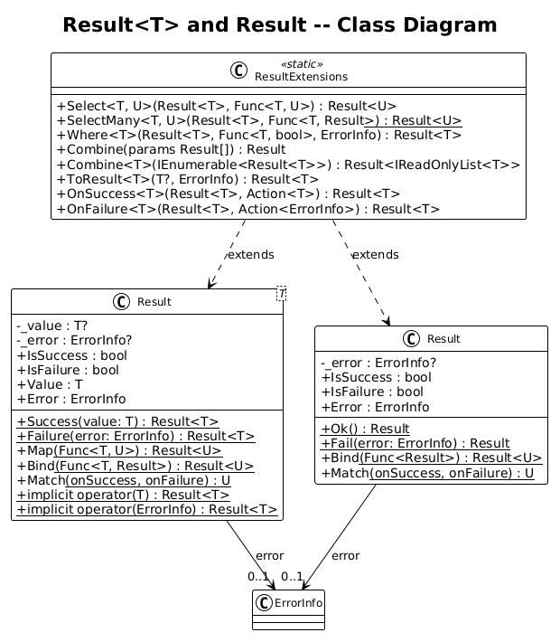
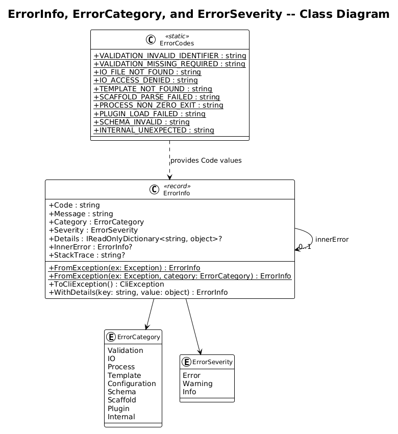
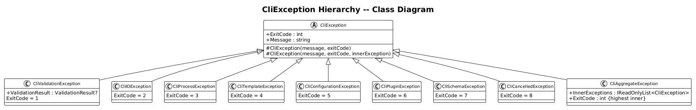
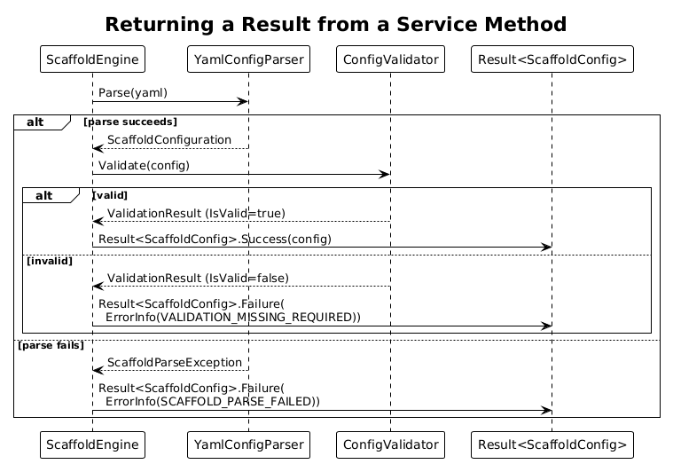
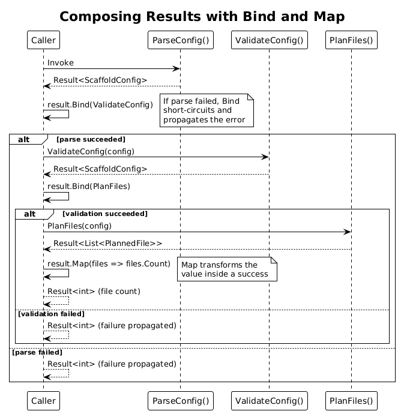
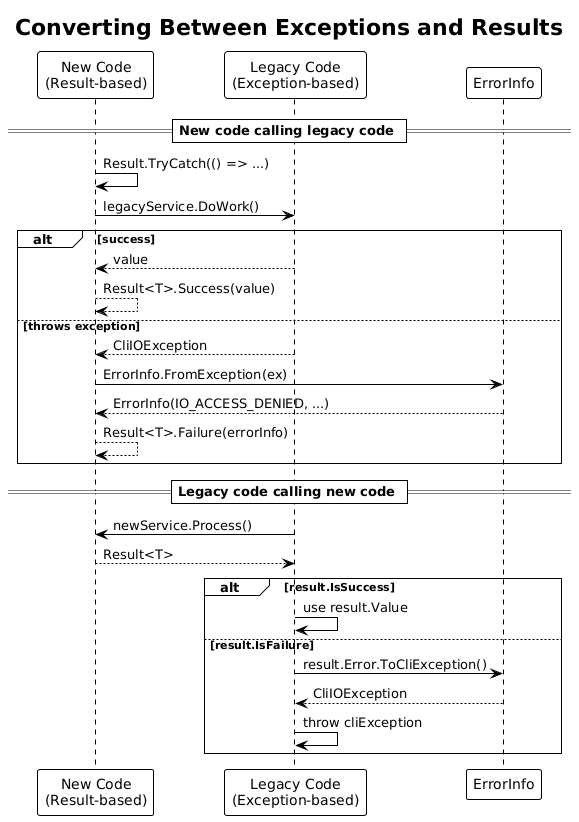

# Result&lt;T&gt; Type and Error Primitives -- Detailed Design

**Feature:** 51-result-type-error-primitives
**Status:** Proposed
**Phase:** 1 (Foundation)
**References:** [error-handling-plan.md](../../error-handling-plan.md) -- Sections 3.1, 3.2, 3.3

---

## 1. Overview

This design introduces the foundational error handling primitives for the CodeGenerator project: a `Result<T>` monadic type for representing success/failure without exceptions, a structured `ErrorInfo` value object for machine-readable error descriptors, an `ErrorCategory` classification enum, a centralized error code registry, and an expanded exception hierarchy.

### Purpose

Replace the current mix of exception-throwing, null-returning, and silent-logging error patterns with a consistent, composable approach where expected failures are values (not control flow) and every error carries structured, machine-readable metadata.

### Actors

| Actor | Description |
|-------|-------------|
| **Strategy Author** | Implements generation strategies; returns `Result<T>` from fallible operations |
| **Engine Consumer** | Calls `ScaffoldEngine`, `ArtifactGenerator`; inspects `Result<T>` to decide next action |
| **CLI Layer** | Maps `Result<T>` failures to exit codes and formatted output |
| **Test Author** | Uses `ResultAssertions` to verify success/failure paths |

### Scope

This design covers new types in `CodeGenerator.Abstractions/Results/` and `CodeGenerator.Core/Errors/`. It does not cover the global exception handler (Feature 52), retry policies (Feature 53), or error formatting (Feature 54).

---

## 2. Architecture

### 2.1 C4 Context Diagram

Shows where the error primitives sit relative to the overall system.



### 2.2 C4 Container Diagram

The packages that contain the new error primitives.



### 2.3 C4 Component Diagram

Internal components within the Results and Errors namespaces.



---

## 3. Component Details

### 3.1 Result&lt;T&gt; (Generic Result Type)

- **Location:** `CodeGenerator.Abstractions/Results/Result{T}.cs`
- **Responsibility:** Represent the outcome of a fallible operation as either `Success(T value)` or `Failure(ErrorInfo error)`, without throwing exceptions for expected failures.
- **States:** Exactly two -- success (carries a `T` value) or failure (carries an `ErrorInfo`).
- **Value access:** `Value` property throws `InvalidOperationException` if the result is a failure. `Error` property throws if the result is a success. Callers should use `IsSuccess`/`IsFailure` guards or `Match` for safe access.
- **Composition methods:**
  - `Map<U>(Func<T, U>)` -- transforms the value if success, propagates error if failure.
  - `Bind<U>(Func<T, Result<U>>)` -- chains fallible operations (flatMap).
  - `Match<U>(Func<T, U> onSuccess, Func<ErrorInfo, U> onFailure)` -- exhaustive pattern match.
- **Implicit operators:** `implicit operator Result<T>(T value)` and `implicit operator Result<T>(ErrorInfo error)` allow natural return syntax.
- **Factory methods:** `Result<T>.Success(T value)` and `Result<T>.Failure(ErrorInfo error)` for explicit construction.

### 3.2 Result (Non-Generic)

- **Location:** `CodeGenerator.Abstractions/Results/Result.cs`
- **Responsibility:** Represent success/failure for void operations (e.g., file writes, command execution) where there is no return value on success.
- **States:** Success (no value) or Failure (carries `ErrorInfo`).
- **Factory methods:** `Result.Ok()` and `Result.Fail(ErrorInfo error)`.
- **Composition:** `Bind<U>(Func<Result<U>>)` to chain into value-producing operations.

### 3.3 ErrorInfo Value Object

- **Location:** `CodeGenerator.Abstractions/Results/ErrorInfo.cs`
- **Responsibility:** Structured, immutable descriptor of an error occurrence. Carries enough context for both machine processing (code, category) and human consumption (message, details).
- **Properties:**
  - `Code` (string) -- machine-readable identifier, e.g., `"SCAFFOLD_PARSE_FAILED"`. Must be non-null and non-empty.
  - `Message` (string) -- human-readable description. Must be non-null and non-empty.
  - `Category` (ErrorCategory) -- classification for routing and exit-code mapping.
  - `Severity` (ErrorSeverity) -- `Error`, `Warning`, or `Info`.
  - `Details` (IReadOnlyDictionary&lt;string, object&gt;?) -- optional key-value metadata (file path, line number, strategy name).
  - `InnerError` (ErrorInfo?) -- nested cause, analogous to `Exception.InnerException`.
  - `StackTrace` (string?) -- populated only when `#if DEBUG` or verbose mode is active.
- **Factory method:** `ErrorInfo.FromException(Exception ex)` converts a caught exception into an `ErrorInfo`, preserving the exception type as `Code` and the message.
- **Equality:** Value equality based on `Code` and `Message`.

### 3.4 ErrorCategory Enum

- **Location:** `CodeGenerator.Abstractions/Results/ErrorCategory.cs`
- **Values:** `Validation`, `IO`, `Process`, `Template`, `Configuration`, `Schema`, `Scaffold`, `Plugin`, `Internal`
- **Purpose:** Allows consumers to filter, group, and route errors by broad category. Maps directly to exit codes in the CLI layer.

### 3.5 ErrorSeverity Enum

- **Location:** `CodeGenerator.Abstractions/Results/ErrorSeverity.cs`
- **Values:** `Error`, `Warning`, `Info`
- **Purpose:** Determines whether an error is fatal, advisory, or informational. Aligns with the existing `ValidationSeverity` in `CodeGenerator.Core.Validation`.

### 3.6 ResultExtensions

- **Location:** `CodeGenerator.Abstractions/Results/ResultExtensions.cs`
- **Responsibility:** LINQ-style extension methods enabling declarative composition of results.
- **Methods:**
  - `Select<T, U>(this Result<T>, Func<T, U>)` -- alias for `Map`, enables LINQ query syntax.
  - `SelectMany<T, U>(this Result<T>, Func<T, Result<U>>)` -- alias for `Bind`, enables LINQ `from ... select`.
  - `Where<T>(this Result<T>, Func<T, bool>, ErrorInfo)` -- filters; returns failure if predicate is false.
  - `Combine(params Result[])` -- returns success if all succeed, aggregated failure otherwise.
  - `Combine<T>(IEnumerable<Result<T>>)` -- collects all successes into a list, or aggregates all failures.
  - `ToResult<T>(this T?, ErrorInfo)` -- converts a nullable value to a `Result<T>`.
  - `OnSuccess<T>(this Result<T>, Action<T>)` -- side-effect on success, returns original result.
  - `OnFailure<T>(this Result<T>, Action<ErrorInfo>)` -- side-effect on failure, returns original result.

### 3.7 ErrorCodes Static Class

- **Location:** `CodeGenerator.Core/Errors/ErrorCodes.cs`
- **Responsibility:** Central registry of all known error code string constants. Prevents typos and enables IDE discoverability.
- **Organization:** Constants grouped by category with XML doc comments.

| Category | Constants |
|----------|-----------|
| Validation | `VALIDATION_INVALID_IDENTIFIER`, `VALIDATION_MISSING_REQUIRED`, `VALIDATION_DIR_NOT_WRITABLE` |
| IO | `IO_FILE_NOT_FOUND`, `IO_ACCESS_DENIED`, `IO_DIR_CREATE_FAILED` |
| Template | `TEMPLATE_NOT_FOUND`, `TEMPLATE_RENDER_FAILED`, `TEMPLATE_SYNTAX_ERROR` |
| Scaffold | `SCAFFOLD_PARSE_FAILED`, `SCAFFOLD_FILE_CONFLICT`, `SCAFFOLD_POST_CMD_FAILED` |
| Process | `PROCESS_TIMEOUT`, `PROCESS_NON_ZERO_EXIT` |
| Plugin | `PLUGIN_LOAD_FAILED`, `PLUGIN_STRATEGY_NOT_FOUND` |
| Schema | `SCHEMA_INVALID`, `SCHEMA_ENTITY_INVALID` |
| Configuration | `CONFIG_MISSING`, `CONFIG_INVALID` |
| Internal | `INTERNAL_UNEXPECTED` |

### 3.8 Expanded Exception Hierarchy

- **Location:** `CodeGenerator.Core/Errors/`
- **New exception types** added alongside the existing ones:

| Exception Class | Exit Code | Trigger |
|-----------------|-----------|---------|
| `CliConfigurationException` | 5 | Invalid CLI config, missing settings, corrupt config files |
| `CliPluginException` | 6 | Plugin discovery, load, or execution failure |
| `CliSchemaException` | 7 | PlantUML or JSON schema parse/validation failure |
| `CliCancelledException` | 8 | Operation cancelled by user (Ctrl+C) or token |
| `CliAggregateException` | highest inner | Wraps multiple `CliException` instances from batch operations |

- **Updated `CliExitCodes`:** Add `ConfigurationError=5`, `PluginError=6`, `SchemaError=7`, `Cancelled=8`.
- **`CliAggregateException`** stores `IReadOnlyList<CliException> InnerExceptions` and computes `ExitCode` as the maximum exit code among its children.

---

## 4. Data Model

### 4.1 Result Type Class Diagram



### 4.2 ErrorInfo and Enums Class Diagram



### 4.3 Exception Hierarchy Class Diagram



---

## 5. Key Workflows

### 5.1 Returning a Result from a Service Method

Shows how a method uses `Result<T>` instead of throwing.



### 5.2 Composing Results with Bind and Map

Shows chaining multiple fallible operations.



### 5.3 Converting Between Exceptions and Results

Shows the boundary where exceptions are caught and converted to `Result<T>`.



---

## 6. Migration Strategy

### 6.1 Incremental Adoption

The `Result<T>` type is introduced alongside existing patterns. No big-bang rewrite is required.

**Phase 1a -- New code uses Result&lt;T&gt;:**
- All new service methods return `Result<T>` or `Result` instead of throwing or returning null.
- New strategies return `Result<string>` from syntax generation.

**Phase 1b -- Retrofit high-traffic paths:**
- `ScaffoldEngine.ScaffoldAsync` returns `Result<ScaffoldResult>` instead of bare `ScaffoldResult` (the `Success` bool is now redundant -- it is encoded in the Result wrapper).
- `ArtifactGenerator.GenerateAsync` returns `Result<ArtifactGenerationResult>` (designed in Feature 52).

**Phase 1c -- Retrofit remaining services:**
- `ICommandService` methods return `Result<int>` (exit code on success).
- `ITemplateProcessor.Process` returns `Result<string>`.

### 6.2 Boundary Adapters

At the boundary between old (exception-throwing) and new (Result-returning) code, use adapter methods:

```csharp
// Old code calling new code
try
{
    var result = newService.DoSomething();
    if (result.IsFailure)
        throw result.Error.ToCliException();
}

// New code calling old code
public static Result<T> TryCatch<T>(Func<T> action, ErrorCategory category)
{
    try { return action(); }
    catch (Exception ex) { return ErrorInfo.FromException(ex, category); }
}
```

### 6.3 Backward Compatibility

- Existing `CliException` subclasses are unchanged.
- `ValidationResult` is unchanged (the new `ErrorInfo` is separate, not a replacement).
- `ScaffoldResult` gains new optional properties with defaults; existing consumers are unaffected.
- No existing public API signatures are removed or changed in Phase 1.

---

## 7. Open Questions

| # | Question | Options | Recommendation |
|---|----------|---------|----------------|
| 1 | Should `Result<T>` be a struct or class? | Struct avoids allocation but complicates nullable value semantics. Class is simpler. | Class. Allocation cost is negligible for this use case. |
| 2 | Should `ErrorInfo` be a record? | Record gives value equality and `with` expressions for free. | Yes, use `public sealed record ErrorInfo`. |
| 3 | Should `ErrorSeverity` reuse `ValidationSeverity`? | Reuse avoids duplication but couples Abstractions to Core. | New enum in Abstractions; add implicit conversion if needed. |
| 4 | How should async methods return results? | `Task<Result<T>>` is straightforward but no `await` sugar. | `Task<Result<T>>` is sufficient. No custom awaiter needed. |
| 5 | Should `Combine` stop at first failure or collect all? | Stop-at-first is simpler; collect-all is more useful for batch. | Provide both: `Combine` (collect all) and `FirstFailure`. |
