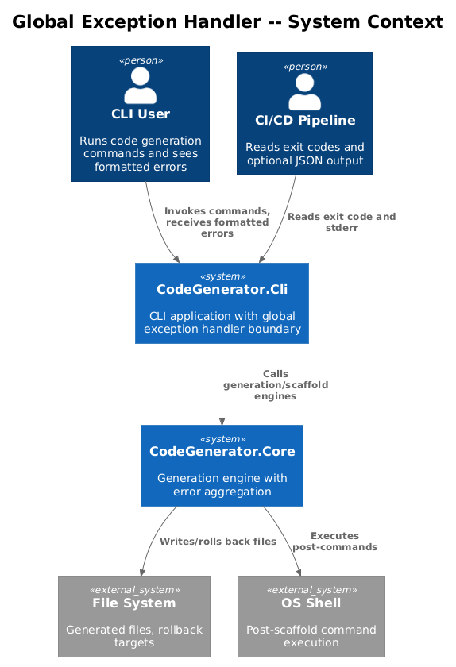
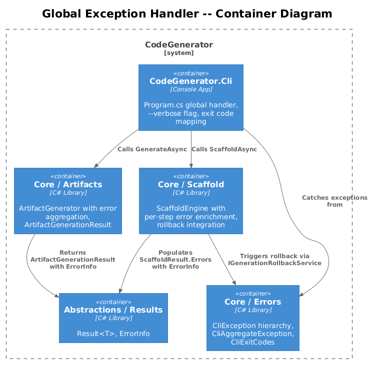
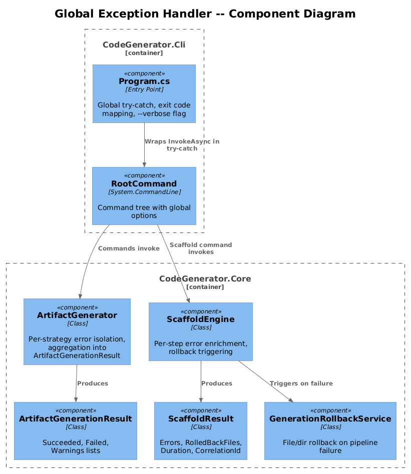
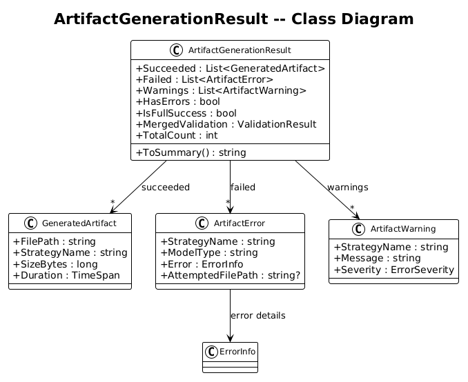
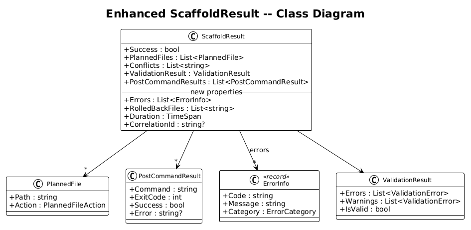
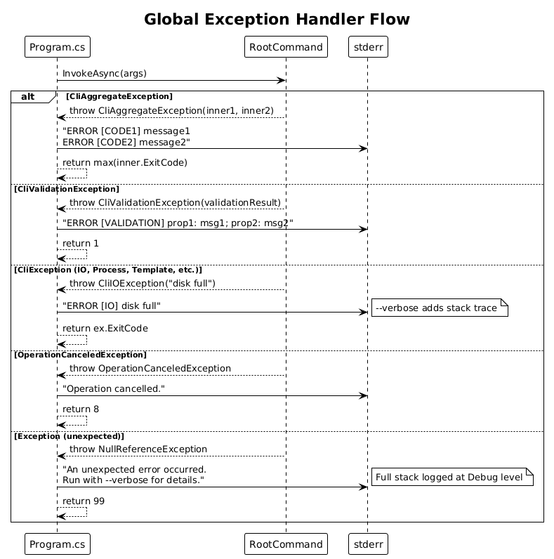
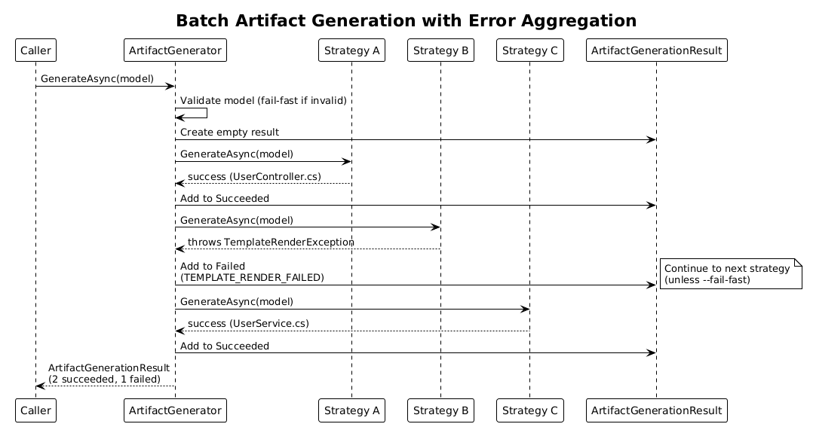
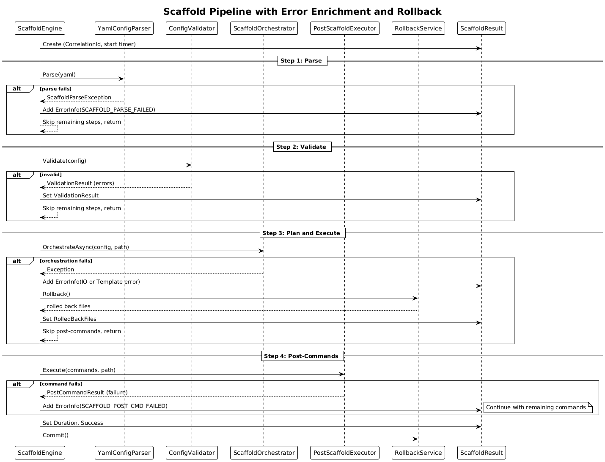

# Global Exception Handler and Pipeline Aggregation -- Detailed Design

**Feature:** 52-global-exception-handler
**Status:** Proposed
**Phase:** 2 (Pipeline Error Handling)
**References:** [error-handling-plan.md](../../error-handling-plan.md) -- Sections 3.4, 3.5, 3.6
**Depends on:** Feature 51 (Result&lt;T&gt; Type and Error Primitives)

---

## 1. Overview

This design adds three critical error handling capabilities to the CodeGenerator pipeline: (1) a global exception handler at the CLI entry point that ensures no unhandled exception ever produces a raw stack trace for end users, (2) batch error aggregation in `ArtifactGenerator` so that partial failures in multi-file generation are collected rather than aborting the entire run, and (3) enriched scaffold pipeline error reporting with correlation IDs, duration tracking, and per-step failure context.

### Purpose

Today, `Program.cs` has no try-catch at all -- any unhandled exception produces a raw .NET stack trace and an unpredictable exit code. The `ArtifactGenerator` throws on the first validation failure with no aggregation. The `ScaffoldEngine` catches parse errors but has no protection around orchestration or post-commands. This design closes all three gaps.

### Actors

| Actor | Description |
|-------|-------------|
| **CLI User** | Sees formatted error messages and deterministic exit codes |
| **CI/CD Pipeline** | Reads exit codes and optional JSON output to determine success/failure |
| **Strategy Author** | Per-strategy failures are isolated; one broken strategy does not crash the batch |
| **ScaffoldEngine** | Each pipeline step contributes errors to an enriched result |

### Scope

This design covers changes to `CodeGenerator.Cli/Program.cs`, `CodeGenerator.Core/Artifacts/`, and `CodeGenerator.Core/Scaffold/`. It does not cover error formatting (Feature 54) or resilience patterns (Feature 53).

---

## 2. Architecture

### 2.1 C4 Context Diagram

Shows the global exception handler boundary and its relationship to users and downstream systems.



### 2.2 C4 Container Diagram

The containers involved in exception handling and error aggregation.



### 2.3 C4 Component Diagram

Components within the CLI and Core that participate in error handling.



---

## 3. Component Details

### 3.1 Global Exception Handler (Program.cs)

- **Location:** `CodeGenerator.Cli/Program.cs`
- **Responsibility:** Wrap the top-level `rootCommand.InvokeAsync(args)` call in a structured try-catch that maps every possible exception type to a formatted console message and a deterministic exit code from `CliExitCodes`.

**Exception handling order (most specific to least specific):**

| Priority | Exception Type | Behavior | Exit Code |
|----------|---------------|----------|-----------|
| 1 | `CliAggregateException` | Format each inner error on its own line. Return the highest exit code among inner exceptions. | max(inner.ExitCode) |
| 2 | `CliValidationException` | Format validation errors grouped by property. Include warning count if any. | 1 |
| 3 | `CliException` (other subclasses) | Format `ex.Message`. In verbose mode, include inner exception chain. | ex.ExitCode |
| 4 | `OperationCanceledException` | Print "Operation cancelled." to stderr. | 8 |
| 5 | `Exception` (catch-all) | Print "An unexpected error occurred. Run with --verbose for details." to stderr. In verbose mode, include full stack trace. Log full exception at Debug level. | 99 |

**Verbose mode:**
- A `--verbose` / `-v` global option is added to the root command.
- When active, all exception handlers include stack traces, inner exception chains, and `ErrorInfo.Details` in their output.
- The minimum log level is changed from `Information` to `Debug`.

**Structured output (future-ready):**
- The handler writes to `stderr` for errors (keeping `stdout` clean for generation output).
- Error messages use the format: `ERROR [{CODE}] {Message}` for consistency.

### 3.2 ArtifactGenerationResult

- **Location:** `CodeGenerator.Core/Artifacts/ArtifactGenerationResult.cs`
- **Responsibility:** Collect per-strategy outcomes from a batch artifact generation run, distinguishing successes, failures, and warnings.

**Properties:**

| Property | Type | Description |
|----------|------|-------------|
| `Succeeded` | `List<GeneratedArtifact>` | Artifacts that were generated successfully |
| `Failed` | `List<ArtifactError>` | Artifacts that failed with error details |
| `Warnings` | `List<ArtifactWarning>` | Non-fatal issues encountered during generation |
| `HasErrors` | `bool` | `Failed.Count > 0` |
| `IsFullSuccess` | `bool` | `!HasErrors && Succeeded.Count > 0` |
| `MergedValidation` | `ValidationResult` | Aggregated validation result across all strategies |
| `TotalCount` | `int` | `Succeeded.Count + Failed.Count` |

**Supporting types:**

```
GeneratedArtifact
  - FilePath : string
  - StrategyName : string
  - SizeBytes : long
  - Duration : TimeSpan

ArtifactError
  - StrategyName : string
  - ModelType : string
  - Error : ErrorInfo
  - AttemptedFilePath : string?

ArtifactWarning
  - StrategyName : string
  - Message : string
  - Severity : ErrorSeverity
```

**`ToSummary()` method:**
Returns a human-readable summary string, e.g.:
```
Generated 18/20 artifacts (2 failed, 3 warnings)
  FAILED: UserController.cs - TEMPLATE_RENDER_FAILED: Missing 'namespace' token
  FAILED: UserService.cs - PLUGIN_STRATEGY_NOT_FOUND: No strategy for ServiceModel
```

### 3.3 ArtifactGenerator Changes

- **Location:** `CodeGenerator.Core/Artifacts/Abstractions/ArtifactGenerator.cs`
- **Current behavior:** Validates the model, then delegates to a single strategy wrapper. No error aggregation. Throws `ModelValidationException` on invalid models.
- **New behavior:**

1. **Model validation** remains fail-fast: if the model is `IValidatable` and invalid, return `Result<ArtifactGenerationResult>.Failure(...)` immediately (or throw `ModelValidationException` for backward compatibility during migration).
2. **Strategy iteration:** The wrapper resolves `IEnumerable<IArtifactGenerationStrategy<T>>` and iterates over all matching strategies (not just the first). Each strategy execution is wrapped in a try-catch boundary.
3. **Per-strategy error isolation:** If a strategy throws, the exception is caught and recorded as an `ArtifactError`. Generation continues with the next strategy.
4. **`--fail-fast` flag:** When set, the generator aborts on the first strategy failure and returns immediately with a partial `ArtifactGenerationResult`.
5. **Return type:** `Task<ArtifactGenerationResult>` (or `Task<Result<ArtifactGenerationResult>>` after Feature 51 migration).

### 3.4 Scaffold Pipeline Error Enrichment

- **Location:** `CodeGenerator.Core/Scaffold/Models/ScaffoldResult.cs` and `CodeGenerator.Core/Scaffold/Services/ScaffoldEngine.cs`
- **Responsibility:** Enrich `ScaffoldResult` with structured errors, rollback information, timing, and correlation data. Ensure each pipeline step (parse, validate, plan, execute, post-commands) contributes errors to the result without leaking unhandled exceptions.

**Enhanced ScaffoldResult properties:**

| Property | Type | Description |
|----------|------|-------------|
| `Errors` | `List<ErrorInfo>` | Structured errors from any pipeline step |
| `RolledBackFiles` | `List<string>` | Files that were cleaned up during rollback |
| `Duration` | `TimeSpan` | Wall-clock time for the entire scaffold operation |
| `CorrelationId` | `string?` | GUID linking this result to log entries |

**`Success` property redefinition:**
```csharp
public bool Success => ValidationResult.IsValid && Errors.Count == 0;
```

**Pipeline step error handling:**

| Step | Current Behavior | New Behavior |
|------|-----------------|--------------|
| Parse | Catches `ScaffoldParseException`, adds to `ValidationResult` | Also creates `ErrorInfo(SCAFFOLD_PARSE_FAILED)` in `Errors` |
| Validate | Returns `ValidationResult`; stops if invalid | Unchanged; validation errors remain in `ValidationResult` |
| Plan (Orchestrate) | No try-catch | Wrap in try-catch; on failure add `ErrorInfo` to `Errors`, trigger rollback |
| Execute (file write) | No try-catch | Wrap in try-catch; on failure add `ErrorInfo`, trigger rollback of written files |
| Post-commands | No try-catch | Wrap each command in try-catch; record failures in both `PostCommandResults` and `Errors` |

**Rollback integration:**
- On failure at any step after file writes have begun, call `IGenerationRollbackService.Rollback()`.
- Record rolled-back file paths in `ScaffoldResult.RolledBackFiles`.
- If rollback itself fails partially, record rollback failures in `Errors` with category `Internal`.

---

## 4. Data Model

### 4.1 ArtifactGenerationResult Class Diagram



### 4.2 Enhanced ScaffoldResult Class Diagram



---

## 5. Key Workflows

### 5.1 Global Exception Handler Flow

Shows how different exception types are caught and mapped to exit codes.



### 5.2 Batch Artifact Generation with Error Aggregation

Shows per-strategy error isolation and aggregation into `ArtifactGenerationResult`.



### 5.3 Scaffold Pipeline with Error Enrichment and Rollback

Shows the full scaffold pipeline with error handling at each step.



---

## 6. Detailed Behaviors

### 6.1 Exit Code Precedence in CliAggregateException

When multiple errors occur in a batch operation, the `CliAggregateException` wraps all inner `CliException` instances. The exit code returned to the OS is the **maximum** exit code among the inner exceptions, ensuring the most severe category is reported.

Example: if a batch produces `CliIOException` (exit 2) and `CliTemplateException` (exit 4), the process exits with code 4.

### 6.2 Fail-Fast vs Collect-All Modes

| Mode | Flag | Behavior |
|------|------|----------|
| Collect-all (default) | (none) | All strategies execute; all errors aggregated |
| Fail-fast | `--fail-fast` | Abort on first strategy failure; return partial result |

In collect-all mode, the `ArtifactGenerator` iterates every matched strategy. In fail-fast mode, it stops at the first `ArtifactError` and returns immediately. Both modes populate `ArtifactGenerationResult` consistently.

### 6.3 CorrelationId Propagation

1. The CLI entry point generates a `CorrelationId` (GUID) at command invocation.
2. The ID is passed to `ScaffoldEngine.ScaffoldAsync` and `ArtifactGenerator.GenerateAsync` via a parameter or ambient context.
3. All `ErrorInfo` instances created during that invocation include the `CorrelationId` in their `Details` dictionary.
4. The `CorrelationId` appears in `ScaffoldResult.CorrelationId` and in log scopes for cross-referencing.

---

## 7. Open Questions

| # | Question | Options | Recommendation |
|---|----------|---------|----------------|
| 1 | Should `--verbose` be a global option or per-command? | Global is simpler; per-command allows finer control. | Global. Consistent UX across all commands. |
| 2 | Should `ArtifactGenerator` return `ArtifactGenerationResult` directly or `Result<ArtifactGenerationResult>`? | Direct is simpler; `Result` wrapping is more consistent with Phase 1. | Return directly during migration; wrap in `Result<T>` after Phase 1 adoption is complete. |
| 3 | Should the global handler write to `stderr` or `stdout`? | stderr keeps stdout clean for piping; stdout is what users see by default. | stderr for errors. Keep stdout for generation output only. |
| 4 | Should `CorrelationId` be an `AsyncLocal<T>` or an explicit parameter? | AsyncLocal is implicit and can be lost across thread boundaries. Explicit parameter is verbose but reliable. | Explicit parameter. Clarity over convenience. |
| 5 | How should `--fail-fast` interact with post-commands? | Skip post-commands on any failure, or run post-commands only for succeeded artifacts? | Skip all post-commands if any artifact failed in fail-fast mode. |
