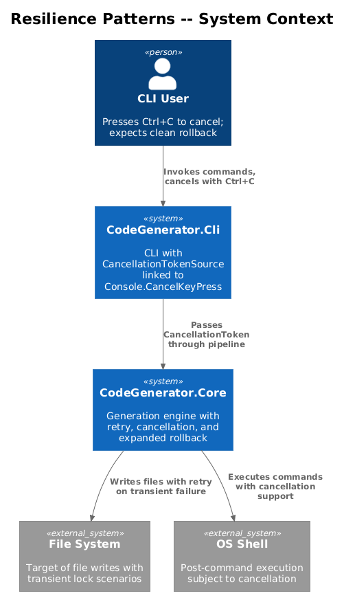
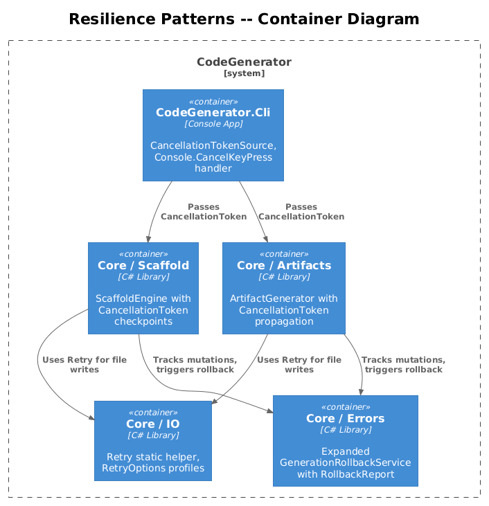
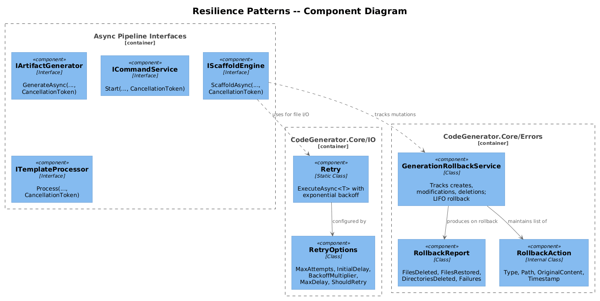
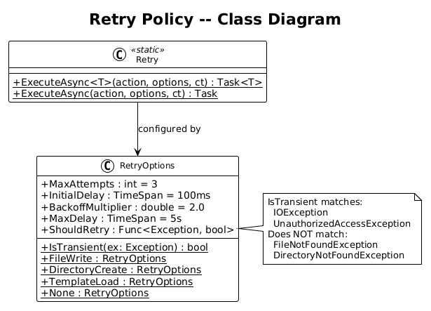
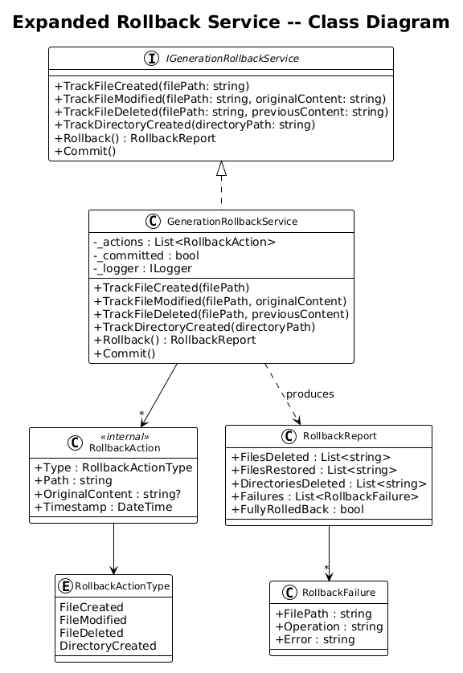
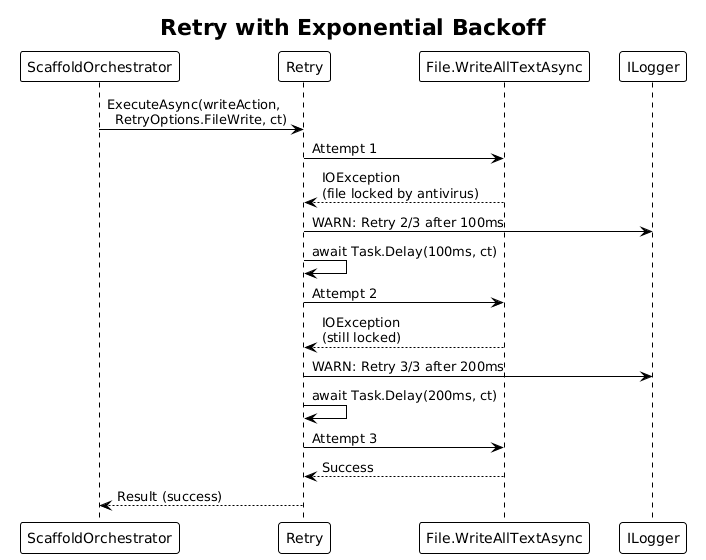
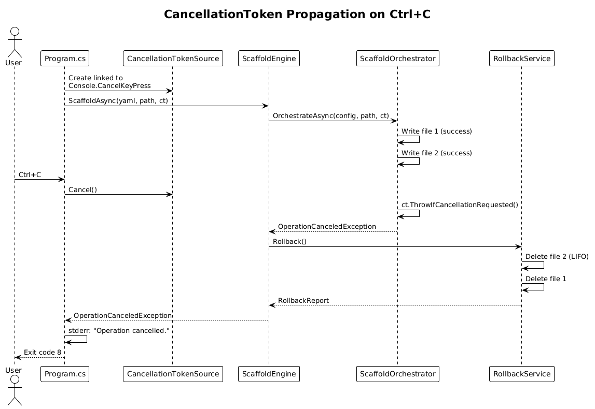
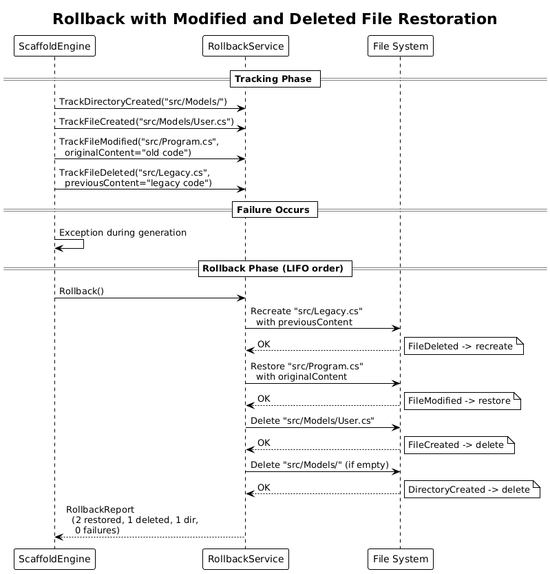

# Resilience Patterns -- Detailed Design

**Feature:** 53-resilience-patterns
**Status:** Proposed
**Phase:** 3 (Resilience)
**References:** [error-handling-plan.md](../../error-handling-plan.md) -- Sections 3.7, 3.8, 3.9
**Depends on:** Feature 51 (Result&lt;T&gt; Error Primitives), Feature 52 (Global Exception Handler)

---

## 1. Overview

This design introduces three resilience patterns to the CodeGenerator pipeline: (1) a lightweight retry policy for transient I/O failures, (2) end-to-end `CancellationToken` propagation so Ctrl+C cleanly halts generation and triggers rollback, and (3) an expanded rollback service that can restore modified and deleted files in addition to removing created files.

### Purpose

Today, transient I/O failures (antivirus file locks, OS caching delays) cause immediate hard failures. `CancellationToken` parameters exist in strategy signatures but are never wired to actual cancellation sources -- Ctrl+C kills the process ungracefully with no rollback. The rollback service only tracks file creation, not modifications or deletions. This design closes all three gaps.

### Actors

| Actor | Description |
|-------|-------------|
| **CLI User** | Presses Ctrl+C to cancel; expects partial work to be cleaned up |
| **File System** | Source of transient failures (locks, permissions, latency) |
| **Generation Pipeline** | Produces files that must be retried on transient failure and rolled back on abort |
| **ScaffoldEngine** | Orchestrates multi-step scaffold with cancellation checkpoints |

### Scope

This design covers new types in `CodeGenerator.Core/IO/`, changes to all async interfaces for `CancellationToken` propagation, and an expanded `IGenerationRollbackService`. It does not cover circuit-breaker patterns (not needed for a CLI tool) or external service retries (no external services exist today).

---

## 2. Architecture

### 2.1 C4 Context Diagram

Shows the resilience patterns in the context of the overall system.



### 2.2 C4 Container Diagram

The containers that participate in retry, cancellation, and rollback.



### 2.3 C4 Component Diagram

Components within Core that implement the resilience patterns.



---

## 3. Component Details

### 3.1 Retry Policy

- **Location:** `CodeGenerator.Core/IO/Retry.cs` and `CodeGenerator.Core/IO/RetryOptions.cs`
- **Responsibility:** Provide a lightweight, zero-dependency retry mechanism for transient I/O failures with exponential backoff.

**`Retry` static class:**

| Method | Description |
|--------|-------------|
| `ExecuteAsync<T>(Func<CancellationToken, Task<T>>, RetryOptions, CancellationToken)` | Executes the action up to `MaxAttempts` times, waiting between attempts with exponential backoff. Returns the result on success or throws the last exception on exhaustion. |
| `ExecuteAsync(Func<CancellationToken, Task>, RetryOptions, CancellationToken)` | Void variant for operations with no return value. |

**`RetryOptions` class:**

| Property | Type | Default | Description |
|----------|------|---------|-------------|
| `MaxAttempts` | `int` | 3 | Total number of attempts (1 = no retry) |
| `InitialDelay` | `TimeSpan` | 100ms | Delay before the first retry |
| `BackoffMultiplier` | `double` | 2.0 | Multiplier applied to delay after each retry |
| `MaxDelay` | `TimeSpan` | 5 seconds | Cap on the delay between retries |
| `ShouldRetry` | `Func<Exception, bool>` | `IsTransient` | Predicate that determines if an exception is retryable |

**`IsTransient` default predicate:**
```csharp
public static bool IsTransient(Exception ex) =>
    ex is IOException or UnauthorizedAccessException;
```

This covers antivirus file locks (`IOException`), transient permission issues (`UnauthorizedAccessException`), and file-in-use scenarios. It explicitly does NOT match `FileNotFoundException` (deterministic -- retrying will not help) or `DirectoryNotFoundException`.

**Retry algorithm:**
1. Execute the action.
2. If it succeeds, return the result.
3. If it throws and `ShouldRetry(ex)` is false, rethrow immediately.
4. If it throws and `ShouldRetry(ex)` is true and attempts remain, wait `min(InitialDelay * BackoffMultiplier^attempt, MaxDelay)` then go to step 1.
5. If all attempts are exhausted, throw the last exception.
6. At every wait point, check `CancellationToken` before sleeping. If cancelled, throw `OperationCanceledException`.

**Predefined retry profiles:**

| Profile | MaxAttempts | InitialDelay | Use Case |
|---------|-------------|--------------|----------|
| `RetryOptions.FileWrite` | 3 | 100ms | File write/copy operations |
| `RetryOptions.DirectoryCreate` | 2 | 50ms | Directory creation |
| `RetryOptions.TemplateLoad` | 2 | 100ms | Template file reads from disk |
| `RetryOptions.None` | 1 | 0ms | No retry (passthrough) |

**Application matrix -- where retry is applied:**

| Operation | Retry? | Profile | Rationale |
|-----------|--------|---------|-----------|
| File write (`File.WriteAllTextAsync`) | Yes | FileWrite | Antivirus locks, transient OS locks |
| File copy (`File.Copy`) | Yes | FileWrite | Same transient lock scenarios |
| Directory creation (`Directory.CreateDirectory`) | Yes | DirectoryCreate | Race conditions in parallel generation |
| Template loading from disk | Yes | TemplateLoad | File system caching delays |
| Process execution (post-commands) | No | None | Side effects may not be idempotent |
| YAML/JSON parsing | No | None | Deterministic; retrying identical input will not help |
| Assembly loading (strategy discovery) | No | None | Deterministic failure |

### 3.2 CancellationToken Propagation

- **Responsibility:** Wire `CancellationToken` from the CLI entry point through every async method in the pipeline so that Ctrl+C produces a clean cancellation with rollback, not a process kill.

**CLI entry point changes (`Program.cs`):**

```csharp
using var cts = new CancellationTokenSource();
Console.CancelKeyPress += (_, e) =>
{
    e.Cancel = true;  // Prevent immediate process termination
    cts.Cancel();
};
```

The `CancellationToken` from `cts` is passed to all command handlers, which propagate it to engine methods.

**Interface changes -- add `CancellationToken ct = default` parameter:**

| Interface | Method | Current Signature | New Signature |
|-----------|--------|-------------------|---------------|
| `IScaffoldEngine` | `ScaffoldAsync` | `(string yaml, string outputPath, bool dryRun, bool force)` | `(..., CancellationToken ct = default)` |
| `IArtifactGenerator` | `GenerateAsync` | `(object model)` | `(object model, CancellationToken ct = default)` |
| `ICommandService` | `Start` | `(string command, string workingDir, bool wait)` | `(..., CancellationToken ct = default)` |
| `ITemplateProcessor` | `Process` | `(string template, IDictionary tokens)` | `(..., CancellationToken ct = default)` |
| All scaffold services | Various | No CancellationToken | Add `CancellationToken ct = default` |

**Cancellation checkpoints:**

Strategic placement of `ct.ThrowIfCancellationRequested()` at these points:

1. Before each strategy execution in `ArtifactGenerator`
2. Before each file write in scaffold orchestration
3. Before each post-command execution
4. Inside `Retry.ExecuteAsync` before each sleep
5. Inside long-running template processing loops

**Cancellation behavior:**

| Scenario | Action |
|----------|--------|
| Ctrl+C during scaffold parse/validate | Throw `OperationCanceledException`; no files written, no rollback needed |
| Ctrl+C during scaffold file generation | Throw `OperationCanceledException`; trigger rollback of already-written files |
| Ctrl+C during post-commands | Throw `OperationCanceledException`; files already written are kept (post-commands are optional) |
| Ctrl+C during artifact generation | Throw `OperationCanceledException`; trigger rollback if rollback service is active |
| Ctrl+C during retry wait | `CancellationToken` check aborts the wait immediately |

**Strategy signatures:**
The existing `ISyntaxGenerationStrategy<T>.GenerateAsync` and `IArtifactGenerationStrategy<T>.GenerateAsync` already accept `CancellationToken ct` but pass `default`. After this change, the actual token flows through. Strategy implementations should call `ct.ThrowIfCancellationRequested()` at natural checkpoints (e.g., before expensive template rendering).

### 3.3 Expanded Rollback Service

- **Location:** `CodeGenerator.Core/Errors/IGenerationRollbackService.cs`
- **Responsibility:** Track all file system mutations (creates, modifications, deletions, directory creates) and reverse them in LIFO order on failure. Return a `RollbackReport` describing what was restored, deleted, and what failed.

**Expanded interface:**

| Method | Description |
|--------|-------------|
| `TrackFileCreated(string filePath)` | Records a newly created file. Rollback deletes it. (Replaces `TrackFile`.) |
| `TrackFileModified(string filePath, string originalContent)` | Records the original content of a file before modification. Rollback restores the original content. |
| `TrackFileDeleted(string filePath, string previousContent)` | Records the previous content of a file that was deleted. Rollback recreates the file with its previous content. |
| `TrackDirectoryCreated(string directoryPath)` | Records a newly created directory. Rollback deletes it if empty. (Replaces `TrackDirectory`.) |
| `Rollback()` | Reverses all tracked operations in LIFO order. Returns `RollbackReport`. |
| `Commit()` | Clears all tracking. Signals that operations completed successfully and rollback is no longer needed. |

**`RollbackReport` class:**

| Property | Type | Description |
|----------|------|-------------|
| `FilesDeleted` | `List<string>` | Created files that were deleted during rollback |
| `FilesRestored` | `List<string>` | Modified/deleted files that were restored to original content |
| `DirectoriesDeleted` | `List<string>` | Created directories that were removed |
| `Failures` | `List<RollbackFailure>` | Operations that failed during rollback |
| `FullyRolledBack` | `bool` | `Failures.Count == 0` |

**`RollbackFailure` class:**

| Property | Type | Description |
|----------|------|-------------|
| `FilePath` | `string` | The file or directory that could not be rolled back |
| `Operation` | `string` | What was attempted (e.g., "delete", "restore") |
| `Error` | `string` | Exception message |

**Internal tracking model:**

The service maintains an ordered list of `RollbackAction` entries:

```
RollbackAction
  - Type : RollbackActionType (FileCreated, FileModified, FileDeleted, DirectoryCreated)
  - Path : string
  - OriginalContent : string? (for Modified and Deleted)
  - Timestamp : DateTime
```

**Rollback algorithm:**
1. If `_committed` is true, return an empty `RollbackReport`.
2. Iterate `_actions` in reverse order (LIFO).
3. For each action:
   - `FileCreated`: Delete the file if it exists.
   - `FileModified`: Write `OriginalContent` back to the file.
   - `FileDeleted`: Recreate the file with `PreviousContent`.
   - `DirectoryCreated`: Delete the directory if it exists and is empty.
4. If any operation throws, record it in `Failures` but continue rolling back remaining items.
5. Clear `_actions` after rollback completes.
6. Return `RollbackReport`.

**Backward compatibility:**
- `TrackFile(string)` is retained as an alias for `TrackFileCreated(string)` marked `[Obsolete]`.
- `TrackDirectory(string)` is retained as an alias for `TrackDirectoryCreated(string)` marked `[Obsolete]`.
- The old `void Rollback()` signature changes to `RollbackReport Rollback()`. Callers that ignored the void return will work with the new return type without source changes.

---

## 4. Data Model

### 4.1 Retry Policy Class Diagram



### 4.2 Expanded Rollback Service Class Diagram



---

## 5. Key Workflows

### 5.1 Retry with Exponential Backoff

Shows a file write operation retried after a transient IOException.



### 5.2 Cancellation Token Propagation on Ctrl+C

Shows how Ctrl+C flows from the console through the pipeline to trigger rollback.



### 5.3 Rollback with Modified and Deleted File Restoration

Shows the expanded rollback service restoring modified files and recreating deleted files.



---

## 6. Detailed Behaviors

### 6.1 Retry Logging

Each retry attempt is logged at `Warning` level with the attempt number, delay, and exception message:

```
WARN: Retry attempt 2/3 for file write to 'src/Models/User.cs'
      after 200ms delay. Error: The process cannot access the file
      because it is being used by another process.
```

On final failure (all attempts exhausted), the exception is logged at `Error` level and rethrown.

### 6.2 Cancellation During Retry

If a `CancellationToken` is signalled while the retry is waiting between attempts, the wait is interrupted immediately and `OperationCanceledException` is thrown. No further retry attempts are made.

### 6.3 Rollback Thread Safety

The `GenerationRollbackService` is designed for single-threaded use within a scoped DI lifetime (one per scaffold/generation operation). It does not use locking internally. If parallel file writes are introduced in the future, the service must be updated to use a `ConcurrentBag<RollbackAction>` or external synchronization.

### 6.4 Memory Considerations for TrackFileModified

`TrackFileModified` stores the original file content as a string in memory. For typical code generation scenarios (files under 100KB), this is acceptable. If the generator is extended to handle large binary files, the service should be enhanced to write backup files to a temp directory instead of holding content in memory.

### 6.5 Interaction Between Retry and Rollback

When a file write is retried:
- `TrackFileCreated` is called once, before the first attempt.
- If all retry attempts fail, the file may or may not exist on disk (partial write).
- Rollback will attempt to delete the file regardless. If it does not exist, the delete is a no-op.

### 6.6 Cancellation Exit Code

When `OperationCanceledException` is caught by the global exception handler (Feature 52), the process exits with code 8 (`CliExitCodes.Cancelled`). The message printed to stderr is "Operation cancelled."

---

## 7. Open Questions

| # | Question | Options | Recommendation |
|---|----------|---------|----------------|
| 1 | Should retry be implemented as a static helper or a DI-injected service? | Static is simpler and has no DI overhead. Service allows per-test configuration. | Static helper with `RetryOptions` parameter. Tests can pass custom options. |
| 2 | Should `TrackFileModified` store content in memory or write to temp files? | Memory is simpler and fast for small files. Temp files handle large files but add I/O. | Memory for now. Add temp-file fallback if file sizes exceed a threshold (e.g., 1MB). |
| 3 | Should `Console.CancelKeyPress` or `PosixSignalRegistration` be used? | CancelKeyPress is cross-platform but limited. PosixSignal is more robust on Unix. | CancelKeyPress for cross-platform simplicity. The CLI runs on Windows primarily. |
| 4 | Should rollback be async? | Current implementation is synchronous. File I/O benefits from async. | Keep synchronous for now. Rollback is a short-lived cleanup path, not a hot path. |
| 5 | How should retry interact with `--fail-fast`? | Retry before fail-fast check (retry the operation, then decide). Or skip retry in fail-fast mode. | Retry before fail-fast. Transient failures should not trigger fail-fast if they recover on retry. |
