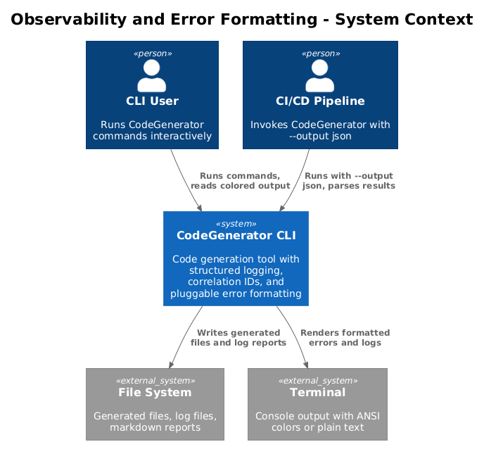
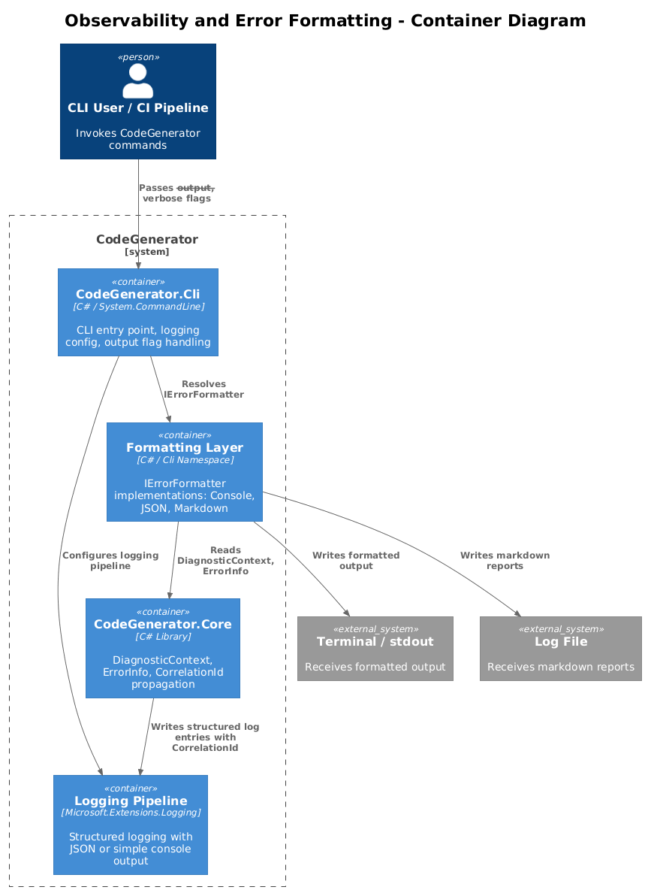
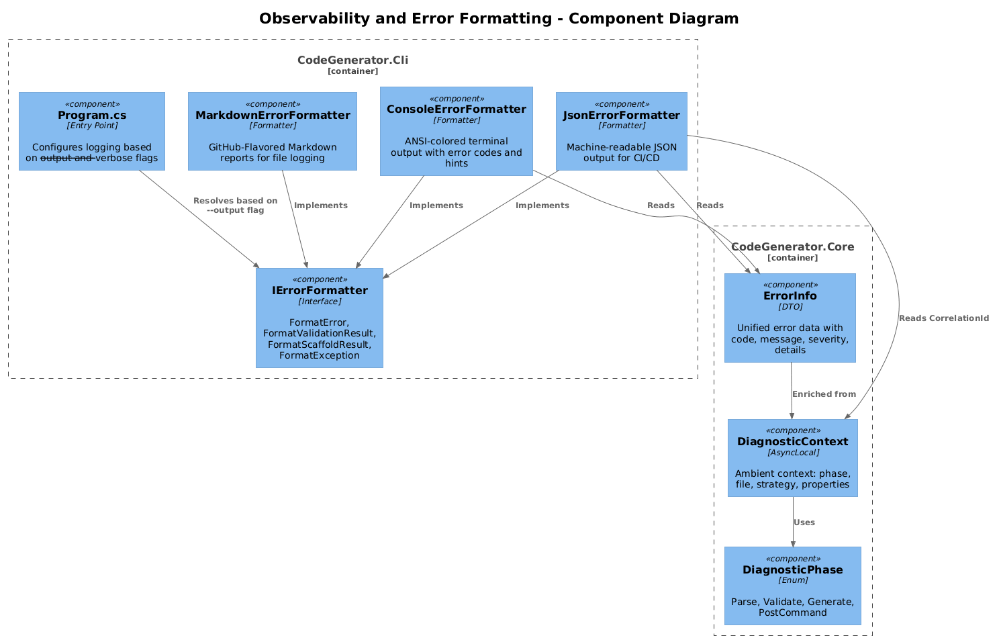
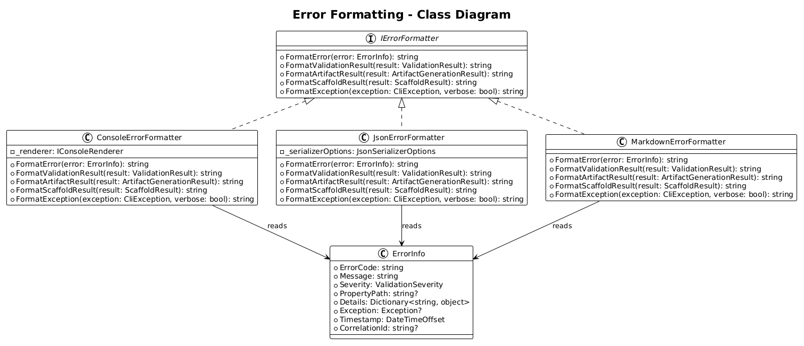
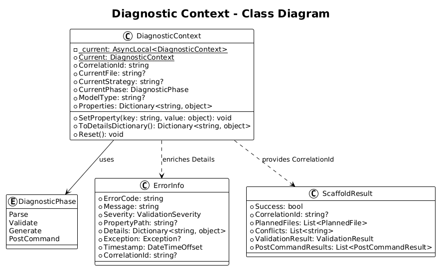
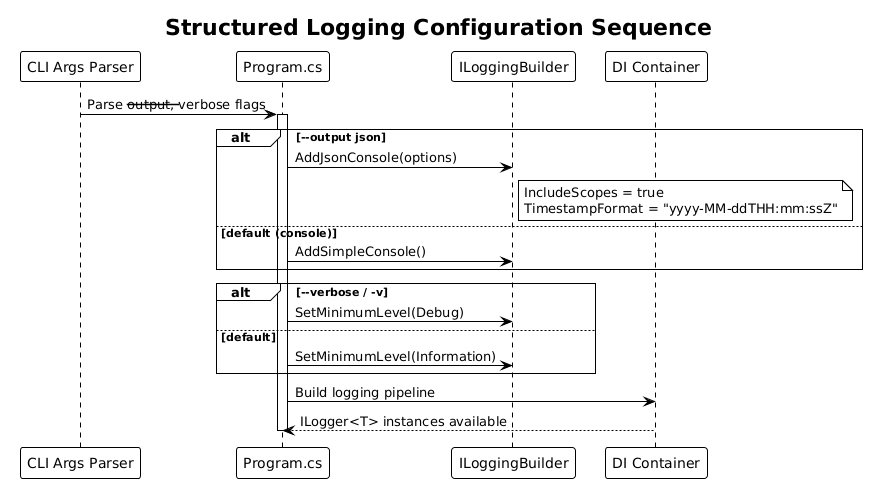
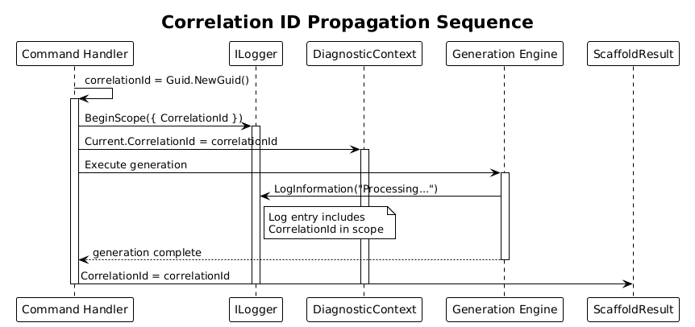
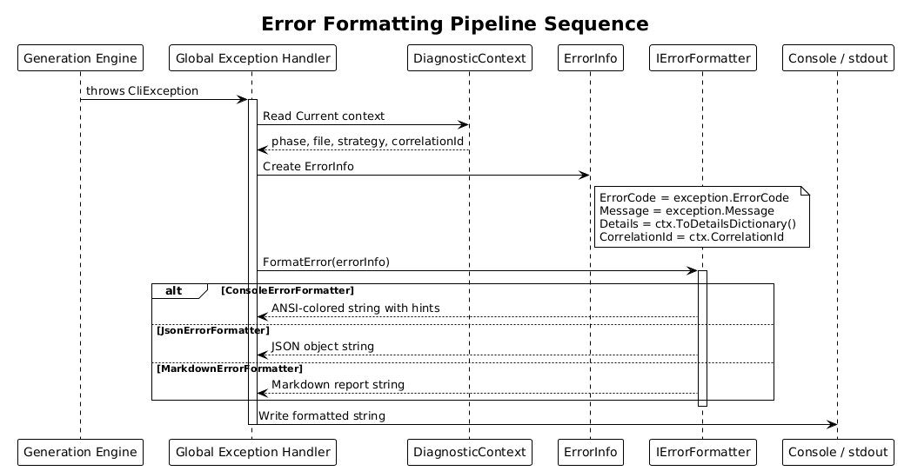
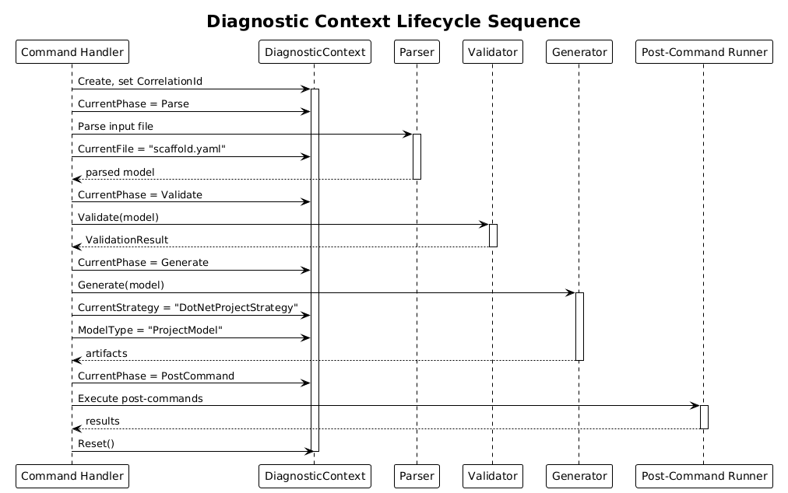

# Observability and Error Formatting - Detailed Design

**Feature:** 54-observability-error-formatting
**Status:** Proposed
**Phase:** 4 (Error Handling Plan - Sections 3.10, 3.11, 3.12)

---

## 1. Overview

This design introduces structured logging, correlation IDs, diagnostic context, and a pluggable error formatting system to the CodeGenerator CLI. Together these components provide production-grade observability: every CLI invocation gets a unique correlation ID, log output can be switched between human-readable and machine-readable (JSON) formats, and errors are rendered through formatters that can target terminals, CI/CD pipelines, or file-based reports.

### Purpose

- Replace the basic `builder.AddConsole()` logging with configurable structured logging (JSON for automation, simple console for humans).
- Propagate a correlation ID through every log entry, result object, and error report so that a single CLI invocation can be traced end-to-end.
- Provide `IErrorFormatter` implementations that separate error data from error presentation.
- Capture ambient diagnostic context (current file, strategy, phase) so that error reports include rich operational detail.

### Actors

| Actor | Description |
|-------|-------------|
| **CLI User** | Runs CodeGenerator commands interactively and reads terminal output |
| **CI/CD Pipeline** | Invokes CodeGenerator with `--output json` and parses structured results |
| **Developer** | Extends formatters or adds new diagnostic context properties |

### Scope

This design covers changes in `CodeGenerator.Cli` (Program.cs logging configuration, `Formatting/` namespace) and `CodeGenerator.Core` (DiagnosticContext, CorrelationId on result types). It does not cover the global exception handler (Feature 52) or resilience patterns (Feature 53), though it integrates with both.

---

## 2. Architecture

### 2.1 C4 Context Diagram

Shows the observability system within the broader CodeGenerator landscape.



### 2.2 C4 Container Diagram

Logical containers introduced by this feature.



### 2.3 C4 Component Diagram

Internal components and their relationships.



---

## 3. Component Details

### 3.1 Structured Logging Configuration (Program.cs)

- **Responsibility:** Configure the logging pipeline based on CLI flags.
- **Behavior:**
  - Default: `builder.AddSimpleConsole()` with `LogLevel.Information`.
  - When `--output json` is specified: `builder.AddJsonConsole()` with `IncludeScopes = true`, `TimestampFormat = "yyyy-MM-ddTHH:mm:ss.fffZ"`.
  - When `--verbose` / `-v` is specified: minimum level set to `LogLevel.Debug`.
  - Both flags can be combined: `--output json -v` produces verbose JSON logs.
- **Key change:** Replace the current `builder.AddConsole(); builder.SetMinimumLevel(LogLevel.Information);` with the conditional configuration above.
- **Package dependency:** `Microsoft.Extensions.Logging.Console` (already present; JSON console formatter is included).

### 3.2 Correlation ID Generation

- **Responsibility:** Generate a unique identifier per CLI command invocation and propagate it through all log entries and result objects.
- **Key class:** `CorrelationIdMiddleware` (a command middleware in System.CommandLine pipeline) or inline at command handler entry.
- **Behavior:**
  1. At the start of each command handler, generate `Guid.NewGuid()`.
  2. Push into logger scope: `logger.BeginScope(new Dictionary<string, object> { ["CorrelationId"] = correlationId })`.
  3. Store in `DiagnosticContext.Current.CorrelationId`.
  4. Set on `ScaffoldResult.CorrelationId` and other result types before returning.
- **New property on `ScaffoldResult`:** `public string? CorrelationId { get; set; }`

### 3.3 IErrorFormatter Interface

- **Location:** `CodeGenerator.Cli/Formatting/IErrorFormatter.cs`
- **Responsibility:** Define the contract for converting error data into presentation strings.
- **Methods:**
  - `string FormatError(ErrorInfo error)` - single error
  - `string FormatValidationResult(ValidationResult result)` - validation summary
  - `string FormatArtifactResult(ArtifactGenerationResult result)` - artifact outcome
  - `string FormatScaffoldResult(ScaffoldResult result)` - scaffold outcome
  - `string FormatException(CliException exception, bool verbose)` - exception detail

### 3.4 ConsoleErrorFormatter

- **Location:** `CodeGenerator.Cli/Formatting/ConsoleErrorFormatter.cs`
- **Responsibility:** Produce ANSI-colored terminal output with error codes, contextual hints, and suggested fixes.
- **Behavior:**
  - Error code prefix in red: `[CG-0001]`
  - Property path highlighted: `projects[MyApi].path`
  - Contextual hint in dim text: `Hint: Check that the parent directory exists.`
  - Uses `Spectre.Console` markup when the `IConsoleRenderer` is a `SpectreConsoleRenderer`.
  - Falls back to plain ANSI escape codes for non-Spectre terminals.
- **Dependencies:** `IConsoleRenderer`

### 3.5 JsonErrorFormatter

- **Location:** `CodeGenerator.Cli/Formatting/JsonErrorFormatter.cs`
- **Responsibility:** Produce machine-readable JSON for CI/CD consumption.
- **Output structure:**

```json
{
  "success": false,
  "correlationId": "a1b2c3d4-...",
  "duration": "00:00:01.234",
  "errors": [
    {
      "code": "CG-0001",
      "message": "Project name is required.",
      "property": "projects[].name",
      "severity": "error",
      "context": { "phase": "validate", "file": "scaffold.yaml" }
    }
  ],
  "warnings": [],
  "artifacts": {
    "planned": 12,
    "created": 0,
    "skipped": 0,
    "failed": 0
  }
}
```

- **Dependencies:** `System.Text.Json`

### 3.6 MarkdownErrorFormatter

- **Location:** `CodeGenerator.Cli/Formatting/MarkdownErrorFormatter.cs`
- **Responsibility:** Produce markdown-formatted reports suitable for file logging or issue creation.
- **Output:** Headings, tables, and code blocks in GitHub-Flavored Markdown.
- **Use cases:** `--log-file report.md`, integration with `PlantUmlValidationResult.ToMarkdownReport()`.

### 3.7 DiagnosticContext

- **Location:** `CodeGenerator.Core/Diagnostics/DiagnosticContext.cs`
- **Responsibility:** Provide ambient context about the current operation for error enrichment.
- **Storage:** `AsyncLocal<DiagnosticContext>` for thread-safe async propagation.
- **Properties:**
  - `CorrelationId` (string) - the invocation correlation ID
  - `CurrentFile` (string?) - file being processed
  - `CurrentStrategy` (string?) - active strategy type name
  - `CurrentPhase` (DiagnosticPhase) - parse, validate, generate, or post-command
  - `ModelType` (string?) - the model type being operated on
  - `Properties` (Dictionary<string, object>) - arbitrary key-value pairs
- **Usage pattern:** When an exception is caught by the global handler, it reads `DiagnosticContext.Current` and enriches the `ErrorInfo.Details` dictionary.

### 3.8 DiagnosticPhase Enum

- **Location:** `CodeGenerator.Core/Diagnostics/DiagnosticPhase.cs`
- **Values:** `Parse`, `Validate`, `Generate`, `PostCommand`

### 3.9 ErrorInfo Data Class

- **Location:** `CodeGenerator.Core/Errors/ErrorInfo.cs`
- **Responsibility:** Unified error data transfer object consumed by all formatters.
- **Properties:**
  - `ErrorCode` (string) - e.g., "CG-0001"
  - `Message` (string) - human-readable message
  - `Severity` (ValidationSeverity) - Error, Warning
  - `PropertyPath` (string?) - the property that failed validation
  - `Details` (Dictionary<string, object>) - contextual data from DiagnosticContext
  - `Exception` (Exception?) - original exception if applicable
  - `Timestamp` (DateTimeOffset)
  - `CorrelationId` (string?)

---

## 4. Data Model

### 4.1 Error Formatting Class Diagram



### 4.2 Diagnostic Context Class Diagram



---

## 5. Key Workflows

### 5.1 Structured Logging Configuration



**Steps:**
1. CLI parses `--output` and `--verbose` flags from command-line arguments.
2. Program.cs reads flags and configures `ILoggingBuilder`.
3. If `--output json`, adds `JsonConsoleFormatter` with scopes enabled.
4. If `--verbose`, sets minimum level to `Debug`.
5. Logging pipeline is built and injected into DI container.

### 5.2 Correlation ID Propagation



**Steps:**
1. Command handler starts; generates `correlationId = Guid.NewGuid()`.
2. Pushes ID into `ILogger.BeginScope`.
3. Sets `DiagnosticContext.Current.CorrelationId`.
4. All downstream log calls automatically include the correlation ID in scope.
5. On completion, `ScaffoldResult.CorrelationId` is set before returning.
6. If error occurs, `ErrorInfo.CorrelationId` is set from DiagnosticContext.

### 5.3 Error Formatting Pipeline



**Steps:**
1. An exception or validation failure occurs during generation.
2. Global exception handler catches the error and reads `DiagnosticContext.Current`.
3. Handler constructs `ErrorInfo` with error code, message, context details.
4. Handler resolves `IErrorFormatter` from DI (based on `--output` flag).
5. Formatter renders the `ErrorInfo` into the appropriate output format.
6. Formatted output is written to console (and optionally to log file).

### 5.4 Diagnostic Context Lifecycle



**Steps:**
1. Command handler creates `DiagnosticContext` and sets `CorrelationId`.
2. Parse phase sets `CurrentPhase = Parse`, `CurrentFile = inputFile`.
3. Validate phase updates `CurrentPhase = Validate`.
4. Generate phase updates `CurrentPhase = Generate`, `CurrentStrategy = strategyName`.
5. Post-command phase updates `CurrentPhase = PostCommand`.
6. On error at any phase, the current context is captured and attached to ErrorInfo.

---

## 6. DI Registration

All new services are registered in `Program.cs` or a `ServiceCollectionExtensions` method:

```csharp
// Formatter selection based on --output flag
if (outputFormat == "json")
{
    services.AddSingleton<IErrorFormatter, JsonErrorFormatter>();
}
else
{
    services.AddSingleton<IErrorFormatter, ConsoleErrorFormatter>();
}

// Markdown formatter always available for file logging
services.AddSingleton<MarkdownErrorFormatter>();
```

---

## 7. Open Questions

| # | Question | Options | Status |
|---|----------|---------|--------|
| 1 | Should correlation ID be a GUID or a shorter human-friendly ID (e.g., 8-char hex)? | GUID for uniqueness vs. short ID for readability | Open |
| 2 | Should `DiagnosticContext` support nesting (push/pop) for nested operations? | Flat context vs. stack-based | Open |
| 3 | Should `MarkdownErrorFormatter` output be configurable (e.g., include/exclude sections)? | Fixed format vs. template-based | Open |
| 4 | Should the JSON output schema version be embedded for forward compatibility? | `"schemaVersion": "1.0"` field | Open |
| 5 | Should `IErrorFormatter` be split into separate interfaces per method for ISP compliance? | Single interface vs. multiple | Open |
