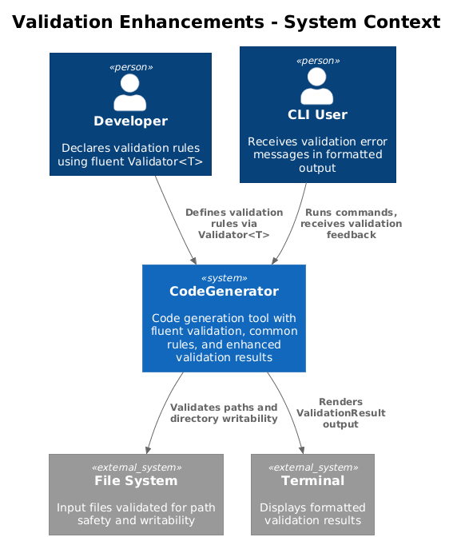
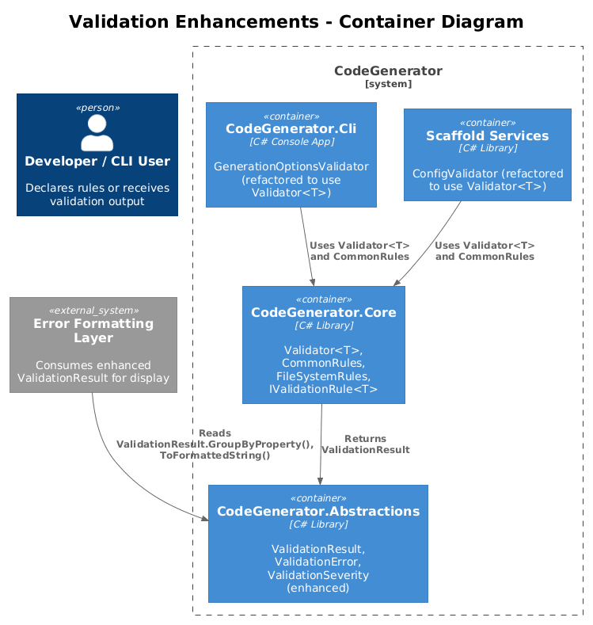
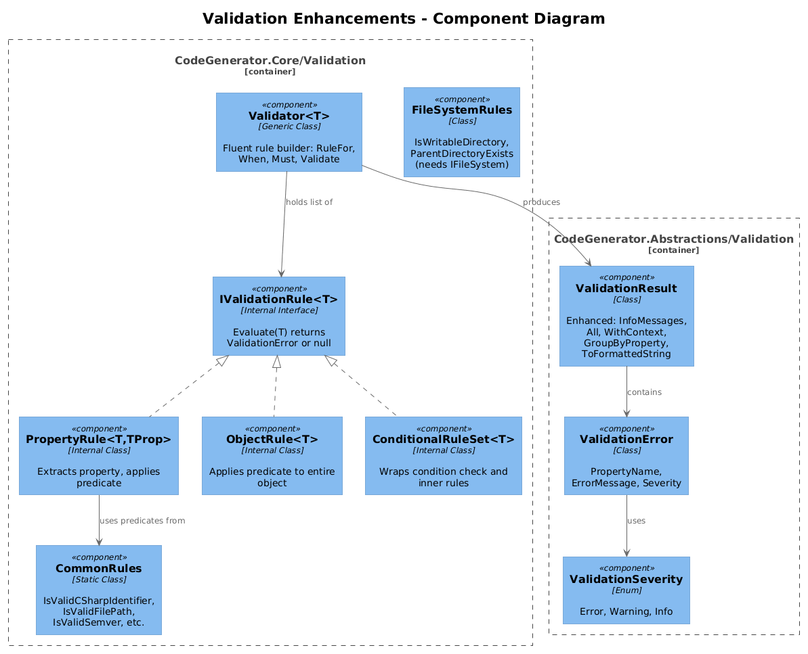
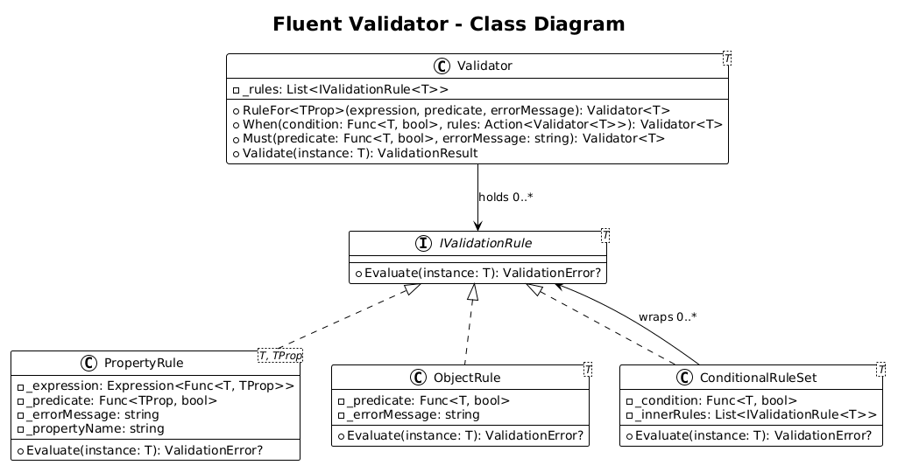
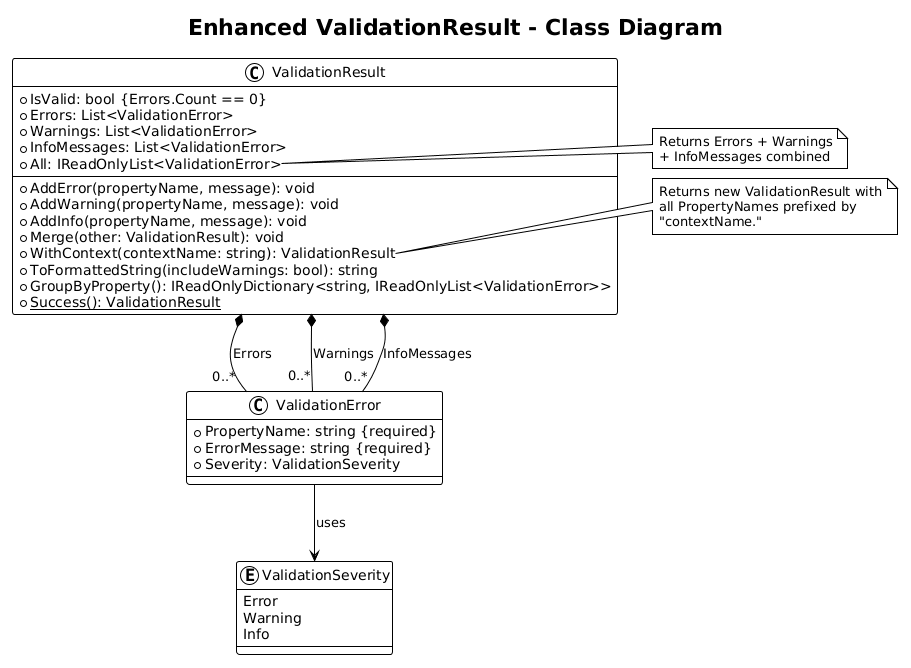
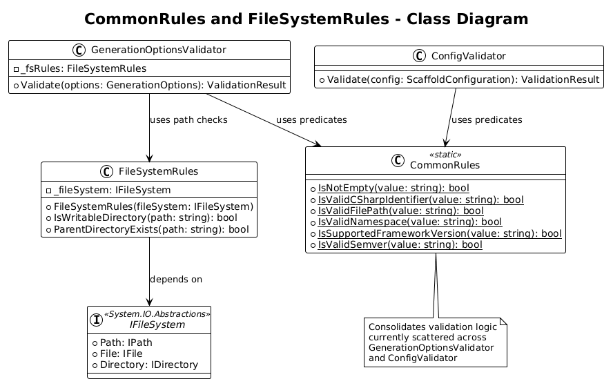
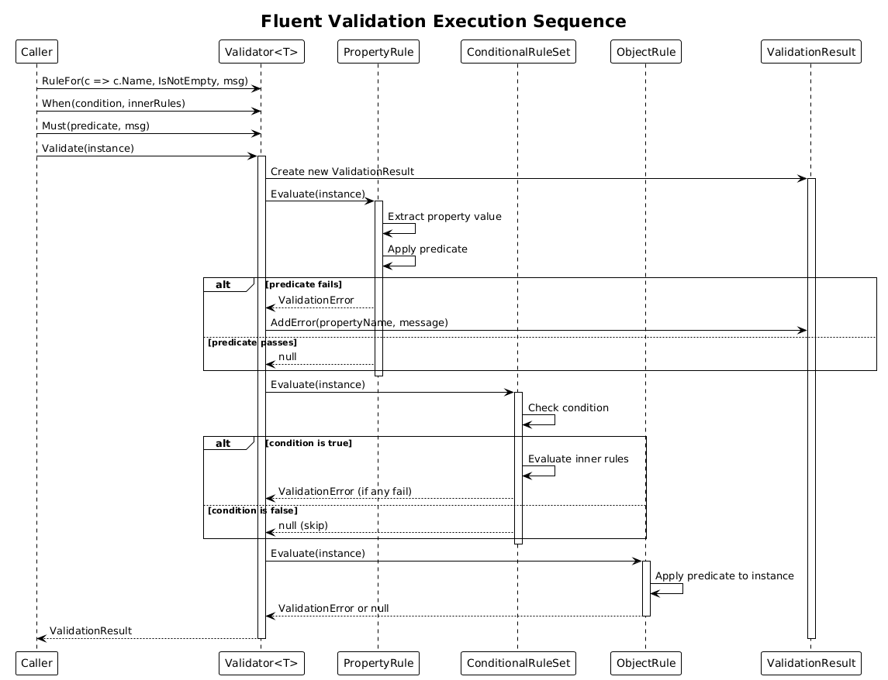
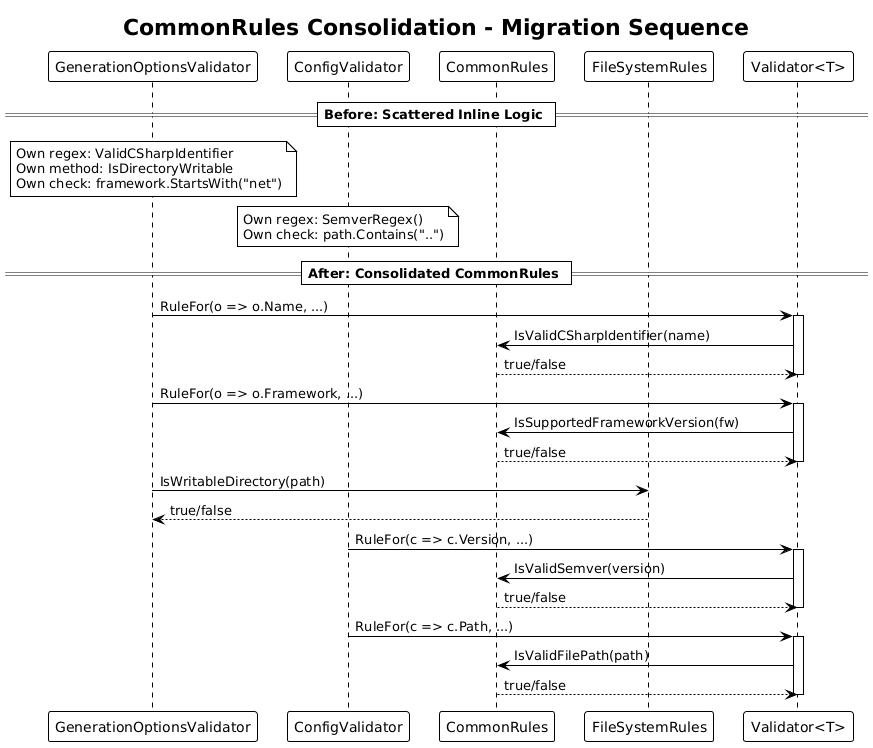
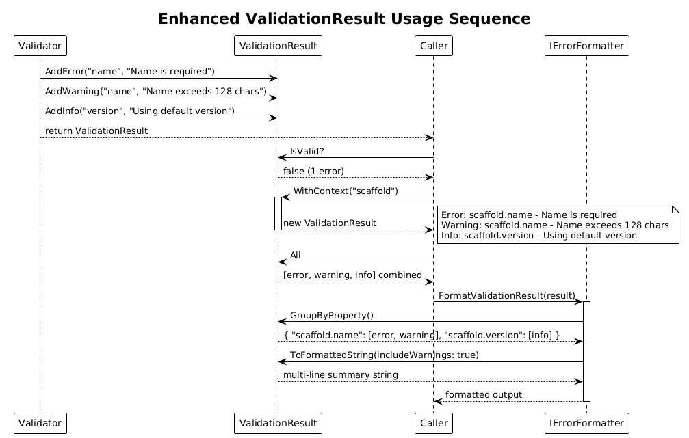

# Validation Enhancements - Detailed Design

**Feature:** 55-validation-enhancements
**Status:** Proposed
**Phase:** 5 (Error Handling Plan - Sections 3.13, 3.14, 3.15)

---

## 1. Overview

This design introduces a fluent `Validator<T>` builder, a `CommonRules` utility class that consolidates scattered validation logic, and enhancements to the existing `ValidationResult` type. Together these components replace the ad-hoc validation code in `GenerationOptionsValidator`, `ConfigValidator`, and model-level validators with a composable, reusable, and testable validation framework.

### Purpose

- Provide a fluent API for declaring property-level and object-level validation rules, eliminating manual `if/else` chains.
- Consolidate common validation predicates (C# identifier check, file path safety, namespace format, framework version, writable directory) into a single `CommonRules` static class.
- Extend `ValidationResult` with informational messages, grouping, context prefixing, and formatted output to support richer error reporting downstream (Feature 54).

### Actors

| Actor | Description |
|-------|-------------|
| **Developer** | Uses the fluent `Validator<T>` to declare validation rules for new model types |
| **CLI Layer** | Calls validators and reads enhanced `ValidationResult` for display |
| **Error Formatting Layer** | Consumes `ValidationResult.ToFormattedString()` and `GroupByProperty()` for rendering |

### Scope

This design covers changes in `CodeGenerator.Abstractions` (`ValidationResult`, `ValidationError`, `ValidationSeverity`) and new types in `CodeGenerator.Core/Validation/` (`Validator<T>`, `CommonRules`). It does not cover the error formatter implementations (Feature 54) or strategy-level error isolation (Feature 56).

---

## 2. Architecture

### 2.1 C4 Context Diagram

Shows the validation enhancements within the broader system.



### 2.2 C4 Container Diagram

Logical containers affected by this feature.



### 2.3 C4 Component Diagram

Internal components and their relationships.



---

## 3. Component Details

### 3.1 Fluent Validator\<T\> Builder

- **Location:** `CodeGenerator.Core/Validation/Validator.cs`
- **Responsibility:** Provide a fluent API for declaring validation rules against a typed model.
- **Key methods:**
  - `RuleFor<TProp>(Expression<Func<T, TProp>> expression, Func<TProp, bool> predicate, string errorMessage)` - declares a property-level rule. The expression is used to extract the property name automatically.
  - `When(Func<T, bool> condition, Action<Validator<T>> rules)` - conditionally applies a set of rules only when the condition is true.
  - `Must(Func<T, bool> predicate, string errorMessage)` - declares an object-level rule that considers the entire instance.
  - `Validate(T instance)` - executes all declared rules and returns a `ValidationResult`.
- **Internal storage:** A `List<IValidationRule<T>>` holds all declared rules. Each rule is an internal record implementing `IValidationRule<T>`.
- **Thread safety:** `Validator<T>` instances are intended to be created per-validation-call (not shared). The rules list is built during construction and not modified after `Validate()` is called.

**Usage example:**

```csharp
var validator = new Validator<ScaffoldConfiguration>();
validator.RuleFor(c => c.Name, CommonRules.IsNotEmpty, "Configuration name is required.");
validator.RuleFor(c => c.Version, CommonRules.IsValidSemver, "Invalid semver format.");
validator.When(c => c.Projects.Count > 0, v => {
    v.Must(c => c.Projects.All(p => !string.IsNullOrWhiteSpace(p.Name)),
        "All projects must have a name.");
});
var result = validator.Validate(config);
```

### 3.2 IValidationRule\<T\> (Internal)

- **Location:** `CodeGenerator.Core/Validation/IValidationRule.cs` (internal)
- **Responsibility:** Define the contract for a single validation rule.
- **Method:** `ValidationError? Evaluate(T instance)` - returns null if the rule passes, or a `ValidationError` if it fails.
- **Implementations:**
  - `PropertyRule<T, TProp>` - extracts property value, applies predicate.
  - `ObjectRule<T>` - applies predicate to the entire object.
  - `ConditionalRuleSet<T>` - wraps a condition and a list of inner rules.

### 3.3 CommonRules Static Class

- **Location:** `CodeGenerator.Core/Validation/CommonRules.cs`
- **Responsibility:** Centralize reusable validation predicates that are currently scattered across `GenerationOptionsValidator` and `ConfigValidator`.
- **Methods:**

| Method | Signature | Consolidates From |
|--------|-----------|-------------------|
| `IsNotEmpty` | `Func<string, bool>` | Multiple validators |
| `IsValidCSharpIdentifier` | `Func<string, bool>` | `GenerationOptionsValidator.ValidCSharpIdentifier` regex |
| `IsValidFilePath` | `Func<string, bool>` | `ConfigValidator.ValidateDirectoryPaths` (path traversal check) |
| `IsValidNamespace` | `Func<string, bool>` | New - dot-separated C# identifiers |
| `IsSupportedFrameworkVersion` | `Func<string, bool>` | `GenerationOptionsValidator.ValidateFramework` |
| `IsValidSemver` | `Func<string, bool>` | `ConfigValidator.SemverRegex` |
| `IsWritableDirectory` | `Func<string, bool>` | `GenerationOptionsValidator.IsDirectoryWritable` |

- **Design decision:** Methods are `Func<TInput, bool>` delegates so they can be passed directly to `RuleFor()` as predicates. Methods that need `IFileSystem` (like `IsWritableDirectory`) are instance methods on a `CommonRules` class that takes `IFileSystem` in its constructor.

**Revised design:**

```csharp
public static class CommonRules
{
    // Pure predicates (no dependencies)
    public static bool IsNotEmpty(string value) => !string.IsNullOrWhiteSpace(value);
    public static bool IsValidCSharpIdentifier(string value) => ...;
    public static bool IsValidFilePath(string value) => ...;
    public static bool IsValidNamespace(string value) => ...;
    public static bool IsSupportedFrameworkVersion(string value) => ...;
    public static bool IsValidSemver(string value) => ...;
}

public class FileSystemRules
{
    private readonly IFileSystem _fileSystem;
    public FileSystemRules(IFileSystem fileSystem) => _fileSystem = fileSystem;
    public bool IsWritableDirectory(string path) => ...;
    public bool ParentDirectoryExists(string path) => ...;
}
```

### 3.4 ValidationResult Enhancements

- **Location:** `CodeGenerator.Abstractions/Validation/ValidationResult.cs` (existing)
- **Changes to existing class:**

| Addition | Type | Description |
|----------|------|-------------|
| `InfoMessages` | `List<ValidationError>` | Informational messages (severity = Info) |
| `All` | `IReadOnlyList<ValidationError>` (property) | Returns `Errors + Warnings + InfoMessages` combined |
| `AddInfo(propertyName, message)` | Method | Adds an info-severity entry to `InfoMessages` |
| `WithContext(contextName)` | Method returning `ValidationResult` | Returns a new result with all property names prefixed by `contextName.` |
| `ToFormattedString(includeWarnings)` | Method returning `string` | Human-readable multi-line summary |
| `GroupByProperty()` | Method returning `IReadOnlyDictionary<string, IReadOnlyList<ValidationError>>` | Groups all entries by property name for display |

- **Backward compatibility:** All additions are non-breaking. `IsValid` continues to check only `Errors.Count == 0`. Existing `Merge()` is updated to also merge `InfoMessages`.

### 3.5 ValidationSeverity Enum Enhancement

- **Location:** `CodeGenerator.Abstractions/Validation/ValidationSeverity.cs` (existing)
- **Change:** Add `Info` value.

```csharp
public enum ValidationSeverity
{
    Error,
    Warning,
    Info,
}
```

### 3.6 Refactored Validators

Once `Validator<T>` and `CommonRules` are available, the existing validators can be refactored:

**GenerationOptionsValidator** (before):
```csharp
// Manual if/else chains with inline regex
private static readonly Regex ValidCSharpIdentifier = new(@"^[A-Za-z_][A-Za-z0-9_.]*$");
private void ValidateName(string name, ValidationResult result) {
    if (string.IsNullOrWhiteSpace(name)) { result.AddError(...); return; }
    if (!ValidCSharpIdentifier.IsMatch(name)) { result.AddError(...); }
}
```

**GenerationOptionsValidator** (after):
```csharp
public ValidationResult Validate(GenerationOptions options)
{
    var v = new Validator<GenerationOptions>();
    v.RuleFor(o => o.Name, CommonRules.IsNotEmpty, "Solution name is required.");
    v.RuleFor(o => o.Name, CommonRules.IsValidCSharpIdentifier,
        "Must start with a letter or underscore, followed by letters, digits, underscores, or dots.");
    v.RuleFor(o => o.Framework, CommonRules.IsNotEmpty, "Target framework is required.");
    v.RuleFor(o => o.Framework, CommonRules.IsSupportedFrameworkVersion,
        "Must start with 'net' (e.g., 'net8.0', 'net9.0').");
    return v.Validate(options);
}
```

---

## 4. Data Model

### 4.1 Validator Class Diagram



### 4.2 Enhanced ValidationResult Class Diagram



### 4.3 CommonRules Class Diagram



---

## 5. Key Workflows

### 5.1 Fluent Validation Execution



**Steps:**
1. Caller creates a `Validator<T>` and declares rules via `RuleFor`, `When`, `Must`.
2. Caller calls `Validate(instance)`.
3. Validator iterates over all declared rules.
4. Each rule evaluates its predicate against the instance (or its property).
5. Failed rules produce `ValidationError` entries added to the result.
6. Conditional rules (`When`) first check the condition; if false, inner rules are skipped.
7. Final `ValidationResult` is returned with all errors, warnings, and info messages.

### 5.2 CommonRules Consolidation



**Steps:**
1. `GenerationOptionsValidator` references `CommonRules.IsValidCSharpIdentifier` instead of its own regex.
2. `ConfigValidator` references `CommonRules.IsValidSemver` instead of its own `SemverRegex()`.
3. `ConfigValidator` references `CommonRules.IsValidFilePath` instead of inline `path.Contains("..")`.
4. `FileSystemRules.IsWritableDirectory` replaces the private method in `GenerationOptionsValidator`.
5. New validators for PlantUML models also use `CommonRules` predicates.

### 5.3 ValidationResult Enhancement Usage



**Steps:**
1. Validator produces a `ValidationResult` with errors, warnings, and info messages.
2. Caller checks `result.IsValid` (only errors count).
3. Caller calls `result.WithContext("scaffold")` to prefix property names.
4. Error formatter calls `result.GroupByProperty()` to render errors grouped by field.
5. Error formatter calls `result.ToFormattedString(includeWarnings: true)` for human-readable output.
6. `result.All` returns the combined list for full iteration.

---

## 6. Migration Strategy

The refactoring of existing validators should proceed incrementally:

1. **Step 1:** Add `Info` to `ValidationSeverity` and new members to `ValidationResult`. These are non-breaking additions.
2. **Step 2:** Implement `Validator<T>` and `CommonRules` as new types. No existing code changes yet.
3. **Step 3:** Refactor `GenerationOptionsValidator` to use `Validator<T>` and `CommonRules`. Update unit tests.
4. **Step 4:** Refactor `ConfigValidator` to use `Validator<T>` and `CommonRules`. Update unit tests.
5. **Step 5:** Apply `Validator<T>` to PlantUML model validators and other model types as needed.

Each step can be an independent PR with its own test coverage.

---

## 7. Open Questions

| # | Question | Options | Status |
|---|----------|---------|--------|
| 1 | Should `Validator<T>` support async rules (e.g., checking remote resources)? | Sync only vs. `ValidateAsync` overload | Open |
| 2 | Should `RuleFor` support chaining (e.g., `RuleFor(...).WithMessage(...).WithSeverity(...)`)? | Current simple API vs. fluent chain | Open |
| 3 | Should `CommonRules` regex patterns be exposed as public constants for reuse in tests? | Public constants vs. encapsulated | Open |
| 4 | Should `WithContext` mutate in place or return a new instance? | Immutable (new instance) preferred for safety | Leaning immutable |
| 5 | Should `Validator<T>` support rule dependencies (rule B only runs if rule A passed)? | Independent rules vs. dependent chains | Open |
| 6 | Should `FileSystemRules` be registered in DI or created manually? | DI registration vs. manual construction | Open |
