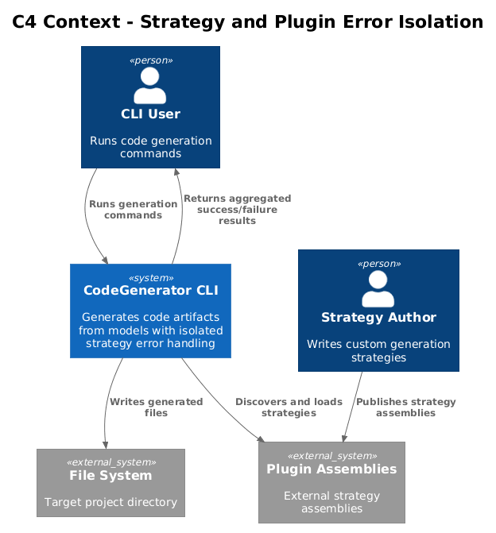
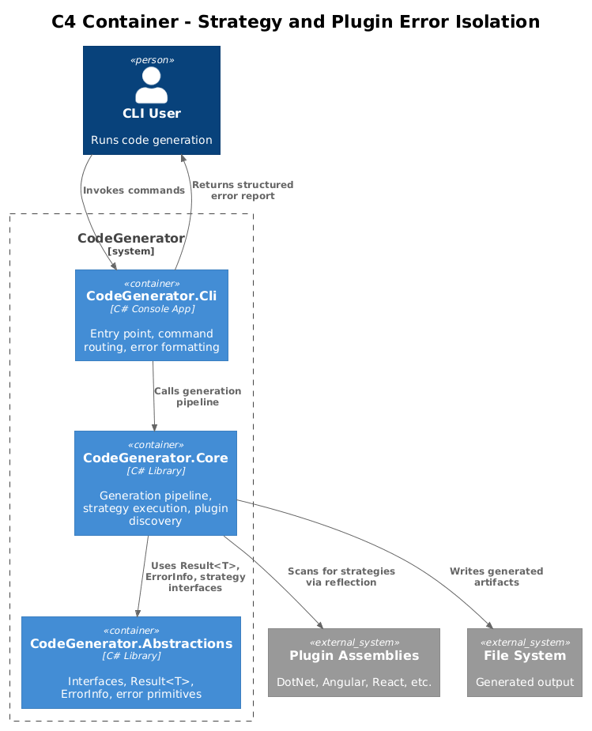
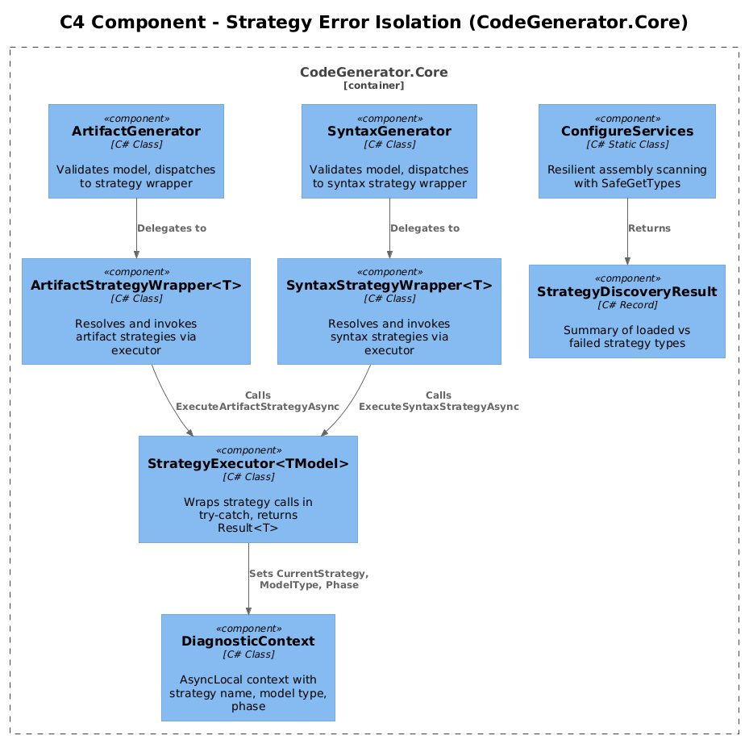
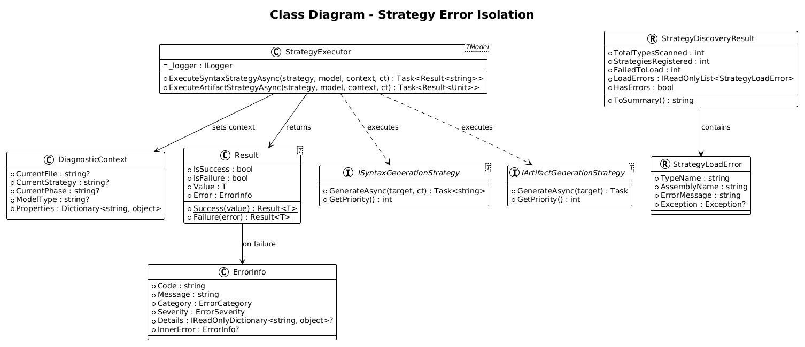
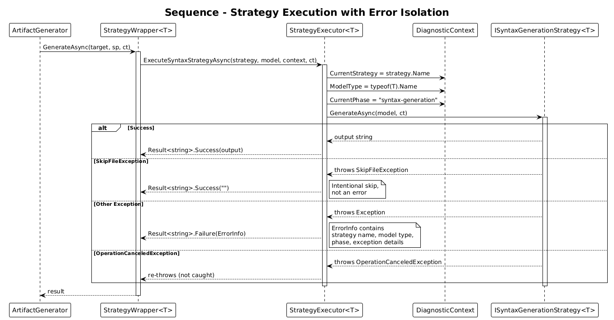
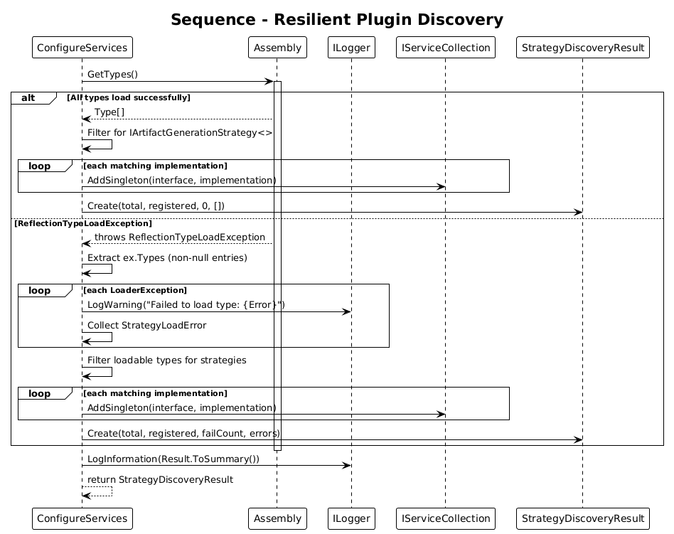
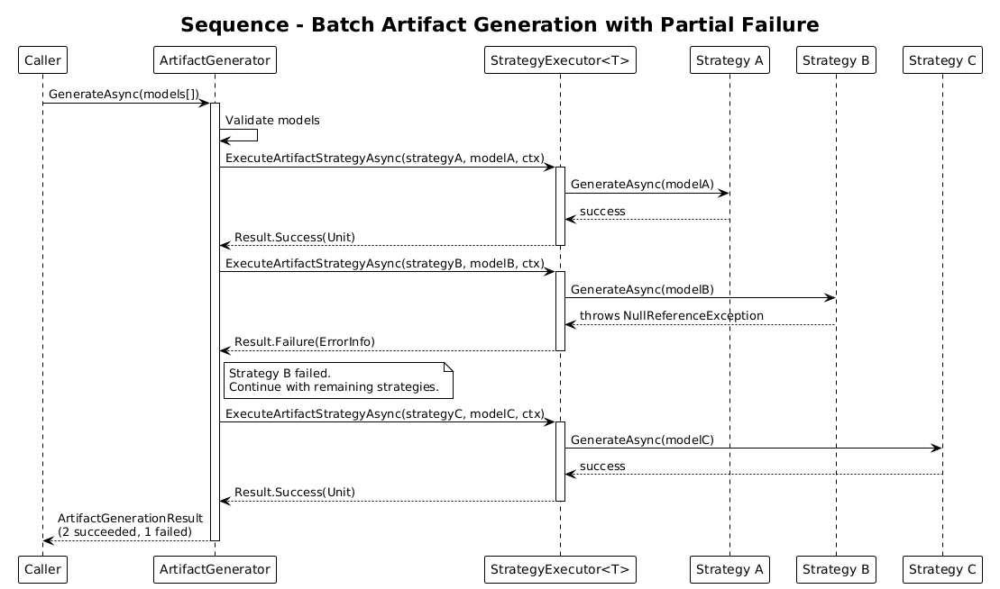

# Strategy and Plugin Error Isolation - Detailed Design

**Feature:** 56-strategy-plugin-error-isolation (Error Handling Plan Phase 6)
**Status:** Draft
**Context:** The CodeGenerator pipeline currently has no error isolation between individual generation strategies. A single broken `IArtifactGenerationStrategy` or `ISyntaxGenerationStrategy` crashes the entire generation run. Similarly, `ConfigureServices.cs` calls `assembly.GetTypes()` without catching `ReflectionTypeLoadException`, so a single unloadable type prevents discovery of all strategies in that assembly.

---

## 1. Overview

### Problem

1. **No per-strategy error isolation:** `ArtifactGenerationStrategyWrapperImplementation<T>` calls `handler.GenerateAsync(target)` with no try-catch. If a strategy throws, the exception propagates up to the caller, aborting the entire pipeline. In batch scenarios (generating 20+ artifacts from a single model), one broken strategy kills all remaining work.

2. **SkipFileException treated as error path:** `SkipFileException` is a legitimate control-flow signal used for conditional file generation. Without explicit handling in the execution wrapper, it would be caught by a generic catch block and incorrectly reported as a failure.

3. **No diagnostic context on failures:** When a strategy fails, there is no structured information about which strategy, which model type, or which generation phase was active. Debugging requires reading raw stack traces.

4. **Fragile plugin discovery:** `ConfigureServices.AddArifactGenerator()` and `AddSyntaxGenerator()` both call `assembly.GetTypes()` directly. If any type in the assembly has unresolvable dependencies (missing assembly references, broken static constructors), a `ReflectionTypeLoadException` is thrown and zero strategies are registered from that assembly.

### Goal

- Wrap every strategy execution in a protective boundary that captures failures as `Result<string>` values instead of letting exceptions propagate.
- Handle `SkipFileException` as an intentional skip (success with empty output), not an error.
- Enrich every failure with structured diagnostic context: strategy name, model type, generation phase.
- Make plugin discovery resilient to partial type-load failures, logging warnings for unloadable types while continuing to register the rest.

### Actors

| Actor | Description |
|-------|-------------|
| **CLI User** | Runs code generation and expects a summary of successes and failures, not a crash |
| **Strategy Author** | Writes custom strategies that may have bugs; expects isolated failure reporting |
| **CI Pipeline** | Needs aggregated error information to determine pass/fail status |
| **Plugin Developer** | Deploys assemblies that may have missing dependencies; expects graceful degradation |

### Scope

- `StrategyExecutor<TModel>` class in `CodeGenerator.Core/Artifacts/`
- `StrategyDiscoveryResult` record in `CodeGenerator.Core/Artifacts/`
- Modifications to `ArtifactGenerator` and `SyntaxGenerator` to use the executor
- Modifications to `ConfigureServices.cs` for resilient type scanning
- Integration with `Result<T>`, `ErrorInfo`, and `DiagnosticContext` from Features 51 and 54

### Out of Scope

- Retry logic for failed strategies (covered in Feature 53)
- User-facing error formatting (covered in Feature 54)
- Result type primitives themselves (covered in Feature 51)

---

## 2. Architecture

### 2.1 C4 Context Diagram

Shows how the CLI user interacts with code generation and receives isolated error feedback instead of crashes.



### 2.2 C4 Container Diagram

The strategy error isolation layer sits within the Core package, wrapping the existing strategy dispatch mechanism.



### 2.3 C4 Component Diagram

Internal components showing how StrategyExecutor, ArtifactGenerator, SyntaxGenerator, and ConfigureServices interact.



---

## 3. Component Details

### 3.1 StrategyExecutor&lt;TModel&gt;

**Location:** `CodeGenerator.Core/Artifacts/StrategyExecutor.cs`

The executor wraps individual strategy calls in a try-catch boundary, converting exceptions into `Result<T>` values.

```csharp
public class StrategyExecutor<TModel>
{
    private readonly ILogger<StrategyExecutor<TModel>> _logger;

    public StrategyExecutor(ILogger<StrategyExecutor<TModel>> logger)
    {
        _logger = logger;
    }

    public async Task<Result<string>> ExecuteSyntaxStrategyAsync(
        ISyntaxGenerationStrategy<TModel> strategy,
        TModel model,
        DiagnosticContext context,
        CancellationToken cancellationToken = default)
    {
        var strategyName = strategy.GetType().Name;
        context.CurrentStrategy = strategyName;
        context.ModelType = typeof(TModel).Name;
        context.CurrentPhase = "syntax-generation";

        try
        {
            _logger.LogDebug(
                "Executing syntax strategy {Strategy} for {Model}",
                strategyName, typeof(TModel).Name);

            var output = await strategy.GenerateAsync(model, cancellationToken);
            return Result<string>.Success(output);
        }
        catch (SkipFileException ex)
        {
            _logger.LogDebug(
                "Strategy {Strategy} signaled skip: {Reason}",
                strategyName, ex.Message);
            return Result<string>.Success(string.Empty);
        }
        catch (OperationCanceledException)
        {
            throw; // Do not swallow cancellation
        }
        catch (Exception ex)
        {
            _logger.LogWarning(ex,
                "Strategy {Strategy} failed for model {Model}",
                strategyName, typeof(TModel).Name);

            return Result<string>.Failure(new ErrorInfo
            {
                Code = ErrorCodes.StrategyExecutionFailed,
                Message = $"Strategy '{strategyName}' failed for model " +
                          $"'{typeof(TModel).Name}': {ex.Message}",
                Category = ErrorCategory.Plugin,
                Severity = ErrorSeverity.Error,
                Details = new Dictionary<string, object>
                {
                    ["strategyName"] = strategyName,
                    ["modelType"] = typeof(TModel).Name,
                    ["phase"] = "syntax-generation",
                    ["exceptionType"] = ex.GetType().Name
                },
                InnerError = ErrorInfo.FromException(ex)
            });
        }
    }

    public async Task<Result<Unit>> ExecuteArtifactStrategyAsync(
        IArtifactGenerationStrategy<TModel> strategy,
        TModel model,
        DiagnosticContext context,
        CancellationToken cancellationToken = default)
    {
        var strategyName = strategy.GetType().Name;
        context.CurrentStrategy = strategyName;
        context.ModelType = typeof(TModel).Name;
        context.CurrentPhase = "artifact-generation";

        try
        {
            _logger.LogDebug(
                "Executing artifact strategy {Strategy} for {Model}",
                strategyName, typeof(TModel).Name);

            await strategy.GenerateAsync(model);
            return Result<Unit>.Success(Unit.Value);
        }
        catch (SkipFileException ex)
        {
            _logger.LogDebug(
                "Strategy {Strategy} signaled skip: {Reason}",
                strategyName, ex.Message);
            return Result<Unit>.Success(Unit.Value);
        }
        catch (OperationCanceledException)
        {
            throw;
        }
        catch (Exception ex)
        {
            _logger.LogWarning(ex,
                "Strategy {Strategy} failed for model {Model}",
                strategyName, typeof(TModel).Name);

            return Result<Unit>.Failure(new ErrorInfo
            {
                Code = ErrorCodes.StrategyExecutionFailed,
                Message = $"Strategy '{strategyName}' failed for model " +
                          $"'{typeof(TModel).Name}': {ex.Message}",
                Category = ErrorCategory.Plugin,
                Severity = ErrorSeverity.Error,
                Details = new Dictionary<string, object>
                {
                    ["strategyName"] = strategyName,
                    ["modelType"] = typeof(TModel).Name,
                    ["phase"] = "artifact-generation",
                    ["exceptionType"] = ex.GetType().Name
                },
                InnerError = ErrorInfo.FromException(ex)
            });
        }
    }
}
```

**Key design decisions:**

- `OperationCanceledException` is always re-thrown -- cancellation is not a strategy error.
- `SkipFileException` returns `Result.Success(empty)` -- it is intentional control flow, not a failure.
- All other exceptions are caught and wrapped in `Result.Failure` with full context.
- `DiagnosticContext` is mutated before execution so that if the strategy throws synchronously before the catch, the context is still set for upstream handlers.

### 3.2 StrategyDiscoveryResult

**Location:** `CodeGenerator.Core/Artifacts/StrategyDiscoveryResult.cs`

```csharp
public record StrategyDiscoveryResult
{
    public int TotalTypesScanned { get; init; }
    public int StrategiesRegistered { get; init; }
    public int FailedToLoad { get; init; }
    public IReadOnlyList<StrategyLoadError> LoadErrors { get; init; }
        = Array.Empty<StrategyLoadError>();

    public bool HasErrors => FailedToLoad > 0;

    public string ToSummary() =>
        HasErrors
            ? $"Loaded {StrategiesRegistered}/{TotalTypesScanned} strategies. " +
              $"{FailedToLoad} failed to load (run with --verbose for details)."
            : $"Loaded {StrategiesRegistered} strategies successfully.";
}

public record StrategyLoadError(
    string TypeName,
    string AssemblyName,
    string ErrorMessage,
    Exception? Exception = null);
```

### 3.3 Resilient Plugin Discovery in ConfigureServices

**Location:** `CodeGenerator.Core/ConfigureServices.cs`

The existing `AddArifactGenerator` and `AddSyntaxGenerator` methods are modified to use a shared helper that safely scans types.

```csharp
private static (List<Type> types, List<StrategyLoadError> errors) SafeGetTypes(
    Assembly assembly, ILogger? logger = null)
{
    var loadErrors = new List<StrategyLoadError>();

    try
    {
        return (assembly.GetTypes().ToList(), loadErrors);
    }
    catch (ReflectionTypeLoadException ex)
    {
        var loadableTypes = ex.Types
            .Where(t => t != null)
            .Cast<Type>()
            .ToList();

        foreach (var loaderException in ex.LoaderExceptions)
        {
            if (loaderException == null) continue;

            var error = new StrategyLoadError(
                TypeName: loaderException is TypeLoadException tle
                    ? tle.TypeName
                    : "Unknown",
                AssemblyName: assembly.GetName().Name ?? "Unknown",
                ErrorMessage: loaderException.Message,
                Exception: loaderException);

            loadErrors.Add(error);

            logger?.LogWarning(
                "Failed to load type from {Assembly}: {Error}",
                assembly.GetName().Name, loaderException.Message);
        }

        return (loadableTypes, loadErrors);
    }
}
```

The `AddArifactGenerator` method becomes:

```csharp
public static StrategyDiscoveryResult AddArifactGenerator(
    this IServiceCollection services,
    Assembly assembly,
    ILogger? logger = null)
{
    var @interface = typeof(IArtifactGenerationStrategy<>);
    var (allTypes, loadErrors) = SafeGetTypes(assembly, logger);

    var implementations = allTypes
        .Where(type =>
            !type.IsAbstract &&
            type.GetInterfaces().Any(interfaceType =>
                interfaceType.IsGenericType &&
                interfaceType.GetGenericTypeDefinition() == @interface))
        .ToList();

    foreach (var implementation in implementations)
    {
        foreach (var implementedInterface in implementation.GetInterfaces())
        {
            if (implementedInterface.IsGenericType &&
                implementedInterface.GetGenericTypeDefinition() == @interface)
            {
                services.AddSingleton(implementedInterface, implementation);
            }
        }
    }

    services.AddSingleton<IObjectCache, ObjectCache>();
    services.AddSingleton<IArtifactGenerator, ArtifactGenerator>();

    return new StrategyDiscoveryResult
    {
        TotalTypesScanned = allTypes.Count + loadErrors.Count,
        StrategiesRegistered = implementations.Count,
        FailedToLoad = loadErrors.Count,
        LoadErrors = loadErrors
    };
}
```

### 3.4 Integration with ArtifactGenerator

The `ArtifactGenerationStrategyWrapperImplementation<T>` is modified to use `StrategyExecutor<T>`:

```csharp
public override async Task GenerateAsync(
    T target,
    IServiceProvider serviceProvider,
    CancellationToken cancellationToken)
{
    var handlers = serviceProvider
        .GetRequiredService<IEnumerable<IArtifactGenerationStrategy<T>>>();
    var executor = serviceProvider
        .GetRequiredService<StrategyExecutor<T>>();
    var context = serviceProvider
        .GetRequiredService<DiagnosticContext>();

    var handler = handlers
        .Where(x => x.CanHandle(target!))
        .OrderByDescending(x => x.GetPriority())
        .First();

    var result = await executor.ExecuteArtifactStrategyAsync(
        handler, target, context, cancellationToken);

    if (result.IsFailure)
    {
        throw new CliPluginException(
            result.Error.Message,
            result.Error.InnerError?.StackTrace);
    }
}
```

### 3.5 Integration with SyntaxGenerator

The `SyntaxGenerationStrategyWrapperImplementation<T>` receives the same treatment. The `SyntaxGenerator.GenerateAsync<T>` method is updated to return `Result<string>` (or alternatively keep the existing signature and unwrap the result for backward compatibility during migration).

```csharp
public Task<string> GenerateAsync<T>(T model)
{
    // ... validation unchanged ...

    var handler = _syntaxGenerators.GetOrAdd(model!.GetType(), ...);

    // Internally, the wrapper now uses StrategyExecutor
    return handler.GenerateAsync(_serviceProvider, model, default);
}
```

---

## 4. Data Model

### 4.1 Class Diagram

Shows the relationships between StrategyExecutor, StrategyDiscoveryResult, and existing types.



---

## 5. Key Workflows

### 5.1 Strategy Execution with Error Isolation

Shows the sequence of calls when a strategy is executed and either succeeds, skips, or fails.



### 5.2 Resilient Plugin Discovery

Shows the sequence of calls during assembly scanning when some types fail to load.



### 5.3 Batch Artifact Generation with Partial Failure

Shows how multiple artifacts are generated when one strategy fails but others succeed.



---

## 6. Error Codes

| Code | Constant | When |
|------|----------|------|
| `PLUGIN_STRATEGY_EXEC_FAILED` | `ErrorCodes.StrategyExecutionFailed` | A strategy threw an unhandled exception during execution |
| `PLUGIN_LOAD_FAILED` | `ErrorCodes.PluginLoadFailed` | A type failed to load during assembly scanning |
| `PLUGIN_STRATEGY_NOT_FOUND` | `ErrorCodes.StrategyNotFound` | No strategy found for the given model type |

---

## 7. DI Registration

```csharp
// In ConfigureServices.AddCoreServices:
services.AddSingleton(typeof(StrategyExecutor<>));
```

The `StrategyExecutor<TModel>` is registered as an open generic singleton. The DI container resolves `StrategyExecutor<ConcreteModel>` automatically when requested.

---

## 8. Testing Strategy

| Test | Type | Description |
|------|------|-------------|
| Strategy succeeds | Unit | Verify `Result.Success` with correct output |
| Strategy throws | Unit | Verify `Result.Failure` with correct ErrorInfo fields |
| Strategy throws SkipFileException | Unit | Verify `Result.Success(empty)`, not failure |
| Strategy throws OperationCanceledException | Unit | Verify exception propagates (not caught) |
| ErrorInfo contains strategy name | Unit | Verify Details dictionary has `strategyName` |
| ErrorInfo contains model type | Unit | Verify Details dictionary has `modelType` |
| SafeGetTypes with clean assembly | Unit | Verify all types returned, no errors |
| SafeGetTypes with broken types | Unit | Verify loadable types returned, errors collected |
| StrategyDiscoveryResult.ToSummary | Unit | Verify message format for success and partial failure |
| Batch generation partial failure | Integration | Verify 18/20 succeed, 2 failures reported |

---

## 9. Open Questions

| # | Question | Status |
|---|----------|--------|
| 1 | Should `StrategyExecutor` support a `--fail-fast` flag that stops on first failure instead of collecting all errors? | Open - likely configurable via `GenerationOptions` |
| 2 | Should the executor record timing per strategy for performance diagnostics? | Open - useful but adds overhead |
| 3 | Should `SafeGetTypes` be extracted to a shared utility in `CodeGenerator.Abstractions` since multiple assemblies use the pattern? | Leaning yes |
| 4 | Should `StrategyDiscoveryResult` be surfaced in the CLI output by default or only with `--verbose`? | Leaning verbose-only for clean output |
