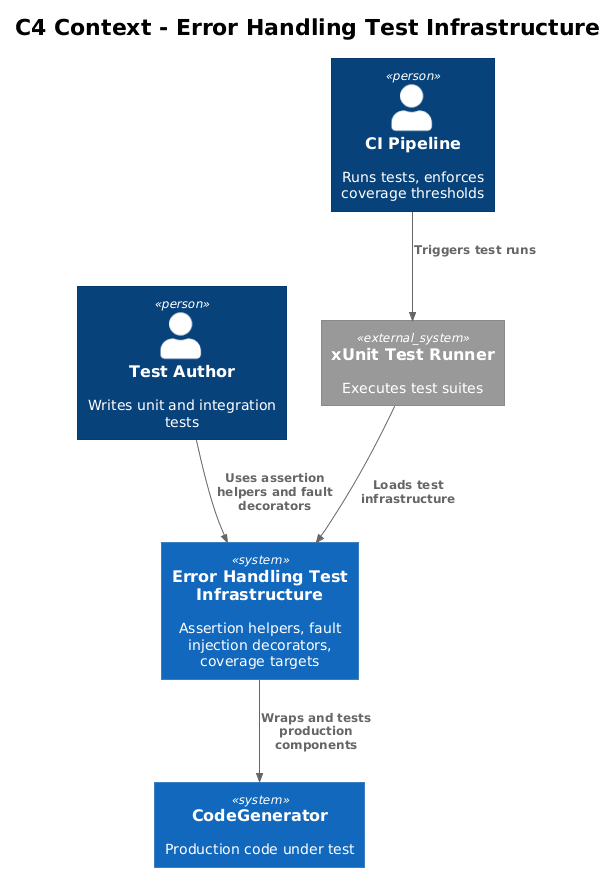
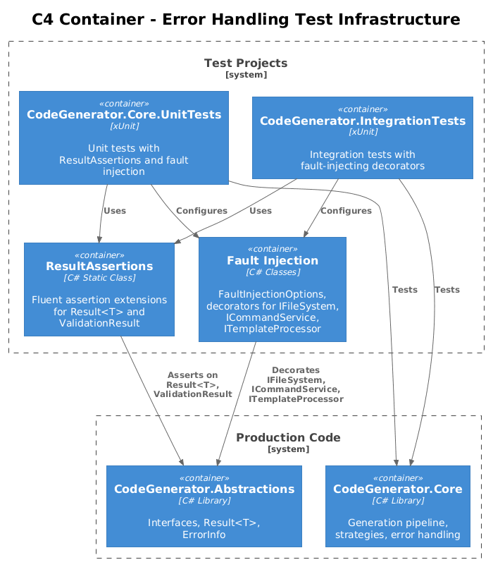
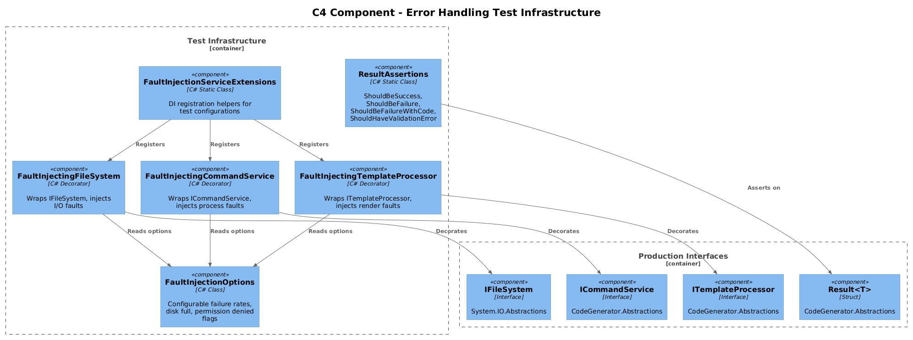
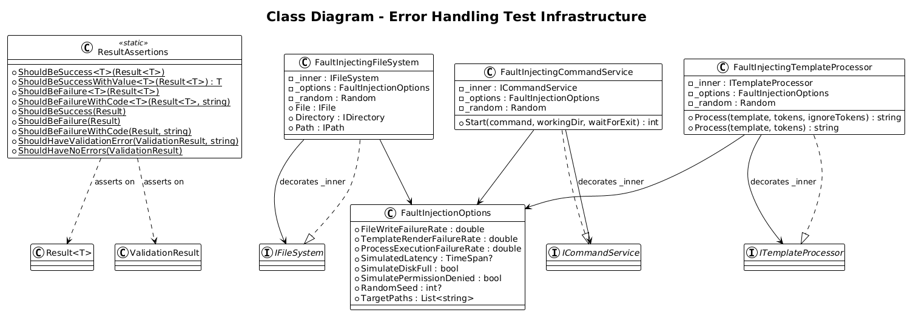
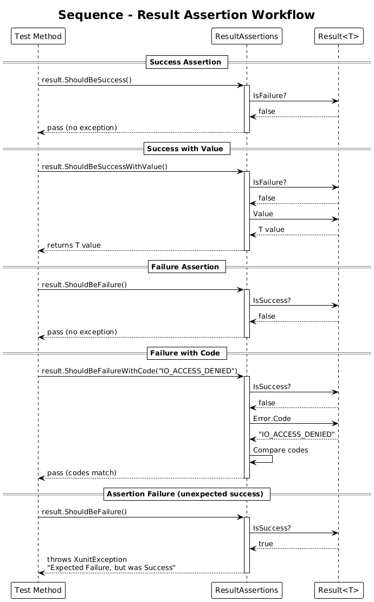
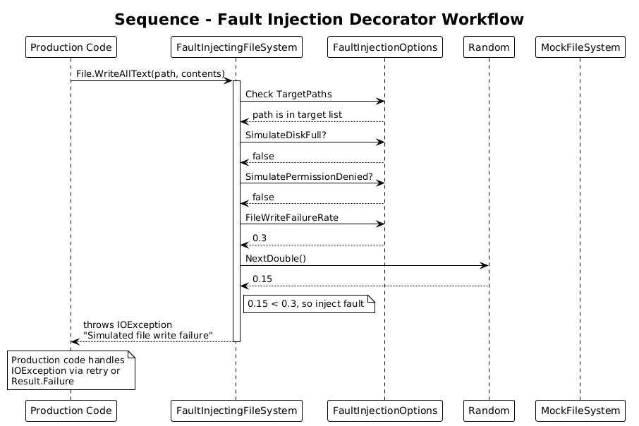
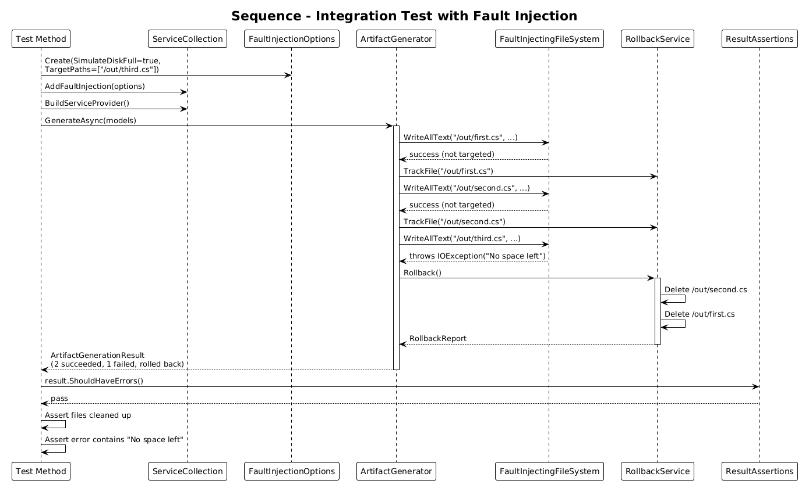

# Error Handling Test Infrastructure - Detailed Design

**Feature:** 57-error-handling-test-infrastructure (Error Handling Plan Phase 7)
**Status:** Draft
**Context:** The CodeGenerator test suite (56 unit tests, 419 integration tests) uses standard xUnit `Assert.True/False/Equal` patterns and has no specialized infrastructure for testing error handling. There are no `Result<T>` assertion helpers, no fault injection mechanisms, and no systematic coverage targets for the error handling subsystem introduced in Features 51-56.

---

## 1. Overview

### Problem

1. **No Result&lt;T&gt; assertion helpers:** Tests that verify `Result<T>` outcomes must manually check `IsSuccess`, `IsFailure`, extract `Error.Code`, and construct meaningful failure messages. This leads to verbose, repetitive test code and inconsistent error reporting when tests fail.

2. **No fault injection:** Integration tests run against the real `MockFileSystem` and `DryRunCommandService`, but cannot simulate partial failures (disk full, permission denied, template render errors). There is no way to verify that rollback, error aggregation, and graceful degradation work under fault conditions.

3. **No coverage targets:** The error handling system spans multiple components (Result types, exception hierarchy, validators, retry policies, strategy executor, rollback service, formatters) with no defined minimum coverage levels per component.

### Goal

- Provide fluent assertion extensions (`ShouldBeSuccess`, `ShouldBeFailure`, `ShouldBeFailureWithCode`, etc.) for `Result<T>` and `ValidationResult`.
- Define a test coverage requirements matrix with specific minimum percentages per error handling component.
- Create fault-injecting decorator classes (`FaultInjectingFileSystem`, `FaultInjectingCommandService`, `FaultInjectingTemplateProcessor`) that wrap real implementations and inject configurable failures for integration testing.

### Actors

| Actor | Description |
|-------|-------------|
| **Test Author** | Writes unit and integration tests for the error handling subsystem |
| **CI Pipeline** | Runs tests and enforces coverage thresholds |
| **Developer** | Adds new error handling features and needs to verify correctness |

### Scope

- `ResultAssertions` static class with extension methods
- `FaultInjectionOptions` configuration class
- `FaultInjectingFileSystem` decorator implementing `IFileSystem`
- `FaultInjectingCommandService` decorator implementing `ICommandService`
- `FaultInjectingTemplateProcessor` decorator implementing `ITemplateProcessor`
- Test coverage requirements matrix
- DI registration helpers for test configurations

### Out of Scope

- The `Result<T>` type itself (Feature 51)
- The `StrategyExecutor` being tested (Feature 56)
- Production error formatting (Feature 54)
- Performance/load testing

---

## 2. Architecture

### 2.1 C4 Context Diagram

Shows how the test infrastructure relates to the test runner and the production code being tested.



### 2.2 C4 Container Diagram

The test infrastructure lives in the test projects and wraps production interfaces with fault-injecting decorators.



### 2.3 C4 Component Diagram

Internal test infrastructure components and their relationships.



---

## 3. Component Details

### 3.1 ResultAssertions

**Location:** `tests/CodeGenerator.Core.UnitTests/Assertions/ResultAssertions.cs`

Fluent assertion extension methods for `Result<T>` and `ValidationResult`. These methods provide clear failure messages when assertions fail, including the actual error details.

```csharp
public static class ResultAssertions
{
    /// <summary>
    /// Asserts the result is a success. Throws with error details if it is a failure.
    /// </summary>
    public static void ShouldBeSuccess<T>(this Result<T> result)
    {
        if (result.IsFailure)
        {
            throw new XunitException(
                $"Expected Result<{typeof(T).Name}> to be Success, " +
                $"but was Failure: [{result.Error.Code}] {result.Error.Message}");
        }
    }

    /// <summary>
    /// Asserts the result is a success and returns the value for further assertions.
    /// </summary>
    public static T ShouldBeSuccessWithValue<T>(this Result<T> result)
    {
        result.ShouldBeSuccess();
        return result.Value;
    }

    /// <summary>
    /// Asserts the result is a failure.
    /// </summary>
    public static void ShouldBeFailure<T>(this Result<T> result)
    {
        if (result.IsSuccess)
        {
            throw new XunitException(
                $"Expected Result<{typeof(T).Name}> to be Failure, " +
                $"but was Success with value: {result.Value}");
        }
    }

    /// <summary>
    /// Asserts the result is a failure with a specific error code.
    /// </summary>
    public static void ShouldBeFailureWithCode<T>(
        this Result<T> result, string errorCode)
    {
        result.ShouldBeFailure();
        if (result.Error.Code != errorCode)
        {
            throw new XunitException(
                $"Expected error code '{errorCode}', " +
                $"but was '{result.Error.Code}': {result.Error.Message}");
        }
    }

    /// <summary>
    /// Asserts the non-generic Result is a success.
    /// </summary>
    public static void ShouldBeSuccess(this Result result)
    {
        if (result.IsFailure)
        {
            throw new XunitException(
                $"Expected Result to be Success, " +
                $"but was Failure: [{result.Error.Code}] {result.Error.Message}");
        }
    }

    /// <summary>
    /// Asserts the non-generic Result is a failure.
    /// </summary>
    public static void ShouldBeFailure(this Result result)
    {
        if (result.IsSuccess)
        {
            throw new XunitException(
                "Expected Result to be Failure, but was Success.");
        }
    }

    /// <summary>
    /// Asserts the non-generic Result is a failure with a specific error code.
    /// </summary>
    public static void ShouldBeFailureWithCode(
        this Result result, string errorCode)
    {
        result.ShouldBeFailure();
        if (result.Error.Code != errorCode)
        {
            throw new XunitException(
                $"Expected error code '{errorCode}', " +
                $"but was '{result.Error.Code}': {result.Error.Message}");
        }
    }

    /// <summary>
    /// Asserts the ValidationResult has an error for the specified property.
    /// </summary>
    public static void ShouldHaveValidationError(
        this ValidationResult result, string propertyName)
    {
        var hasError = result.Errors.Any(e =>
            string.Equals(e.PropertyName, propertyName,
                StringComparison.OrdinalIgnoreCase));

        if (!hasError)
        {
            var props = result.Errors.Select(e => e.PropertyName);
            throw new XunitException(
                $"Expected validation error for '{propertyName}', " +
                $"but errors were on: [{string.Join(", ", props)}]");
        }
    }

    /// <summary>
    /// Asserts the ValidationResult has no errors (warnings are allowed).
    /// </summary>
    public static void ShouldHaveNoErrors(this ValidationResult result)
    {
        if (!result.IsValid)
        {
            var messages = result.Errors
                .Select(e => $"  {e.PropertyName}: {e.ErrorMessage}");
            throw new XunitException(
                $"Expected no validation errors, but found {result.Errors.Count}:\n" +
                string.Join("\n", messages));
        }
    }
}
```

**Design decisions:**

- Extension methods on `Result<T>`, `Result`, and `ValidationResult` so tests read fluently: `result.ShouldBeSuccess()`.
- Failure messages always include the actual error details -- when a test fails, the developer immediately sees what went wrong without stepping through a debugger.
- `ShouldBeSuccessWithValue` returns the value so it can be chained: `var output = result.ShouldBeSuccessWithValue(); Assert.Contains("expected", output);`
- `XunitException` is used (not `Assert.True`) so xUnit reports the failure correctly with the custom message.

### 3.2 FaultInjectionOptions

**Location:** `tests/CodeGenerator.Core.UnitTests/FaultInjection/FaultInjectionOptions.cs`

Configurable options that control what faults the decorators inject and at what rate.

```csharp
public class FaultInjectionOptions
{
    /// <summary>
    /// Probability (0.0 to 1.0) that a file write operation will fail.
    /// </summary>
    public double FileWriteFailureRate { get; set; } = 0.0;

    /// <summary>
    /// Probability (0.0 to 1.0) that a template render operation will fail.
    /// </summary>
    public double TemplateRenderFailureRate { get; set; } = 0.0;

    /// <summary>
    /// Probability (0.0 to 1.0) that a process execution will fail.
    /// </summary>
    public double ProcessExecutionFailureRate { get; set; } = 0.0;

    /// <summary>
    /// If set, adds artificial latency to all I/O operations.
    /// </summary>
    public TimeSpan? SimulatedLatency { get; set; }

    /// <summary>
    /// If true, file write operations throw IOException("No space left on device").
    /// Overrides FileWriteFailureRate.
    /// </summary>
    public bool SimulateDiskFull { get; set; }

    /// <summary>
    /// If true, file operations throw UnauthorizedAccessException.
    /// Overrides FileWriteFailureRate.
    /// </summary>
    public bool SimulatePermissionDenied { get; set; }

    /// <summary>
    /// Optional seed for deterministic random fault injection.
    /// When null, uses a time-based seed.
    /// </summary>
    public int? RandomSeed { get; set; }

    /// <summary>
    /// Optional list of specific file paths that should always fail.
    /// When set, only these paths are affected by fault injection.
    /// </summary>
    public List<string> TargetPaths { get; set; } = new();
}
```

### 3.3 FaultInjectingFileSystem

**Location:** `tests/CodeGenerator.Core.UnitTests/FaultInjection/FaultInjectingFileSystem.cs`

A decorator around `IFileSystem` (from `System.IO.Abstractions`) that injects faults based on `FaultInjectionOptions`.

```csharp
public class FaultInjectingFileSystem : IFileSystem
{
    private readonly IFileSystem _inner;
    private readonly FaultInjectionOptions _options;
    private readonly Random _random;

    public FaultInjectingFileSystem(
        IFileSystem inner,
        FaultInjectionOptions options)
    {
        _inner = inner;
        _options = options;
        _random = options.RandomSeed.HasValue
            ? new Random(options.RandomSeed.Value)
            : new Random();
    }

    // IFileSystem delegates -- each write operation checks for fault injection
    // before delegating to inner.

    public IFile File => new FaultInjectingFile(_inner.File, _options, _random);
    public IDirectory Directory => _inner.Directory;
    public IPath Path => _inner.Path;
    // ... remaining IFileSystem members delegate to _inner

    private class FaultInjectingFile : IFile
    {
        private readonly IFile _inner;
        private readonly FaultInjectionOptions _options;
        private readonly Random _random;

        public FaultInjectingFile(
            IFile inner, FaultInjectionOptions options, Random random)
        {
            _inner = inner;
            _options = options;
            _random = random;
        }

        public void WriteAllText(string path, string contents)
        {
            MaybeInjectFault(path);
            _inner.WriteAllText(path, contents);
        }

        private void MaybeInjectFault(string path)
        {
            if (_options.TargetPaths.Count > 0 &&
                !_options.TargetPaths.Contains(path))
                return;

            if (_options.SimulateDiskFull)
                throw new IOException("No space left on device");

            if (_options.SimulatePermissionDenied)
                throw new UnauthorizedAccessException(
                    $"Access to '{path}' is denied.");

            if (_random.NextDouble() < _options.FileWriteFailureRate)
                throw new IOException(
                    $"Simulated file write failure for '{path}'");
        }

        // ... remaining IFile members delegate to _inner
    }
}
```

### 3.4 FaultInjectingCommandService

**Location:** `tests/CodeGenerator.Core.UnitTests/FaultInjection/FaultInjectingCommandService.cs`

```csharp
public class FaultInjectingCommandService : ICommandService
{
    private readonly ICommandService _inner;
    private readonly FaultInjectionOptions _options;
    private readonly Random _random;

    public FaultInjectingCommandService(
        ICommandService inner,
        FaultInjectionOptions options)
    {
        _inner = inner;
        _options = options;
        _random = options.RandomSeed.HasValue
            ? new Random(options.RandomSeed.Value)
            : new Random();
    }

    public int Start(string command, string workingDirectory = null,
        bool waitForExit = true)
    {
        if (_options.SimulatedLatency.HasValue)
            Thread.Sleep(_options.SimulatedLatency.Value);

        if (_random.NextDouble() < _options.ProcessExecutionFailureRate)
            throw new CliProcessException(
                $"Simulated process failure for command: {command}");

        return _inner.Start(command, workingDirectory, waitForExit);
    }
}
```

### 3.5 FaultInjectingTemplateProcessor

**Location:** `tests/CodeGenerator.Core.UnitTests/FaultInjection/FaultInjectingTemplateProcessor.cs`

```csharp
public class FaultInjectingTemplateProcessor : ITemplateProcessor
{
    private readonly ITemplateProcessor _inner;
    private readonly FaultInjectionOptions _options;
    private readonly Random _random;

    public FaultInjectingTemplateProcessor(
        ITemplateProcessor inner,
        FaultInjectionOptions options)
    {
        _inner = inner;
        _options = options;
        _random = options.RandomSeed.HasValue
            ? new Random(options.RandomSeed.Value)
            : new Random();
    }

    public string Process(string template, IDictionary<string, object> tokens,
        string[] ignoreTokens = null)
    {
        MaybeInjectFault(template);
        return _inner.Process(template, tokens, ignoreTokens);
    }

    public string Process(string template, IDictionary<string, object> tokens)
    {
        MaybeInjectFault(template);
        return _inner.Process(template, tokens);
    }

    private void MaybeInjectFault(string template)
    {
        if (_random.NextDouble() < _options.TemplateRenderFailureRate)
            throw new CliTemplateException(
                "Simulated template render failure");
    }
}
```

### 3.6 DI Registration for Test Configurations

**Location:** `tests/CodeGenerator.Core.UnitTests/FaultInjection/FaultInjectionServiceExtensions.cs`

```csharp
public static class FaultInjectionServiceExtensions
{
    public static IServiceCollection AddFaultInjection(
        this IServiceCollection services,
        FaultInjectionOptions options)
    {
        services.AddSingleton(options);

        // Replace IFileSystem with fault-injecting decorator
        services.Decorate<IFileSystem>((inner, _) =>
            new FaultInjectingFileSystem(inner, options));

        // Replace ICommandService with fault-injecting decorator
        services.Decorate<ICommandService>((inner, _) =>
            new FaultInjectingCommandService(inner, options));

        // Replace ITemplateProcessor with fault-injecting decorator
        services.Decorate<ITemplateProcessor>((inner, _) =>
            new FaultInjectingTemplateProcessor(inner, options));

        return services;
    }
}
```

Alternatively, if the DI container does not support `Decorate`, the decorators can be composed manually in test fixtures:

```csharp
// In test setup:
var mockFs = new MockFileSystem();
var faultFs = new FaultInjectingFileSystem(mockFs, new FaultInjectionOptions
{
    FileWriteFailureRate = 0.3,
    RandomSeed = 42  // deterministic for reproducible tests
});
services.AddSingleton<IFileSystem>(faultFs);
```

---

## 4. Test Coverage Requirements Matrix

| Area | Minimum Coverage | Test Type | Rationale |
|------|-----------------|-----------|-----------|
| `Result<T>` / `Result` | 100% | Unit | Core primitive used everywhere; must be bulletproof |
| Exception hierarchy constructors | 100% | Unit | Every exception path must produce correct exit codes and messages |
| `ValidationResult` operations | 100% | Unit | Validation is the first line of defense; full coverage prevents silent data corruption |
| Global exception handler | 95% | Integration | Must handle every exception category; 5% gap for truly exotic edge cases |
| Rollback service | 95% | Integration | Partial rollback failures are hard to test exhaustively |
| Retry policy | 90% | Unit | Core success/failure/backoff paths; edge cases around timing are lower priority |
| Error formatters | 90% | Unit | All format methods covered; exotic Unicode edge cases are lower priority |
| Strategy executor | 90% | Unit | Success, failure, skip, cancellation paths; edge cases around concurrent execution |
| Scaffold pipeline errors | 85% | Integration | Complex multi-step pipeline; some failure combinations are impractical to test |
| E2E error scenarios | 80% | E2E | Full CLI invocations; lower threshold due to environmental variability |

### Coverage Enforcement

Coverage thresholds are enforced in CI via `dotnet test` with Coverlet:

```xml
<!-- In test .csproj files -->
<PropertyGroup>
    <CollectCoverage>true</CollectCoverage>
    <CoverletOutputFormat>cobertura</CoverletOutputFormat>
    <ThresholdType>line</ThresholdType>
</PropertyGroup>
```

Per-assembly thresholds are configured in the CI pipeline rather than in project files, since different assemblies have different targets.

---

## 5. Data Model

### 5.1 Class Diagram

Shows the relationships between test infrastructure components.



---

## 6. Key Workflows

### 6.1 Result Assertion Workflow

Shows how test code uses `ResultAssertions` to verify success and failure outcomes.



### 6.2 Fault Injection Workflow

Shows how a fault-injecting decorator wraps the real implementation and injects failures.



### 6.3 Integration Test with Fault Injection

Shows a complete integration test scenario with partial failures, rollback verification, and error aggregation.



---

## 7. Example Test Scenarios

### 7.1 Unit Test - Strategy Executor Returns Failure

```csharp
[Fact]
public async Task ExecuteSyntaxStrategy_WhenStrategyThrows_ReturnsFailure()
{
    var strategy = new ThrowingStrategy();
    var executor = new StrategyExecutor<TestModel>(
        NullLogger<StrategyExecutor<TestModel>>.Instance);
    var context = new DiagnosticContext();

    var result = await executor.ExecuteSyntaxStrategyAsync(
        strategy, new TestModel(), context);

    result.ShouldBeFailureWithCode(ErrorCodes.StrategyExecutionFailed);
}
```

### 7.2 Unit Test - SkipFileException is Success

```csharp
[Fact]
public async Task ExecuteSyntaxStrategy_WhenSkipFile_ReturnsSuccess()
{
    var strategy = new SkippingStrategy();
    var executor = new StrategyExecutor<TestModel>(
        NullLogger<StrategyExecutor<TestModel>>.Instance);
    var context = new DiagnosticContext();

    var result = await executor.ExecuteSyntaxStrategyAsync(
        strategy, new TestModel(), context);

    var value = result.ShouldBeSuccessWithValue();
    Assert.Equal(string.Empty, value);
}
```

### 7.3 Integration Test - Fault Injection with Rollback

```csharp
[Fact]
public async Task Generation_WithDiskFull_RollsBackCreatedFiles()
{
    var mockFs = new MockFileSystem();
    var options = new FaultInjectionOptions
    {
        SimulateDiskFull = true,
        TargetPaths = new List<string> { "/output/third-file.cs" }
    };
    var faultFs = new FaultInjectingFileSystem(mockFs, options);

    // First two files succeed, third fails
    // Verify rollback removes the first two files
    // Verify error aggregation reports the failure
}
```

---

## 8. Open Questions

| # | Question | Status |
|---|----------|--------|
| 1 | Should `ResultAssertions` be in a shared test utilities project or duplicated per test project? | Leaning shared -- create `CodeGenerator.TestUtilities` project |
| 2 | Should fault injection support async latency simulation (Task.Delay) in addition to Thread.Sleep? | Leaning yes for realistic async testing |
| 3 | Should the coverage matrix be enforced as hard gates in CI (build fails) or soft warnings? | Leaning hard gates for core primitives (Result, exceptions), soft warnings for integration |
| 4 | Should `FaultInjectionOptions` support file-pattern matching (e.g., `*.cs`) in addition to exact path targeting? | Open -- useful but adds complexity |
| 5 | Should fault injection decorators record a log of injected faults for test assertions? | Leaning yes -- `InjectedFaults` list property on each decorator |
