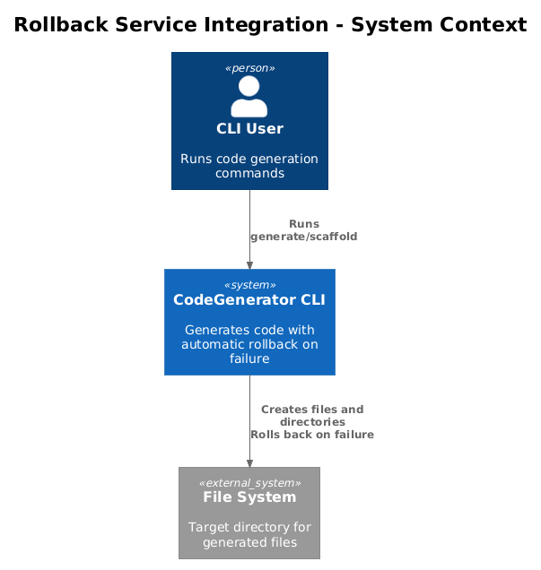
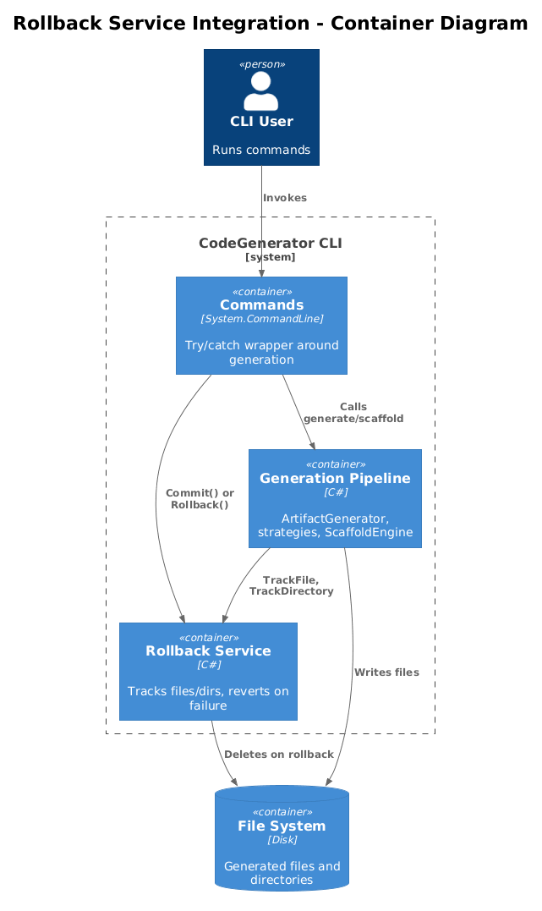
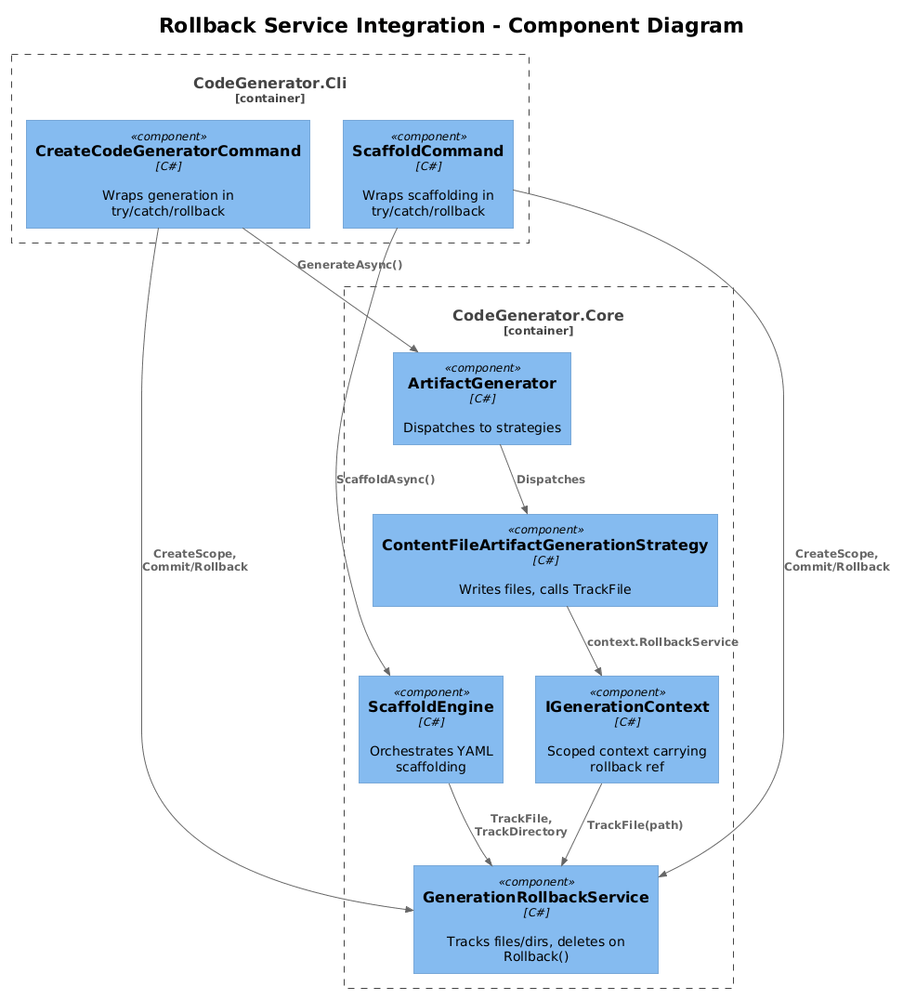
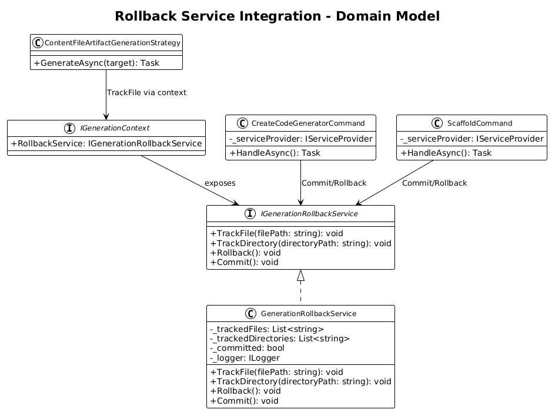
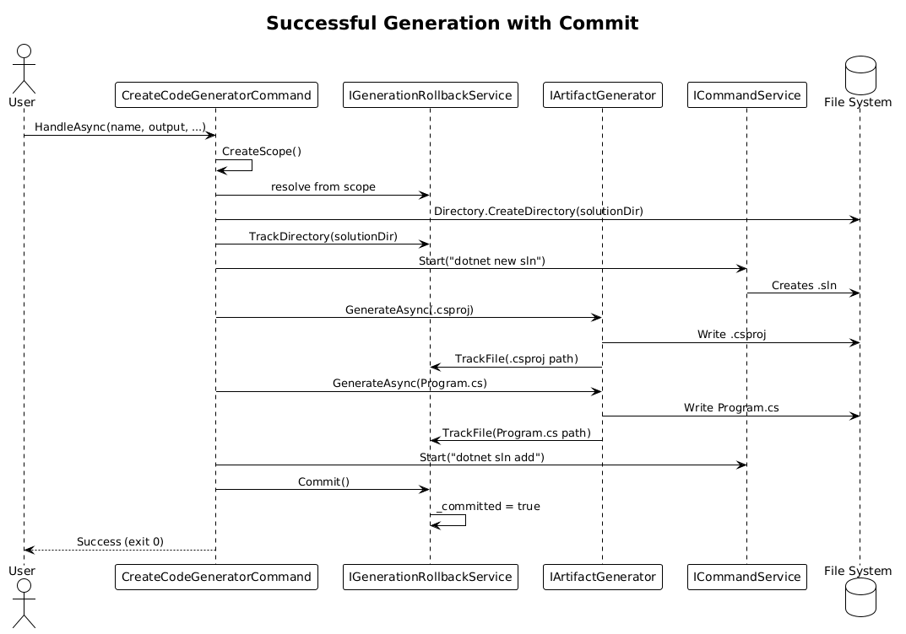
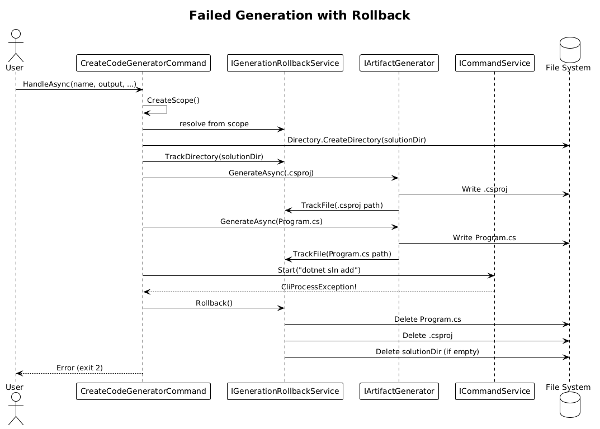
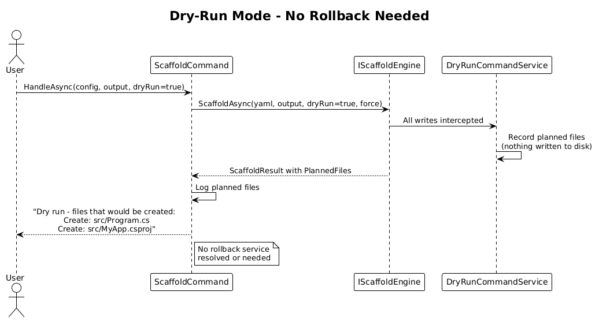

# Rollback Service Integration into Command Flow — Detailed Design

## 1. Overview

`IGenerationRollbackService` and `GenerationRollbackService` exist in `CodeGenerator.Core.Errors` and are registered as scoped services in DI. However, neither `CreateCodeGeneratorCommand` nor `ScaffoldCommand` resolve or use them. If generation fails mid-way (e.g., `dotnet sln add` throws, a template render fails, disk is full), partially-created files and directories are left on disk with no cleanup.

This design wires the rollback service into both commands so that:
- Every file and directory created during generation is tracked.
- On success, `Commit()` is called to finalize.
- On any exception, `Rollback()` is called to clean up partial output.
- Dry-run mode skips rollback entirely (nothing written).

**Actors:** CLI user, CI pipeline  
**Scope:** `CreateCodeGeneratorCommand`, `ScaffoldCommand`, `ArtifactGenerator` pipeline, `ScaffoldEngine`

## 2. Architecture

### 2.1 C4 Context Diagram


### 2.2 C4 Container Diagram


### 2.3 C4 Component Diagram


## 3. Component Details

### 3.1 CreateCodeGeneratorCommand — Try/Catch with Rollback

**Responsibility:** Wrap all generation logic in a try/catch that triggers rollback on failure.

**Current state:** `HandleAsync` calls `Directory.CreateDirectory`, `commandService.Start`, and `artifactGenerator.GenerateAsync` sequentially with no error recovery.

**Target state:**
```
HandleAsync(...)
  resolve IGenerationRollbackService from serviceProvider
  try
    track each Directory.CreateDirectory → rollback.TrackDirectory(path)
    generate solution file
    generate .csproj
    generate project files (each tracked automatically by artifact generator)
    add project to solution
    generate install-cli.bat
    rollback.Commit()
    log success
  catch (Exception ex)
    rollback.Rollback()
    log error
    throw CliIOException wrapping ex
```

**Key change:** Resolve `IGenerationRollbackService` via `_serviceProvider.CreateScope()` (it's registered as scoped) and wrap the entire generation block.

**Dependencies:** `IGenerationRollbackService`

### 3.2 ScaffoldCommand — Rollback Around ScaffoldEngine

**Responsibility:** Wrap `engine.ScaffoldAsync` in rollback protection.

**Current state:** Calls `engine.ScaffoldAsync(yaml, outputDir, dryRun, force)` with no error handling beyond validation.

**Target state:**
```
HandleAsync(...)
  if dryRun or validate or exportSchema or init:
    proceed without rollback (no files written)
    return

  using var scope = serviceProvider.CreateScope()
  var rollback = scope.ServiceProvider.GetRequiredService<IGenerationRollbackService>()
  try
    var result = await engine.ScaffoldAsync(yaml, outputDir, dryRun, force)
    if result.ValidationResult.IsValid:
      rollback.Commit()
    else:
      rollback.Rollback()
  catch (Exception ex)
    rollback.Rollback()
    throw
```

**Dependencies:** `IGenerationRollbackService`

### 3.3 ArtifactGenerator — Automatic File Tracking

**Responsibility:** Track every file written through the artifact generation pipeline.

**Current state:** `ArtifactGenerator.GenerateAsync` dispatches to strategy implementations that write files. No tracking.

**Target state:** The artifact generation strategies that write files (`ContentFileArtifactGenerationStrategy`, etc.) should call `IGenerationRollbackService.TrackFile(path)` after writing. Since rollback is scoped and strategies are singletons, the rollback service must be resolved from a scoped service provider or passed through the generation context.

**Recommended approach:** Inject tracking through `IGenerationContext` which is already scoped:
1. Add `IGenerationRollbackService` property to `IGenerationContext`.
2. Strategies that write files call `context.RollbackService.TrackFile(outputPath)`.
3. This keeps strategies as singletons while the rollback scope flows through the context.

**Dependencies:** `IGenerationContext`, `IGenerationRollbackService`

### 3.4 ScaffoldEngine — File Tracking During Scaffolding

**Responsibility:** Track files created during YAML-driven scaffolding.

**Current state:** `ScaffoldEngine.ScaffoldAsync` creates files via orchestrators. Returns `ScaffoldResult.PlannedFiles` but doesn't track for rollback.

**Target state:** The scaffold orchestrators already know which files they create (they populate `PlannedFiles`). Add rollback tracking alongside:
1. Resolve `IGenerationRollbackService` in `ScaffoldEngine` (scoped).
2. After each file write, call `rollback.TrackFile(path)`.
3. After each directory creation, call `rollback.TrackDirectory(path)`.

**Dependencies:** `IGenerationRollbackService`

## 4. Data Model

### 4.1 Class Diagram


### 4.2 Entity Descriptions

| Entity | Description |
|---|---|
| `IGenerationRollbackService` | Interface: `TrackFile`, `TrackDirectory`, `Rollback`, `Commit`. Already exists. |
| `GenerationRollbackService` | Thread-safe implementation with committed flag. Already exists. |
| `IGenerationContext` | Scoped context flowing through generation. Needs `RollbackService` property. |
| `CreateCodeGeneratorCommand` | Root command — needs try/catch/rollback wrapper. |
| `ScaffoldCommand` | Scaffold command — needs try/catch/rollback wrapper. |
| `ContentFileArtifactGenerationStrategy` | Writes files — needs `TrackFile` call. |

## 5. Key Workflows

### 5.1 Successful Generation with Commit


1. Command creates a DI scope, resolves `IGenerationRollbackService`.
2. `Directory.CreateDirectory(solutionDir)` → `rollback.TrackDirectory(solutionDir)`.
3. `artifactGenerator.GenerateAsync(csproj)` → strategy writes file → `rollback.TrackFile(path)`.
4. Repeat for each file.
5. `rollback.Commit()` — sets `_committed = true`, rollback disabled.
6. Command returns exit code 0.

### 5.2 Failed Generation with Rollback


1. Command creates scope, resolves rollback.
2. Directories and files created, each tracked.
3. `commandService.Start("dotnet sln add ...")` throws `CliProcessException`.
4. Catch block calls `rollback.Rollback()`.
5. Rollback deletes tracked files in order, then empty tracked directories deepest-first.
6. Command re-throws as `CliIOException` with exit code 2.

### 5.3 Dry-Run — No Rollback Needed


1. `--dry-run` flag set.
2. `DryRunCommandService` intercepts all writes — nothing hits disk.
3. No rollback tracking needed.
4. Command displays planned files and returns.

## 6. API Contracts

### IGenerationContext Extension

```csharp
// Addition to existing IGenerationContext
public interface IGenerationContext
{
    // ... existing members ...
    IGenerationRollbackService RollbackService { get; }
}
```

No public CLI API changes. Rollback is entirely internal.

## 7. Security Considerations

- `Rollback()` only deletes files that were tracked during the current generation scope. It cannot delete pre-existing files.
- Directory deletion is restricted to empty directories only (`!Directory.EnumerateFileSystemEntries(dir).Any()`), preventing accidental deletion of user content.
- The `_committed` flag prevents double-rollback or rollback after success.

## 8. Open Questions

1. **Scoped vs. transient rollback service?** Currently registered as scoped. This is correct for the command flow — one scope per command execution. The commands need to create an explicit scope via `_serviceProvider.CreateScope()` since the top-level `ServiceProvider` doesn't have an ambient scope.
2. **Should rollback be opt-in via `--no-rollback`?** For debugging, users might want to inspect partial output. Recommendation: not needed initially; users can re-run with `--dry-run` to preview.
3. **Pre-existing file backup?** If `--force` overwrites an existing file, rollback cannot restore the original. Should we back up overwritten files to a temp directory? Recommendation: defer to a future iteration — the `--force` flag already implies the user accepts data loss.
