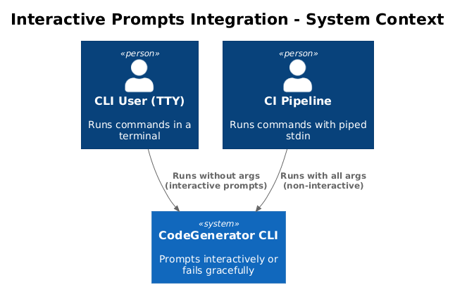
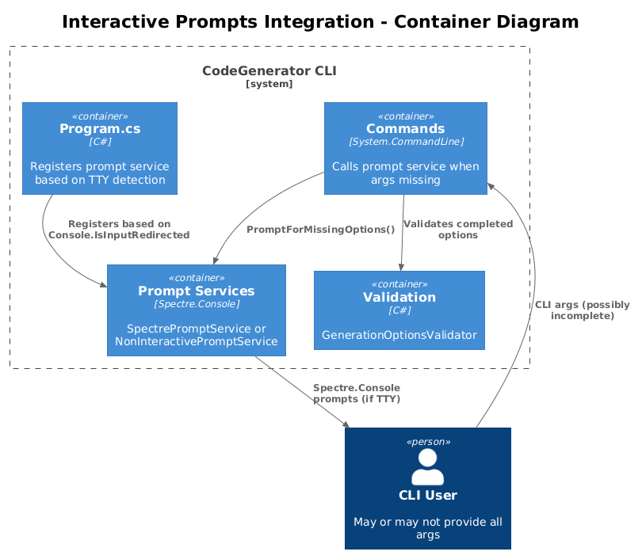
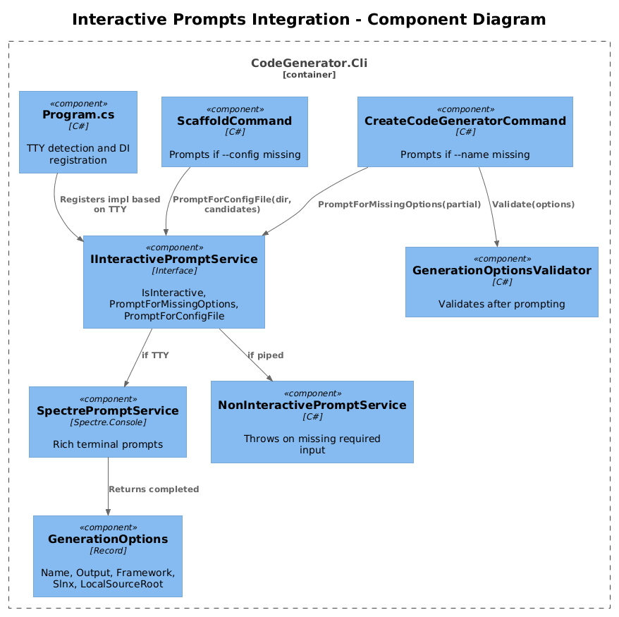
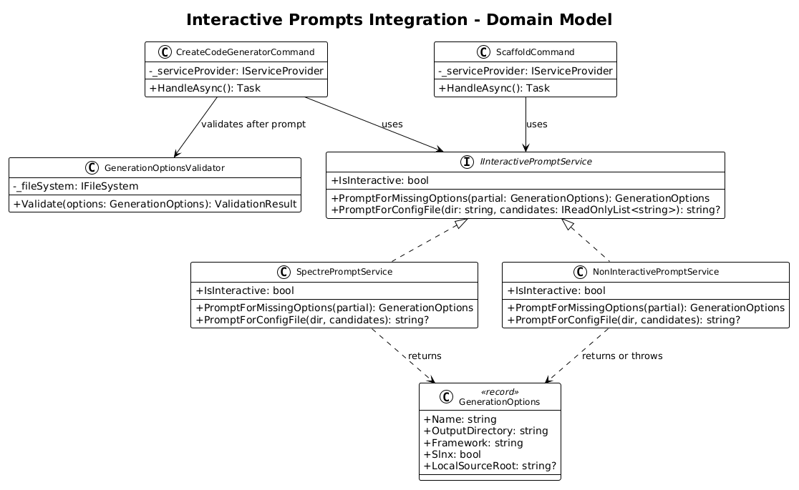
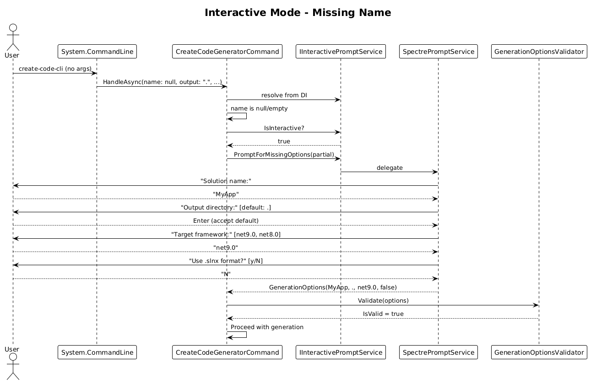
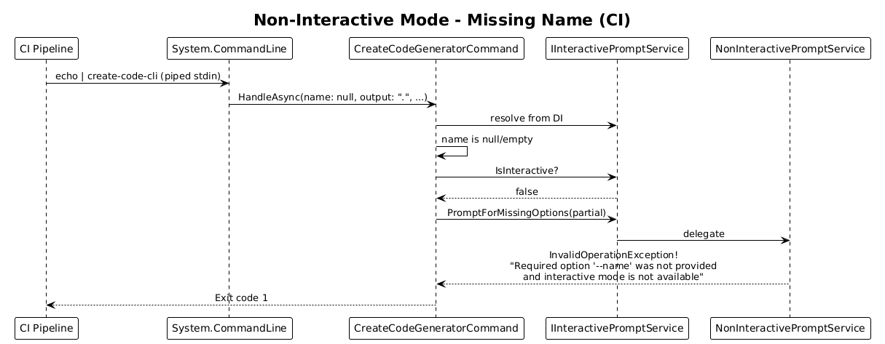
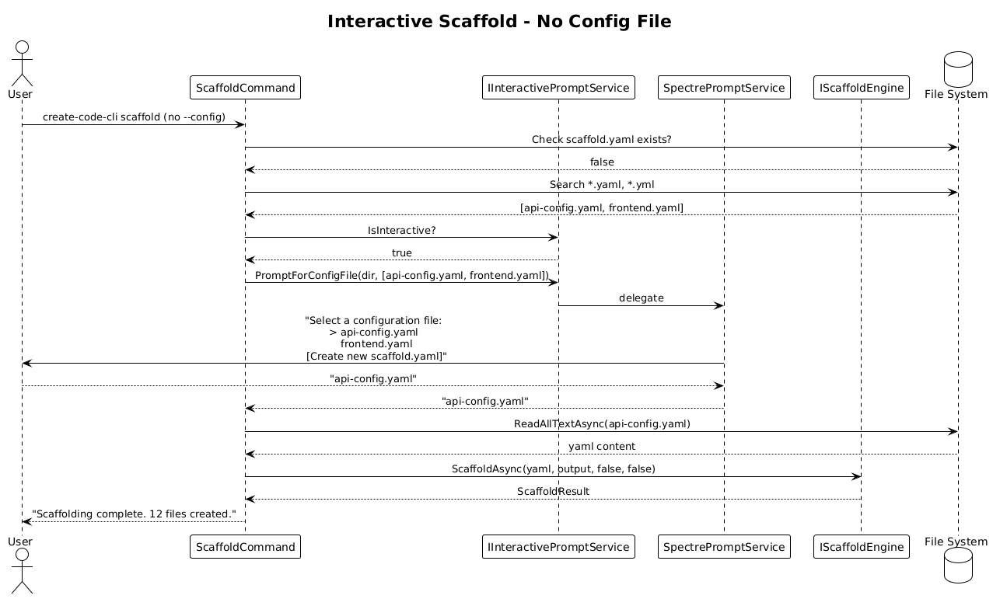

# Interactive Prompts Integration into Command Flow — Detailed Design

## 1. Overview

`IInteractivePromptService`, `SpectrePromptService`, and `NonInteractivePromptService` exist in `CodeGenerator.Cli.Services` but are never registered in DI or called from any command. `CreateCodeGeneratorCommand` requires `--name` as mandatory and hard-codes all other option defaults. If a user runs `create-code-cli` without `--name`, System.CommandLine emits a generic error — there is no interactive fallback.

This design wires the interactive prompt system into the command flow so that:
- When stdin is a TTY and required args are missing, the user is prompted interactively via Spectre.Console.
- When stdin is piped/redirected (CI), missing required args produce a clear error.
- The prompt service is registered in DI with TTY-based implementation selection.
- `ScaffoldCommand` gains interactive prompts for `--config` path selection.

**Actors:** CLI user (terminal), CI pipeline (non-interactive)  
**Scope:** `Program.cs` (DI registration), `CreateCodeGeneratorCommand`, `ScaffoldCommand`

## 2. Architecture

### 2.1 C4 Context Diagram


### 2.2 C4 Container Diagram


### 2.3 C4 Component Diagram


## 3. Component Details

### 3.1 Program.cs — DI Registration with TTY Detection

**Responsibility:** Register the correct `IInteractivePromptService` implementation based on terminal detection.

**Current state:** Neither implementation is registered.

**Target state:**
```csharp
if (!Console.IsInputRedirected)
{
    services.AddSingleton<IInteractivePromptService, SpectrePromptService>();
}
else
{
    services.AddSingleton<IInteractivePromptService, NonInteractivePromptService>();
}
```

TTY detection happens once at startup. This is correct because the terminal state doesn't change during a process lifetime.

**Dependencies:** None

### 3.2 CreateCodeGeneratorCommand — Interactive Fallback for Missing Args

**Responsibility:** When required options are missing and the terminal is interactive, prompt the user instead of failing.

**Current state:** `--name` is `IsRequired = true` — System.CommandLine rejects the invocation before `HandleAsync` runs.

**Target state:**
1. Change `--name` from `IsRequired = true` to `IsRequired = false`.
2. At the start of `HandleAsync`, check if `name` is null/empty.
3. If missing and interactive: call `promptService.PromptForMissingOptions(partial)`.
4. If missing and non-interactive: `NonInteractivePromptService` throws `InvalidOperationException` (existing behavior).
5. The returned `GenerationOptions` replaces the individual parameters for the rest of the handler.

**Updated HandleAsync signature and flow:**
```
HandleAsync(name?, outputDirectory, framework, slnx, localSourceRoot?)
  resolve IInteractivePromptService
  
  var partial = new GenerationOptions {
    Name = name ?? "",
    OutputDirectory = outputDirectory,
    Framework = framework,
    Slnx = slnx,
    LocalSourceRoot = localSourceRoot
  };

  if (string.IsNullOrWhiteSpace(partial.Name) && promptService.IsInteractive)
    options = promptService.PromptForMissingOptions(partial)
  else
    options = partial

  validate(options)
  ... proceed with generation ...
```

**Dependencies:** `IInteractivePromptService`

### 3.3 ScaffoldCommand — Interactive Config File Selection

**Responsibility:** When `--config` is not provided and no `scaffold.yaml` exists, prompt the user to select a YAML file or create one.

**Current state:** Falls back to `scaffold.yaml` in output dir; logs error if not found.

**Target state:**
1. Resolve `IInteractivePromptService`.
2. If `--config` not provided and `scaffold.yaml` not found:
   - If interactive: search for `*.yaml` and `*.yml` files in the output directory, present a selection prompt. Include an "Initialize new scaffold.yaml" option.
   - If non-interactive: error as before.
3. If `--init` with interactive: prompt for solution name, framework, and entities to bootstrap a richer starter YAML.

**New method on IInteractivePromptService:**
```csharp
public interface IInteractivePromptService
{
    bool IsInteractive { get; }
    GenerationOptions PromptForMissingOptions(GenerationOptions partial);
    string? PromptForConfigFile(string directory, IReadOnlyList<string> candidates);
}
```

**Dependencies:** `IInteractivePromptService`

### 3.4 SpectrePromptService — Config File Prompt Implementation

**Responsibility:** Present a Spectre.Console selection prompt for config file discovery.

**New method:**
```csharp
public string? PromptForConfigFile(string directory, IReadOnlyList<string> candidates)
{
    if (candidates.Count == 0)
    {
        return AnsiConsole.Confirm("No YAML files found. Create a starter scaffold.yaml?")
            ? "__init__"
            : null;
    }

    var choices = candidates.ToList();
    choices.Add("[Create new scaffold.yaml]");

    var selected = AnsiConsole.Prompt(
        new SelectionPrompt<string>()
            .Title("Select a [green]configuration file[/]:")
            .AddChoices(choices));

    return selected == "[Create new scaffold.yaml]" ? "__init__" : selected;
}
```

### 3.5 NonInteractivePromptService — Config File Prompt (Throws)

```csharp
public string? PromptForConfigFile(string directory, IReadOnlyList<string> candidates)
{
    throw new InvalidOperationException(
        "No configuration file specified and no scaffold.yaml found. "
        + "Provide --config or run with --init in an interactive terminal.");
}
```

## 4. Data Model

### 4.1 Class Diagram


### 4.2 Entity Descriptions

| Entity | Description |
|---|---|
| `IInteractivePromptService` | Interface with `IsInteractive`, `PromptForMissingOptions`, `PromptForConfigFile`. Exists, needs extension. |
| `SpectrePromptService` | Spectre.Console implementation with rich prompts. Exists, needs new method. |
| `NonInteractivePromptService` | CI-safe implementation that throws on missing required input. Exists, needs new method. |
| `GenerationOptions` | Record holding all CLI options. Already exists. |
| `GenerationOptionsValidator` | Validates options after prompting completes. Already exists. |

## 5. Key Workflows

### 5.1 Interactive Mode — Missing Name


1. User runs `create-code-cli` with no arguments.
2. System.CommandLine invokes `HandleAsync(name: null, ...)`.
3. Command detects `name` is null, checks `promptService.IsInteractive` → true.
4. Calls `promptService.PromptForMissingOptions(partial)`.
5. `SpectrePromptService` prompts for name, confirms output dir, selects framework, confirms slnx.
6. Returns completed `GenerationOptions`.
7. Command validates and proceeds with generation.

### 5.2 Non-Interactive Mode — Missing Name (CI)


1. CI runs `create-code-cli` without `--name` (stdin is piped).
2. `HandleAsync(name: null, ...)` invoked.
3. Command detects `name` is null, checks `promptService.IsInteractive` → false.
4. Calls `promptService.PromptForMissingOptions(partial)`.
5. `NonInteractivePromptService` throws `InvalidOperationException` with descriptive message.
6. Command exits with error code.

### 5.3 Interactive Scaffold — No Config File


1. User runs `create-code-cli scaffold` with no `--config`.
2. Command searches for `scaffold.yaml` — not found.
3. Searches for `*.yaml`/`*.yml` files in directory — finds `api-config.yaml`, `frontend.yaml`.
4. Calls `promptService.PromptForConfigFile(dir, candidates)`.
5. User selects `api-config.yaml` from the Spectre selection prompt.
6. Command proceeds with selected file.

## 6. API Contracts

### CLI Behavior Change

| Scenario | Before | After |
|---|---|---|
| `create-code-cli` (no args, TTY) | Error: `--name` required | Interactive prompt for all options |
| `create-code-cli` (no args, piped) | Error: `--name` required | Error: clear message about missing `--name` |
| `create-code-cli -n Foo` (TTY) | Generates with defaults | Generates with defaults (unchanged) |
| `create-code-cli scaffold` (no config, TTY) | Error: no scaffold.yaml | Prompt to select YAML or create one |

### IInteractivePromptService — Extended Interface

```csharp
public interface IInteractivePromptService
{
    bool IsInteractive { get; }
    GenerationOptions PromptForMissingOptions(GenerationOptions partial);
    string? PromptForConfigFile(string directory, IReadOnlyList<string> candidates);
}
```

## 7. Security Considerations

- Spectre.Console renders ANSI escape codes. On terminals that don't support ANSI (rare on modern systems), `Console.IsInputRedirected` correctly routes to `NonInteractivePromptService`.
- User input from prompts flows through the same `GenerationOptionsValidator` as CLI args — no bypass.
- Config file path from interactive selection is validated with `File.Exists` before use.

## 8. Open Questions

1. **Should all options be prompted, or only missing ones?** Current `SpectrePromptService.PromptForMissingOptions` always prompts for everything. An alternative is to only prompt for missing values and show pre-filled values as confirmations. Recommendation: prompt for all with pre-filled defaults from config — this gives users a chance to review and change.
2. **Spectre.Console dependency in Cli project?** `Spectre.Console` is already referenced in `CodeGenerator.Cli.csproj`. No new dependency needed.
3. **Should `ScaffoldCommand` prompt for entities during `--init`?** An interactive `--init` that asks for solution name, entities, and framework would produce a more useful starter YAML. Recommendation: implement basic `--init` first (current behavior), add interactive `--init` as a follow-up.
