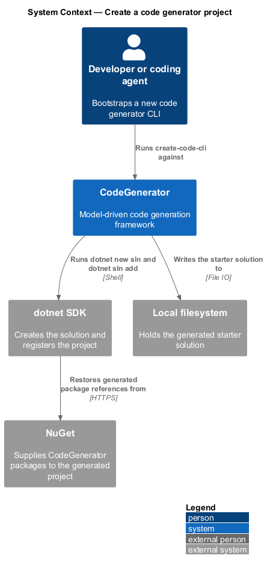
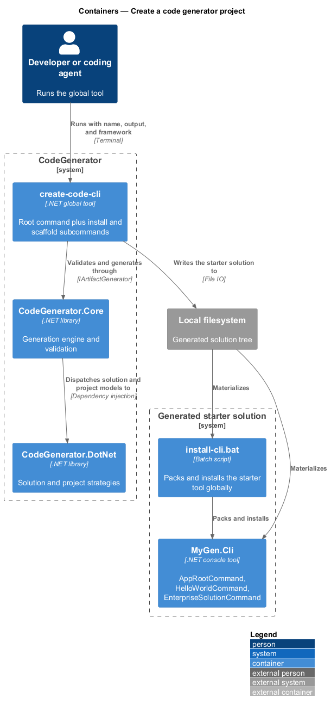
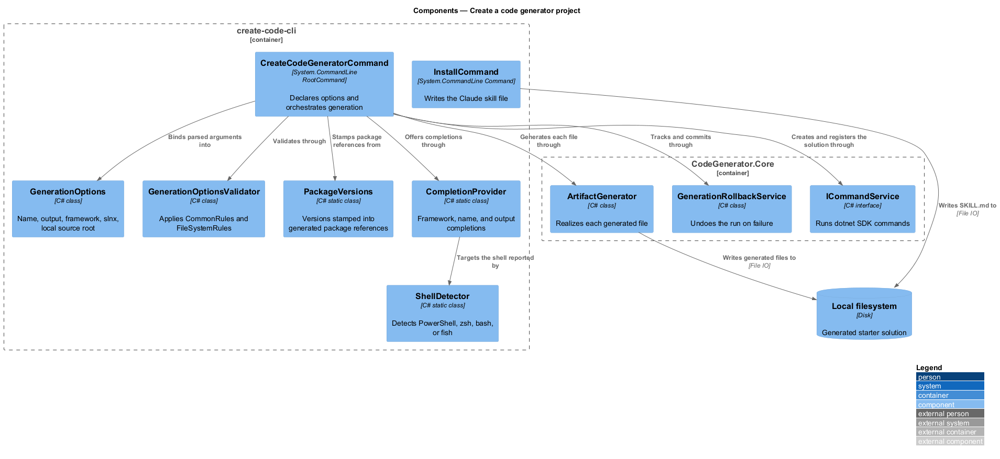
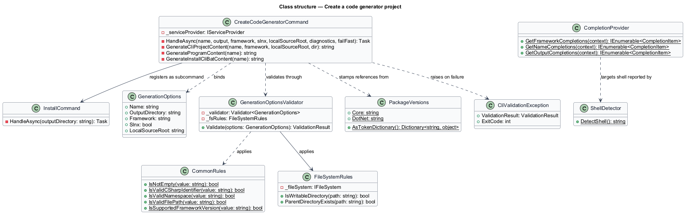
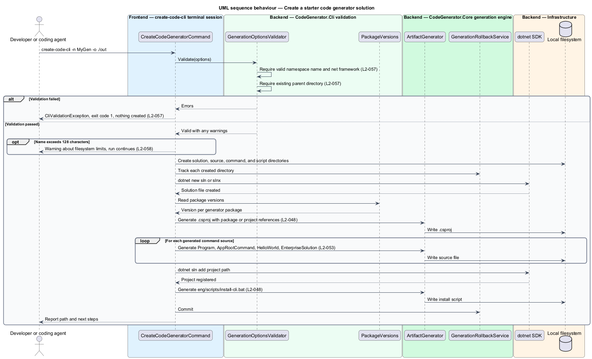

# Create a code generator project

## Overview

CodeGenerator ships as a .NET global tool named `create-code-cli`. Its root
command generates a new code-generator CLI project: a solution, a console
project already wired to every target package, three example commands, and a
script that packs and installs the result as a global tool of its own.

**starter project** — generated solution whose purpose is to host a caller's own
generation commands

**tool command name** — the verb a packed .NET global tool is invoked by

**local source root** — path to a checkout of CodeGenerator, used to reference
the framework by project rather than by package

The command is a bootstrapper. What it produces is not an application, but the
scaffolding a team needs to start writing its own generation commands: service
registration is already in place, the example commands demonstrate both a
single-file generation and a full-stack one, and the install script closes the
loop from source to installed tool.

Validation runs before any directory is created, so a rejected invocation leaves
the filesystem untouched.

## Description

- **`CreateCodeGeneratorCommand`** — the root command in
  `CodeGenerator.Cli.Commands`. It declares `--name`, `--output`, `--framework`,
  `--slnx`, `--local-source-root`, `--diagnostics`, and `--fail-fast`, and adds
  the `install` and `scaffold` subcommands.
- **`GenerationOptions`** — the option record carrying `Name`,
  `OutputDirectory`, `Framework`, `Slnx`, and `LocalSourceRoot`.
- **`GenerationOptionsValidator`** — validation over `GenerationOptions`. It
  requires a non-empty name that is a valid namespace identifier, a non-empty
  framework beginning with `net`, and an existing parent for the output
  directory. It adds a warning when the name exceeds 128 characters.
- **`CommonRules`** — the shared predicates `IsNotEmpty`,
  `IsValidCSharpIdentifier`, `IsValidNamespace`, `IsValidFilePath`, and
  `IsSupportedFrameworkVersion`.
- **`FileSystemRules`** — `ParentDirectoryExists` and `IsWritableDirectory`,
  both operating through `IFileSystem` so they are testable without touching
  disk.
- **`InstallCommand`** — the `install` subcommand. It writes a Claude skill file
  to `<output>/.claude/skills/code-generator/SKILL.md`, creating intermediate
  directories.
- **`PackageVersions`** — the single place holding the package version stamped
  into each generated `PackageReference`, plus `AsTokenDictionary()` for template
  use.
- **`CompletionProvider`** — completions for the framework, name, and output
  options. It offers `net8.0`, `net9.0`, and `net10.0`, and at most 20
  subdirectories for the output option.
- **`ShellDetector`** — shell detection from `PSModulePath` and `SHELL`,
  defaulting to PowerShell on Windows and bash elsewhere.
- **Generated sources** — `Program.cs` registering every target package,
  `AppRootCommand.cs`, `HelloWorldCommand.cs`, `EnterpriseSolutionCommand.cs`,
  the `.csproj` marked `PackAsTool`, and `eng/scripts/install-cli.bat`.

## Requirements

The feature realizes the following level-2 (L2) requirements. Each L2
requirement refines a level-1 (L1) requirement, cited by identifier. Requirement
text is stated in `shall` form; every identifier resolves to `docs/specs/L2.md`.

| L2 ID | Refines (L1) | Requirement |
|-------|--------------|-------------|
| `L2-048` | `L1-010` | The root command shall validate its options before writing, and shall create the solution, the `.csproj`, the command sources, the install script, and the solution registration, using project references when a local source root is supplied and package references otherwise. |
| `L2-049` | `L1-010` | The `install` command shall write a Claude skill file to `<output>/.claude/skills/code-generator/SKILL.md`, creating intermediate directories, and shall log the written path. |
| `L2-052` | `L1-010` | The tool shall supply completions for the framework, name, and output options, and shall detect the active shell, defaulting to PowerShell on Windows and bash elsewhere. |
| `L2-053` | `L1-010` | The generated starter project shall be packable as a .NET global tool named after the lower-cased solution name suffixed with `-cli`, shall register every generator package, and shall expose working `hello` and `enterprise-solution` commands. |
| `L2-057` | `L1-012` | Generation options shall be validated before any directory is created, requiring a valid namespace identifier for the name, a framework beginning with `net`, and an existing parent directory, and a failure shall exit with code `1`. |
| `L2-058` | `L1-012` | A solution name longer than 128 characters shall produce a warning about filesystem limits, and warnings shall not prevent the operation. |

## Diagrams

### System context

A developer runs the tool; it writes a starter solution and calls the .NET SDK to
create the solution file and register the project.

### Containers

`create-code-cli` hosts the root command and its two subcommands, and drives the
generation engine to produce the starter solution.

### Components

The root command validates options, prompts when interactive, generates each
file through the engine, and registers the project with the solution.

### Class structure

`CreateCodeGeneratorCommand` reads `GenerationOptions`, validates them through
`GenerationOptionsValidator`, and raises `CliValidationException` on failure.

### Behaviour — create a starter solution

The command validates under `L2-057`, reports warnings under `L2-058`, and
generates the solution, sources, and install script under `L2-048`.

