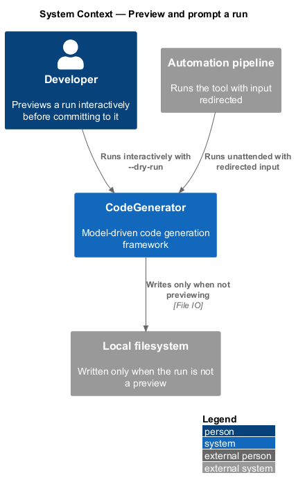
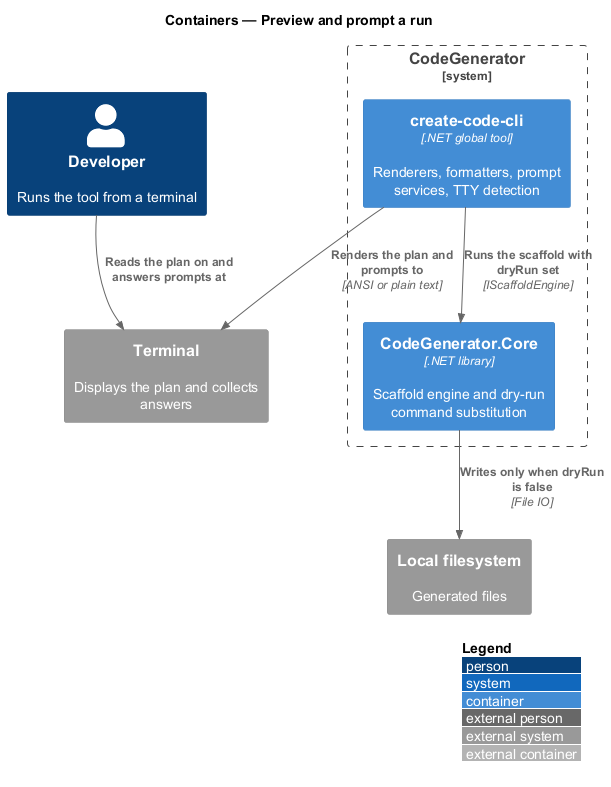
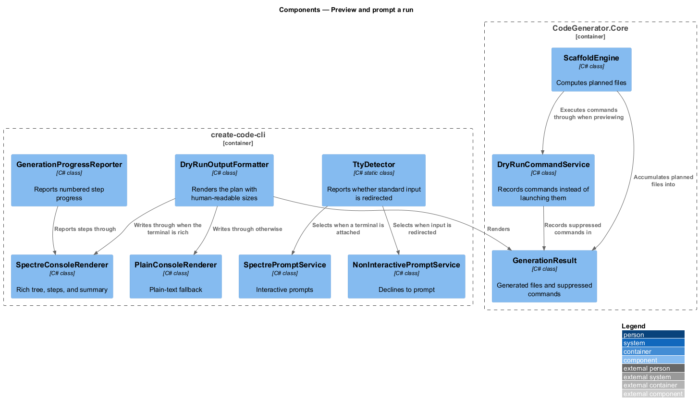
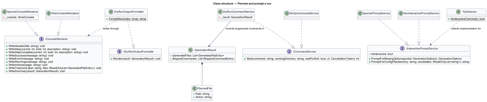
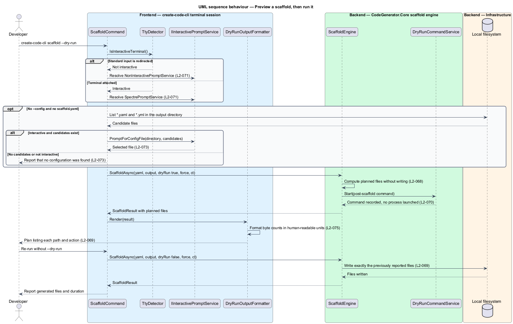

# Preview and prompt a run

## Overview

Code generation writes many files at once, which makes it hard to undo by hand
and easy to regret. Two facilities reduce that risk from opposite directions: a
preview mode that shows the whole plan without writing anything, and an
interactive mode that asks for what the invocation left out.

**dry run** — execution that computes the full plan and writes nothing

**planned file** — file the run intends to write, paired with the action it
would take

**interactive terminal** — session whose standard input is attached to a
terminal rather than redirected

A dry run is a complete run with the writes removed. The plan it reports is the
same plan the real run executes, so the preview is a prediction rather than an
approximation. External commands are suppressed the same way: `DryRunCommandService`
satisfies the command contract by recording the command instead of launching it.

Interactivity is detected, not configured. When standard input is redirected the
tool selects a non-interactive prompt service and a missing required option
becomes a validation error rather than a prompt that would block a pipeline
forever.

Console output adapts on the same principle: a rich renderer when the terminal
supports it, a plain renderer when it does not, both carrying the same
information.

## Description

- **`DryRunCommandService`** — the `ICommandService` implementation used for
  preview. `Start` records the command and working directory in the
  `GenerationResult` and returns without launching a process.
- **`NoOpCommandService`** — the command implementation that neither launches nor
  records.
- **`PlannedFile`** — the record of a file the run would write, carrying its path
  and action.
- **`GenerationResult`** / **`GeneratedFileEntry`** / **`SkippedCommandEntry`** —
  the accumulated outcome of a run, its generated files, and its suppressed
  commands.
- **`IDryRunOutputFormatter`** / **`DryRunOutputFormatter`** — rendering of the
  plan, including `FormatSize`, which expresses byte counts in human-readable
  units.
- **`IConsoleRenderer`** — the rendering contract: `WriteHeader`, `WriteStep`,
  `WriteStepComplete`, `WriteSuccess`, `WriteError`, `WriteWarning`,
  `WriteInfo`, `WriteTree`, `WriteSummary`, and `WriteLine`.
- **`SpectreConsoleRenderer`** — the rich implementation over `IAnsiConsole`,
  drawing the generated files as a directory tree.
- **`PlainConsoleRenderer`** — the fallback implementation, emitting the same
  information without ANSI sequences.
- **`GenerationProgressReporter`** — step progress reporting during a run.
- **`IInteractivePromptService`** — the prompt contract, carrying
  `IsInteractive`, `PromptForMissingOptions`, and `PromptForConfigFile`.
- **`SpectrePromptService`** — the interactive implementation.
- **`NonInteractivePromptService`** — the redirected-input implementation, which
  reports `IsInteractive` as false and prompts for nothing.
- **`TtyDetector`** — `IsInteractiveTerminal()`, which reports whether standard
  input is redirected.

## Requirements

The feature realizes the following level-2 (L2) requirements. Each L2
requirement refines a level-1 (L1) requirement, cited by identifier. Requirement
text is stated in `shall` form; every identifier resolves to `docs/specs/L2.md`.

| L2 ID | Refines (L1) | Requirement |
|-------|--------------|-------------|
| `L2-068` | `L1-015` | A dry run shall create no file or directory, shall execute no external command, and shall not engage rollback. |
| `L2-069` | `L1-015` | A dry run shall report every file it would produce with the action it would take, and the set of files a subsequent real run creates shall equal the set previously reported. |
| `L2-070` | `L1-015` | `DryRunCommandService` shall satisfy `ICommandService` without launching a process, recording each suppressed command in the generation result. |
| `L2-071` | `L1-016` | The tool shall select an interactive prompt service when standard input is attached to a terminal and a non-interactive one when input is redirected, and a missing required option shall become a validation error in a non-interactive session. |
| `L2-072` | `L1-016` | In an interactive session the root command shall prompt for options that were not supplied, seeding each prompt with the resolved value, and prompted values shall be subject to the same validation as command-line values. |
| `L2-073` | `L1-016` | When `scaffold` runs interactively without `--config` and no `scaffold.yaml` exists, the tool shall offer the `*.yaml` and `*.yml` files in the output directory for selection, and shall show no prompt when none exist or the session is non-interactive. |
| `L2-074` | `L1-017` | The console renderer shall expose headers, numbered step progress, success, error, warning and info messages, a generated-file tree, and a run summary, with a rich implementation and a plain fallback presenting the same information. |
| `L2-075` | `L1-017` | Byte counts in generated output listings shall be rendered in human-readable units. |

## Diagrams

### System context

The tool reads its environment — whether input is a terminal — and writes either
a preview to the console or files to the filesystem.

### Containers

The preview and prompt facilities live in `create-code-cli`; the command
substitution that makes a dry run inert lives in `CodeGenerator.Core`.

### Components

Renderers, formatters, and prompt services are each selected by an environment
test rather than by configuration.

### Class structure

`IConsoleRenderer` and `IInteractivePromptService` each have two implementations
selected at startup; `DryRunCommandService` substitutes for `ICommandService`.

### Behaviour — preview a scaffold, then run it

The tool selects a prompt service under `L2-071`, offers configuration files
under `L2-073`, suppresses writes and commands under `L2-068` and `L2-070`, and
reports the plan under `L2-069`.

