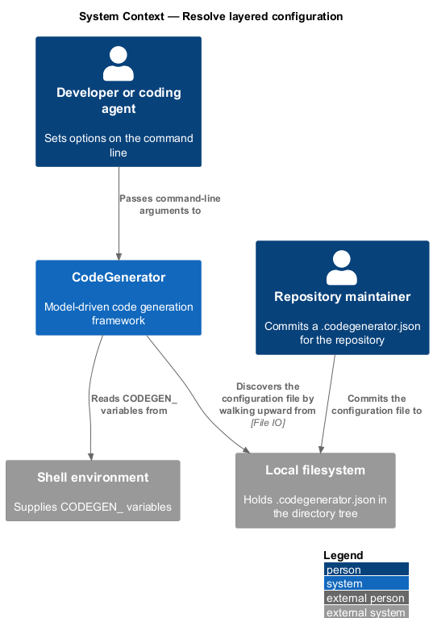
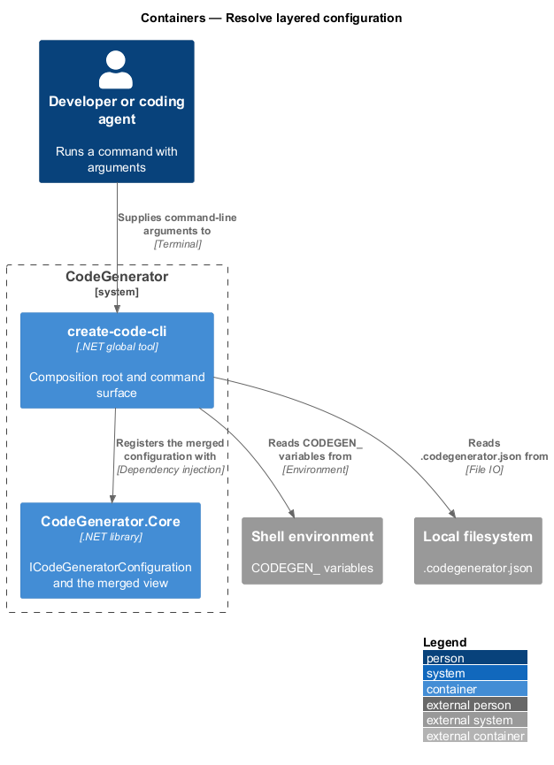
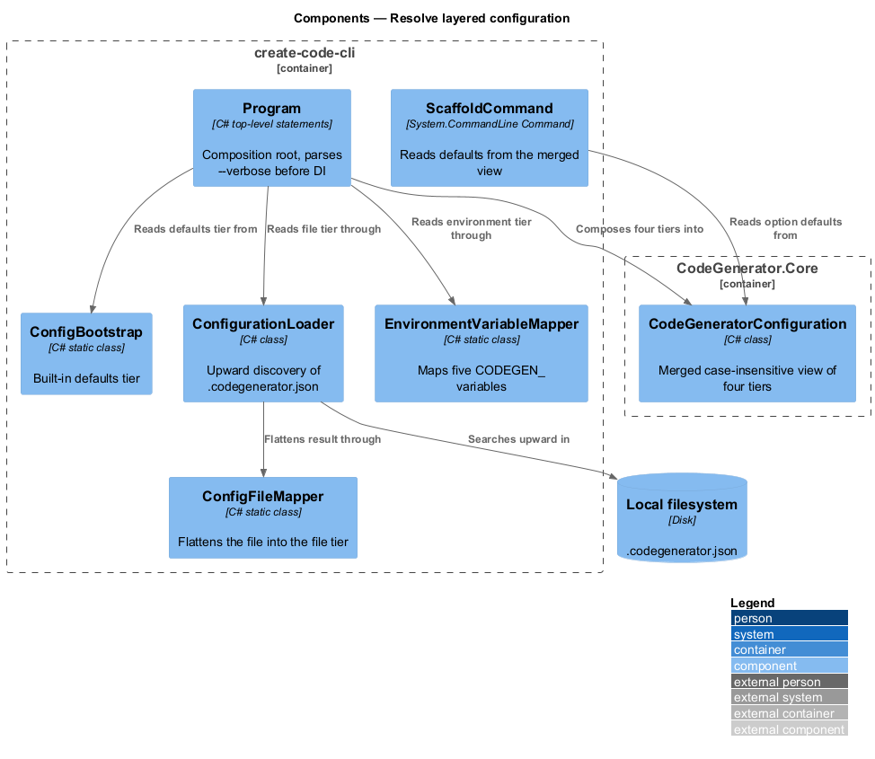
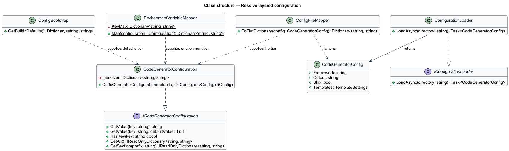
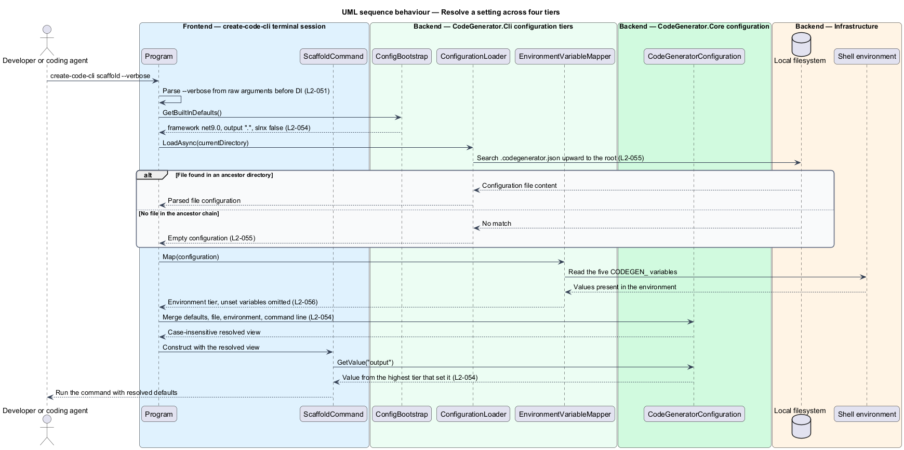

# Resolve layered configuration

## Overview

A setting such as the target framework can come from four places: a built-in
default, a configuration file in the repository, an environment variable in the
shell, or an argument on the command line. This feature covers how those four
sources combine into one answer.

**tier** — one configuration source in the precedence order

**precedence** — rule that a more specific tier overrides a more general one

**upward discovery** — search for a configuration file that walks from the
starting directory toward the filesystem root

The order is fixed: built-in defaults, then the configuration file, then
environment variables, then command-line arguments. Each tier is merged over the
previous one, so a value set in a later tier replaces the earlier value and a
value absent from a later tier leaves the earlier one standing. Key lookup is
case-insensitive.

The configuration file is found by upward discovery, so a setting placed at the
root of a repository applies to every directory beneath it without being
repeated.

## Description

- **`ICodeGeneratorConfiguration`** / **`CodeGeneratorConfiguration`** — the
  resolved view in `CodeGenerator.Core.Configuration`. Its constructor merges the
  four tiers in order into a single case-insensitive dictionary. It exposes
  `GetValue(key)`, the converting `GetValue<T>(key, default)`, `HasKey`,
  `GetAll`, and `GetSection(prefix)`, which returns the keys under a prefix with
  the prefix removed.
- **`ConfigBootstrap`** — the built-in defaults: `framework` is `net9.0`,
  `output` is `.`, and `slnx` is `false`.
- **`IConfigurationLoader`** / **`ConfigurationLoader`** — upward discovery of
  `.codegenerator.json`, walking from the supplied directory to the filesystem
  root and returning an empty configuration when no file is found. Deserialization
  is case-insensitive.
- **`CodeGeneratorConfig`** — the shape of the configuration file.
- **`ConfigFileMapper`** — flattening of `CodeGeneratorConfig` into the file
  tier's key-value form.
- **`EnvironmentVariableMapper`** — the environment tier. It maps
  `CODEGEN_FRAMEWORK` to `framework`, `CODEGEN_OUTPUT` to `output`,
  `CODEGEN_SLNX` to `slnx`, `CODEGEN_AUTHOR` to `templates.author`, and
  `CODEGEN_LICENSE` to `templates.license`. An unset variable contributes no key.
- **`ScaffoldCommand`** — the `scaffold` subcommand. Its `--output` default is
  taken from the resolved configuration, and it falls back to `scaffold.yaml` in
  the output directory when `--config` is absent.
- **`Program`** — the composition root. It parses `--verbose` from the raw
  argument array before dependency injection is configured, so the log level is
  correct even for failures that occur during startup.

## Requirements

The feature realizes the following level-2 (L2) requirements. Each L2
requirement refines a level-1 (L1) requirement, cited by identifier. Requirement
text is stated in `shall` form; every identifier resolves to `docs/specs/L2.md`.

| L2 ID | Refines (L1) | Requirement |
|-------|--------------|-------------|
| `L2-050` | `L1-010` | The `scaffold` command shall accept its nine options, shall default to `scaffold.yaml` in the output directory when `--config` is absent, and shall report a clear error when no configuration can be located. |
| `L2-051` | `L1-010` | A global `--verbose` option shall raise the minimum log level to `Debug` and include stack traces in error output, and shall be honoured even when the failure occurs before command parsing completes. |
| `L2-054` | `L1-011` | Configuration shall resolve from built-in defaults, then the configuration file, then environment variables, then command-line arguments, with later tiers overriding earlier ones and case-insensitive key lookup. |
| `L2-055` | `L1-011` | The loader shall search for `.codegenerator.json` from the supplied directory upward to the filesystem root, shall return the first match, and shall return an empty configuration when none is found. |
| `L2-056` | `L1-011` | The environment tier shall map the five `CODEGEN_` variables to their configuration keys, and an unset variable shall contribute no key. |

## Diagrams

### System context

Configuration reaches the tool from three places outside it: the repository's
configuration file, the shell environment, and the command line.

### Containers

`create-code-cli` composes the four tiers at startup and hands the resolved view
to every command.

### Components

`ConfigBootstrap`, `ConfigFileMapper`, and `EnvironmentVariableMapper` each
produce one tier; `CodeGeneratorConfiguration` merges them in precedence order.

### Class structure

`CodeGeneratorConfiguration` merges four dictionaries supplied by the bootstrap,
the loader, and the environment mapper.

### Behaviour — resolve a setting across four tiers

Startup composes the tiers under `L2-054`, discovering the configuration file by
upward search under `L2-055` and mapping environment variables under `L2-056`.

