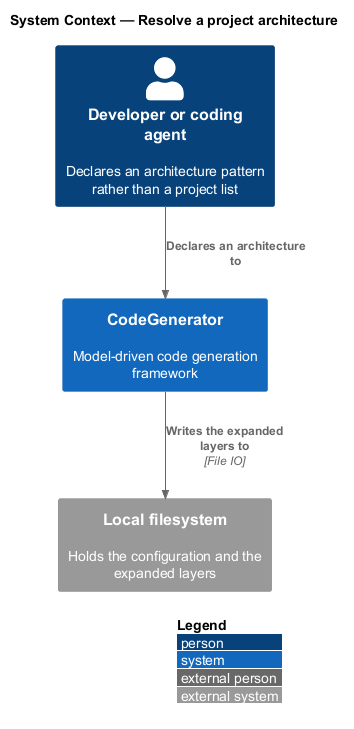
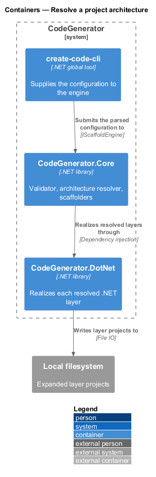
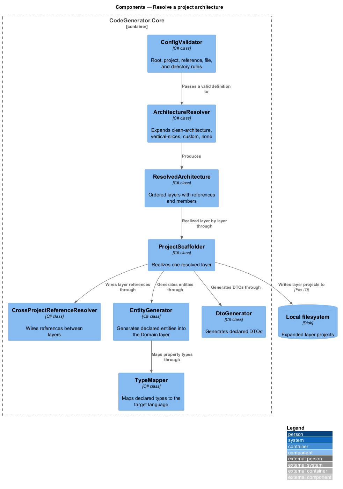
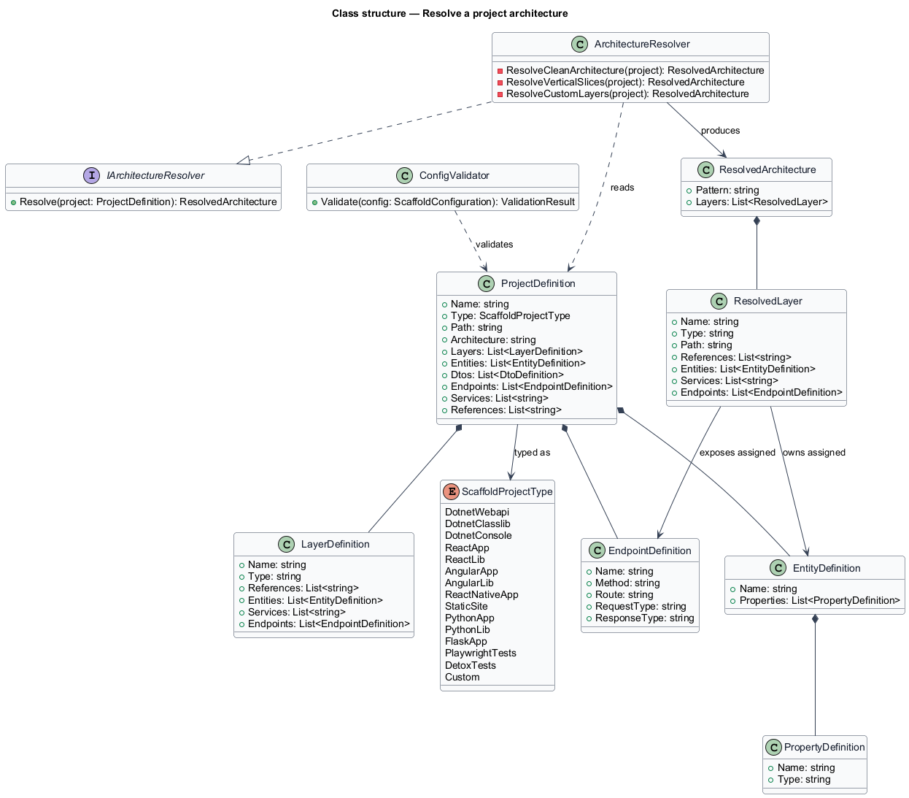
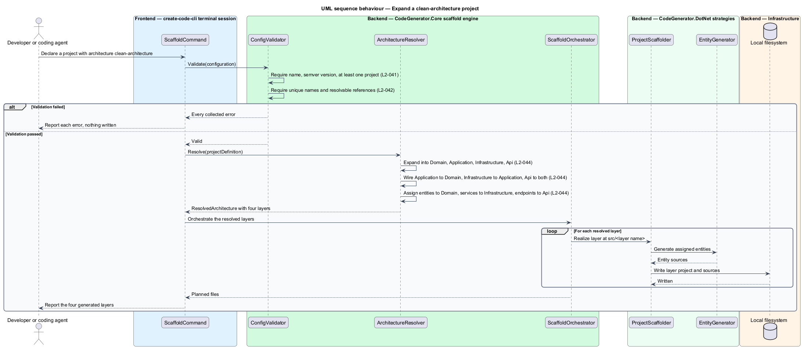

# Resolve a project architecture

## Overview

A scaffold configuration declares intent, not structure. A project that names
`clean-architecture` does not list four projects and their references; it names
the pattern, and the resolver expands it. This feature covers that expansion and
the validation that guards it.

**architecture pattern** — named arrangement of layers a project expands into

**layer** — one project within a resolved architecture, with its own type, path,
references, and assigned members

**resolved architecture** — the expanded pattern: an ordered set of layers ready
for scaffolding

Three patterns are recognized. `clean-architecture` expands into Domain,
Application, Infrastructure, and Api layers under `src/`, wired so that
Application references Domain, Infrastructure references Application, and Api
references both Application and Infrastructure. `vertical-slices` expands into a
single web API project holding everything. A project declaring explicit `layers`
expands into those custom layers. Anything else resolves to the `none` pattern.

Expansion also distributes what the project declared. Entities go to the Domain
layer, services to Infrastructure, and endpoints to the Api layer — the pattern
decides where each declared member lands.

Validation runs before expansion and is total: every error in the document is
collected rather than the first one aborting the pass.

## Description

- **`IArchitectureResolver`** / **`ArchitectureResolver`** — expansion in
  `CodeGenerator.Core.Scaffold.Services`. `Resolve(ProjectDefinition)` switches on
  the lower-cased `Architecture` value, falling through to custom layers when
  `Layers` is non-empty and to the `none` pattern otherwise.
- **`ResolvedArchitecture`** / **`ResolvedLayer`** — the expansion result. Each
  layer carries `Name`, `Type`, `Path`, `References`, `Entities`, `Services`, and
  `Endpoints`.
- **`ProjectDefinition`** — the declared project, carrying `Architecture`,
  `Layers`, `Entities`, `Dtos`, `Endpoints`, `Services`, `PageObjects`, `Specs`,
  `Fixtures`, `Features`, `References`, `Dependencies`, and `DevDependencies`.
- **`LayerDefinition`** — a custom layer as declared, carrying its name, type,
  references, entities, services, and endpoints.
- **`EntityDefinition`** / **`PropertyDefinition`** — a declared entity and its
  typed properties.
- **`EndpointDefinition`** — a declared endpoint, carrying `Name`, `Method`
  (defaulting to `GET`), `Route`, `RequestType`, and `ResponseType`.
- **`DtoDefinition`** — a declared data transfer object.
- **`ScaffoldProjectType`** — the fifteen project kinds a declaration may select,
  from `DotnetWebapi` and `DotnetClasslib` through `ReactApp`, `AngularApp`,
  `FlaskApp`, `PlaywrightTests`, and `DetoxTests` to `Custom`.
- **`ConfigValidator`** — root, project, reference, file, and directory
  validation. `SemverRegex` enforces the version format, and project names are
  compared case-insensitively.
- **`IEntityGenerator`** / **`IDtoGenerator`** / **`ITypeMapper`** — generation of
  the declared entities and DTOs into the resolved layers.

## Requirements

The feature realizes the following level-2 (L2) requirements. Each L2
requirement refines a level-1 (L1) requirement, cited by identifier. Requirement
text is stated in `shall` form; every identifier resolves to `docs/specs/L2.md`.

| L2 ID | Refines (L1) | Requirement |
|-------|--------------|-------------|
| `L2-041` | `L1-009` | A configuration shall declare a non-empty name, a version matching semantic versioning with optional prerelease and build metadata, and at least one project. |
| `L2-042` | `L1-009` | Every project shall declare a name and a path, project names shall be unique case-insensitively, and every project reference and solution project reference shall resolve to a declared project. |
| `L2-044` | `L1-009` | The resolver shall expand `clean-architecture` into Domain, Application, Infrastructure, and Api layers with their reference chain, `vertical-slices` into a single web API project, explicit layers into custom layers, and anything else into the `none` pattern, assigning entities, services, and endpoints to the correct layer. |

## Diagrams

### System context

The declared architecture is a property of the configuration file the developer
authors; expansion happens entirely inside CodeGenerator.

### Containers

Resolution sits in `CodeGenerator.Core` between the scaffold engine and the
project scaffolders that realize each resolved layer.

### Components

`ConfigValidator` runs first and collects every error; `ArchitectureResolver`
then expands the pattern, and the scaffolders realize each resolved layer.

### Class structure

`ProjectDefinition` carries the declared architecture and its members;
`ResolvedArchitecture` holds the expanded `ResolvedLayer` set.

### Behaviour — expand a clean-architecture project

Validation applies `L2-041` and `L2-042`, then `L2-044` expands the pattern into
four layers and assigns the declared entities, services, and endpoints.

