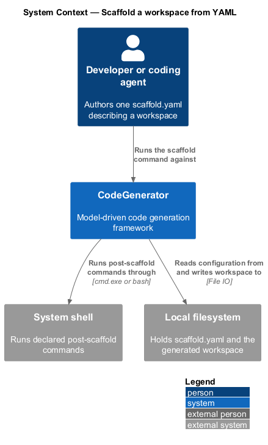
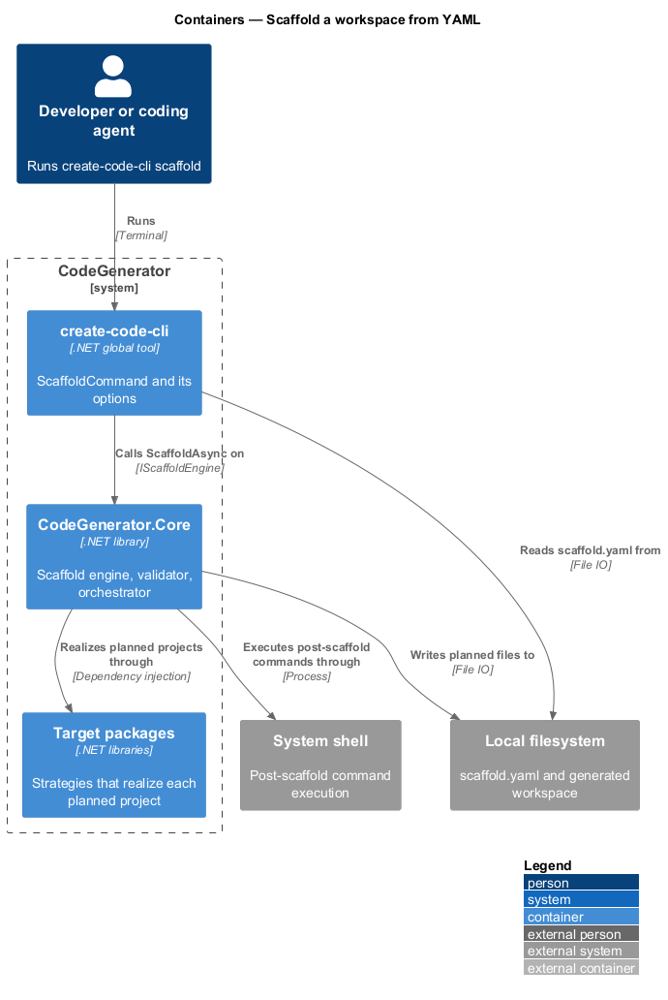
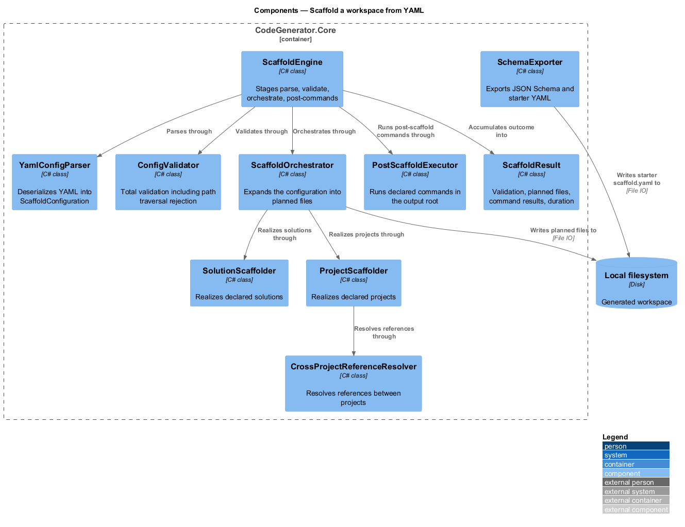
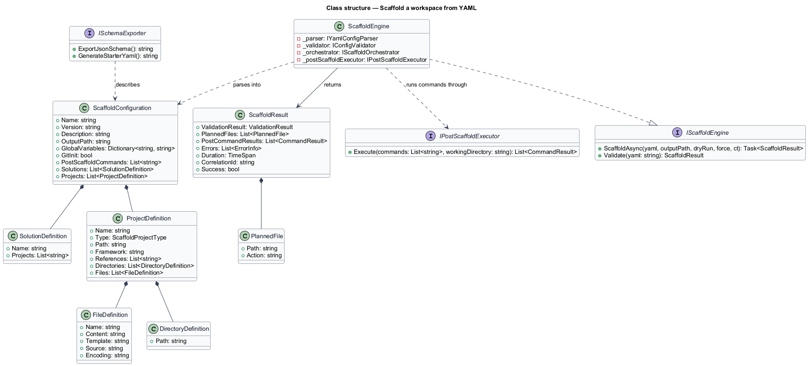
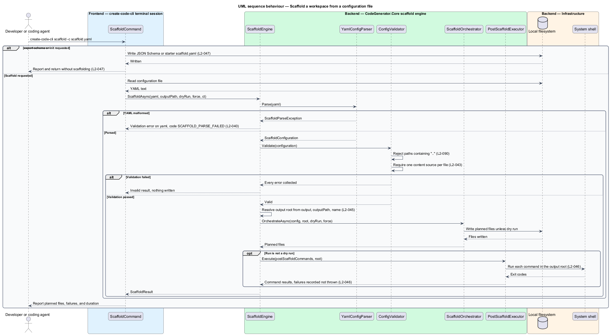

# Scaffold a workspace from YAML

## Overview

The programmatic API asks a caller to write C#. The `scaffold` command asks for a
single YAML file instead, and produces a whole multi-project workspace from it.
This is the declarative face of the same engine.

**scaffold configuration** — YAML document describing a workspace: its name,
version, output path, projects, solutions, and post-scaffold commands

**planned file** — file the run intends to write, carrying the action that would
be taken for it

**post-scaffold command** — shell command declared in the configuration and run
in the output root after files are written

The run is staged so that nothing is written until everything is understood.
Parsing comes first, and a malformed document is reported as a validation error
against the `yaml` property rather than as an exception. Validation comes next,
and it is total: every error in the document is collected before the run stops.
Only then does orchestration write files, and only after that do post-scaffold
commands execute.

Two security properties belong to this stage. Any project or directory path
containing `..` is rejected during validation, so a configuration cannot direct
output outside its tree. Post-scaffold commands are the sharper edge: they run
through the system shell, which makes a scaffold configuration executable
content.

## Description

- **`IScaffoldEngine`** / **`ScaffoldEngine`** — the entry point in
  `CodeGenerator.Core.Scaffold.Services`. `ScaffoldAsync(yaml, outputPath,
  dryRun, force, ct)` parses, validates, orchestrates, and runs post-scaffold
  commands; `Validate(yaml)` stops after validation.
- **`IYamlConfigParser`** / **`YamlConfigParser`** — deserialization into
  `ScaffoldConfiguration`, raising `ScaffoldParseException` on malformed YAML.
- **`ScaffoldConfiguration`** — the parsed document, carrying `Name`, `Version`,
  `Description`, `OutputPath`, `GlobalVariables`, `GitInit`,
  `PostScaffoldCommands`, `Solutions`, and `Projects`.
- **`IConfigValidator`** / **`ConfigValidator`** — total validation of the
  document, including the path-traversal rejection.
- **`IScaffoldOrchestrator`** / **`ScaffoldOrchestrator`** — expansion of the
  validated configuration into planned files and their materialization.
- **`ISolutionScaffolder`**, **`IProjectScaffolder`**,
  **`ITestProjectScaffolder`** — scaffolders for solutions, projects, and test
  projects.
- **`ICrossProjectReferenceResolver`** — resolution of references between the
  declared projects.
- **`IEntityGenerator`**, **`IDtoGenerator`**, **`ITypeMapper`** — generation of
  entities and DTOs declared on a project, and mapping of declared types to the
  target language.
- **`IPostScaffoldExecutor`** / **`PostScaffoldExecutor`** — execution of the
  declared commands in the resolved output root, recording each result.
- **`ISchemaExporter`** / **`SchemaExporter`** — `ExportJsonSchema()` for
  `--export-schema` and `GenerateStarterYaml()` for `--init`.
- **`ScaffoldResult`** — the outcome, carrying `ValidationResult`,
  `PlannedFiles`, `PostCommandResults`, `Errors`, `Duration`, and the
  `CorrelationId`.
- **`FileDefinition`** — a declared file, carrying `Name`, `Encoding`, and at
  most one of `Content`, `Template`, and `Source`.
- **`ErrorCodes.Scaffold`** — the codes `SCAFFOLD_PARSE_FAILED`,
  `SCAFFOLD_FILE_CONFLICT`, and `SCAFFOLD_POST_CMD_FAILED`.

## Requirements

The feature realizes the following level-2 (L2) requirements. Each L2
requirement refines a level-1 (L1) requirement, cited by identifier. Requirement
text is stated in `shall` form; every identifier resolves to `docs/specs/L2.md`.

| L2 ID | Refines (L1) | Requirement |
|-------|--------------|-------------|
| `L2-040` | `L1-009` | The parser shall raise `ScaffoldParseException` on malformed YAML, and the failure shall be reported as a validation error on the `yaml` property with code `SCAFFOLD_PARSE_FAILED` before any file is written. |
| `L2-043` | `L1-009` | A file definition shall declare a name and at most one content source among `content`, `template`, and `source`. |
| `L2-045` | `L1-009` | The output root shall resolve as the supplied output directory, then the configuration `outputPath` when set and not `.`, then the configuration name. |
| `L2-046` | `L1-009` | Post-scaffold commands shall run only when the run is not a dry run, shall execute in the resolved output root, and a failing command shall be recorded with code `SCAFFOLD_POST_CMD_FAILED` without aborting the run. |
| `L2-047` | `L1-009` | The command shall support `--export-schema`, writing the configuration JSON Schema to standard output, and `--init`, writing a starter `scaffold.yaml`, each returning without scaffolding. |
| `L2-090` | `L1-023` | Project paths, directory paths, and template relative paths containing `..` shall be rejected, and `CommonRules.IsValidFilePath` shall return false for them. |
| `L2-091` | `L1-023` | Post-scaffold commands originating from a configuration the invoking user did not author shall not execute without explicit confirmation or an explicit opt-in flag. |

`L2-091` states an obligation the implementation does not yet meet:
`PostScaffoldExecutor` currently runs declared commands whenever the run is not a
dry run. The specification records it as a gap, and this design describes the
intended control rather than present behaviour.

## Diagrams

### System context

A developer supplies one YAML file; CodeGenerator produces the workspace and runs
the declared post-scaffold commands through the system shell.

### Containers

The `scaffold` command in `create-code-cli` drives the scaffold engine in
`CodeGenerator.Core`, which writes the generated workspace.

### Components

Parsing, validation, orchestration, and post-scaffold execution are separate
components, staged so that validation completes before any file is written.

### Class structure

`ScaffoldConfiguration` aggregates the solution and project definitions, and
`ScaffoldResult` carries the validation result, planned files, and command
results back to the caller.

### Behaviour — scaffold from a configuration file

The engine parses under `L2-040`, validates paths under `L2-090`, resolves the
output root under `L2-045`, materializes planned files, and executes commands
under `L2-046`.

