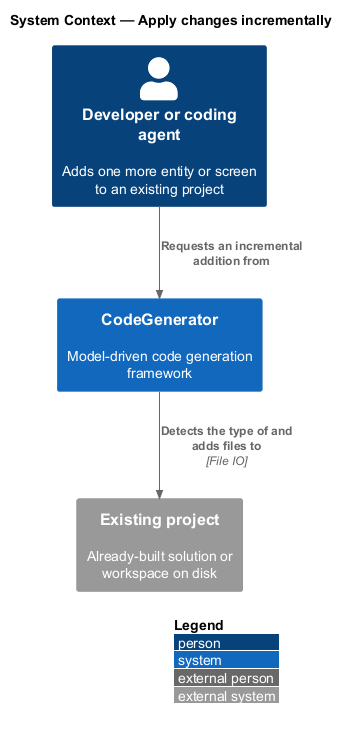
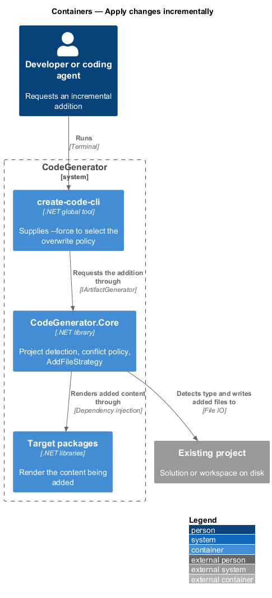
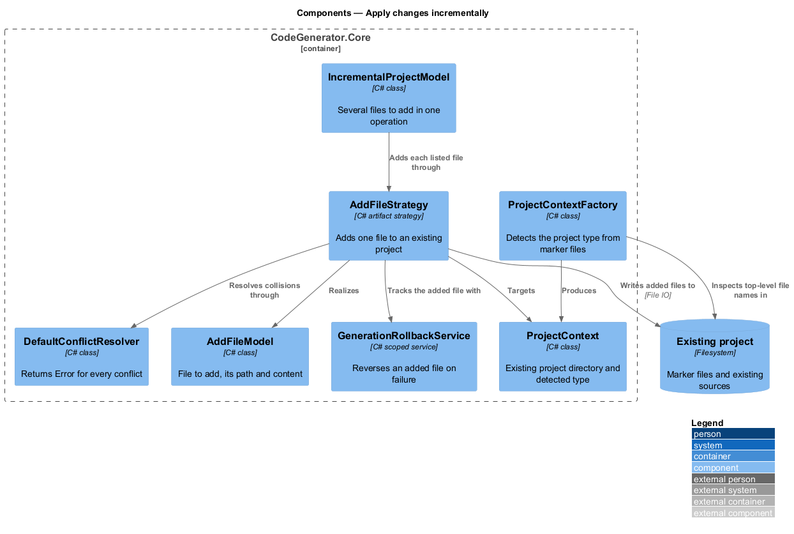
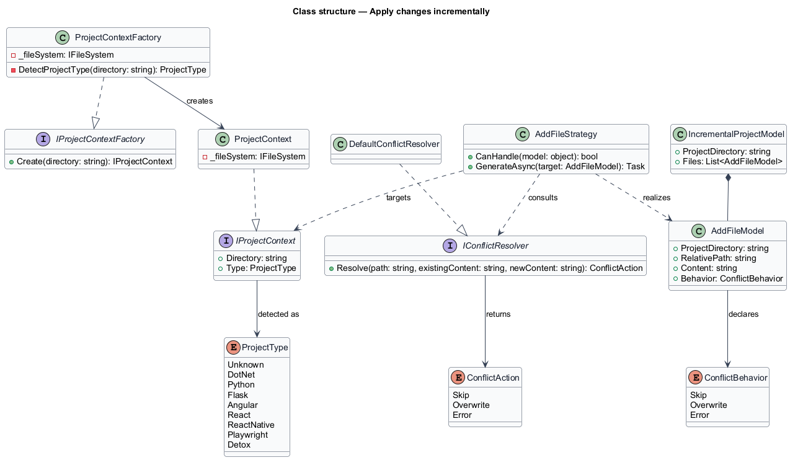
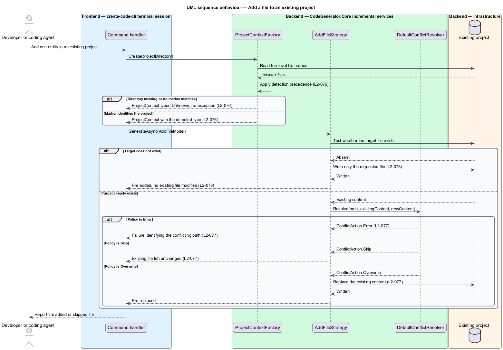

# Apply changes incrementally

## Overview

Generation is most often described as creating something new, but most real use
is additive: a project already exists, and one more entity, screen, or page
object needs to join it. This feature covers adding generated files to an
existing project without regenerating it.

**project context** — view of an existing project directory and its detected type

**conflict** — attempt to write a file that already exists

**conflict action** — decision taken when a conflict occurs: skip, overwrite, or
error

The project type is detected from the directory's contents rather than declared.
Detection is ordered, because marker files overlap: a directory holding both a
`package.json` and a `playwright.config.ts` is a Playwright project, and a
`package.json` naming `react-native` is a React Native project rather than a
React one.

The default conflict action is `Error`. Overwriting a developer's file is the
kind of loss that is discovered late, so the safe answer is chosen unless the
caller asks otherwise, either through a different resolver or through the
`--force` option on the `scaffold` command.

## Description

- **`IProjectContextFactory`** / **`ProjectContextFactory`** — detection in
  `CodeGenerator.Core.Incremental.Services`. `Create(directory)` inspects the
  top-level file names and returns a context carrying the detected type. It
  operates through `IFileSystem`, so detection is testable without touching disk.
- **`ProjectType`** — the detected kind: `Unknown`, `DotNet`, `Python`, `Flask`,
  `Angular`, `React`, `ReactNative`, `Playwright`, or `Detox`.
- **`IProjectContext`** / **`ProjectContext`** — the existing project as seen by
  an incremental run.
- **`IConflictResolver`** / **`DefaultConflictResolver`** — the conflict policy.
  The default implementation returns `ConflictAction.Error` for every conflict.
- **`ConflictAction`** / **`ConflictBehavior`** — the decision and the policy
  values `Skip`, `Overwrite`, and `Error`.
- **`AddFileModel`** — the model describing one file to add to an existing
  project.
- **`IncrementalProjectModel`** — the model describing several files to add in one
  operation.
- **`AddFileStrategy`** — the artifact strategy in
  `CodeGenerator.Core.Incremental.Strategies` that realizes an `AddFileModel`
  against an existing project, honouring the conflict policy.

Detection precedence, in the order `ProjectContextFactory` applies it: a
`.csproj`, `.sln`, or `.slnx` yields `DotNet`; `playwright.config.ts` or
`playwright.config.js` yields `Playwright`; `.detoxrc.js` or `.detoxrc.json`
yields `Detox`; `angular.json` yields `Angular`; a `package.json` naming
`react-native` yields `ReactNative` and one naming `react` yields `React`;
`wsgi.py` or `app.py` yields `Flask`; any `.py`, `setup.py`, or `pyproject.toml`
yields `Python`; anything else yields `Unknown`.

## Requirements

The feature realizes the following level-2 (L2) requirements. Each L2
requirement refines a level-1 (L1) requirement, cited by identifier. Requirement
text is stated in `shall` form; every identifier resolves to `docs/specs/L2.md`.

| L2 ID | Refines (L1) | Requirement |
|-------|--------------|-------------|
| `L2-076` | `L1-018` | `Create(directory)` shall classify an existing directory as DotNet, Playwright, Detox, Angular, React Native, React, Flask, Python, or Unknown from the marker files present, evaluated in that precedence order, and shall return `Unknown` without throwing for a missing or unrecognized directory. |
| `L2-077` | `L1-018` | A write to an existing file shall be resolved under an explicit policy of skip, overwrite, or error, the default resolver shall return error, and `--force` shall overwrite. |
| `L2-078` | `L1-018` | `AddFileStrategy` shall add a file to an existing project without regenerating it, honouring the conflict policy, and an `IncrementalProjectModel` shall add every file it lists. |

## Diagrams

### System context

The project already exists on the filesystem; the incremental run reads its shape
and adds to it.

### Containers

Detection and the conflict policy live in `CodeGenerator.Core`, and the target
packages supply the content being added.

### Components

`ProjectContextFactory` detects the type, `AddFileStrategy` performs the write,
and `IConflictResolver` decides what happens when the target already exists.

### Class structure

`ProjectContext` carries the detected `ProjectType`; `AddFileStrategy` consults
`IConflictResolver` before writing an `AddFileModel`.

### Behaviour — add a file to an existing project

Detection applies `L2-076`, the strategy adds only the requested file under
`L2-078`, and a collision is resolved under `L2-077`.

