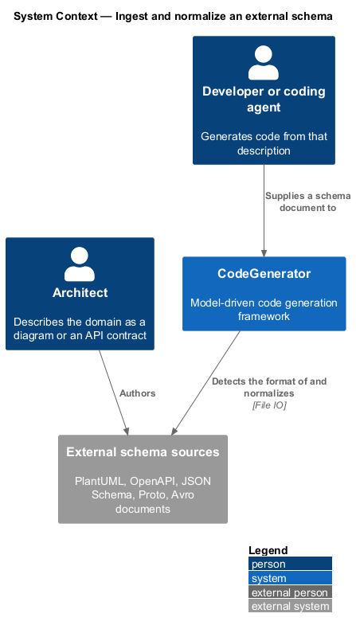
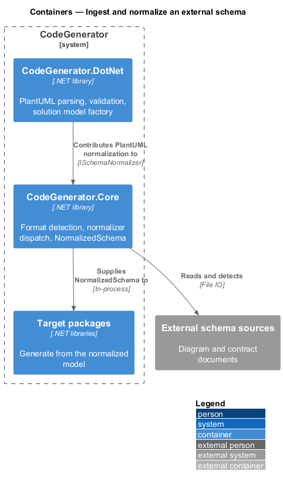
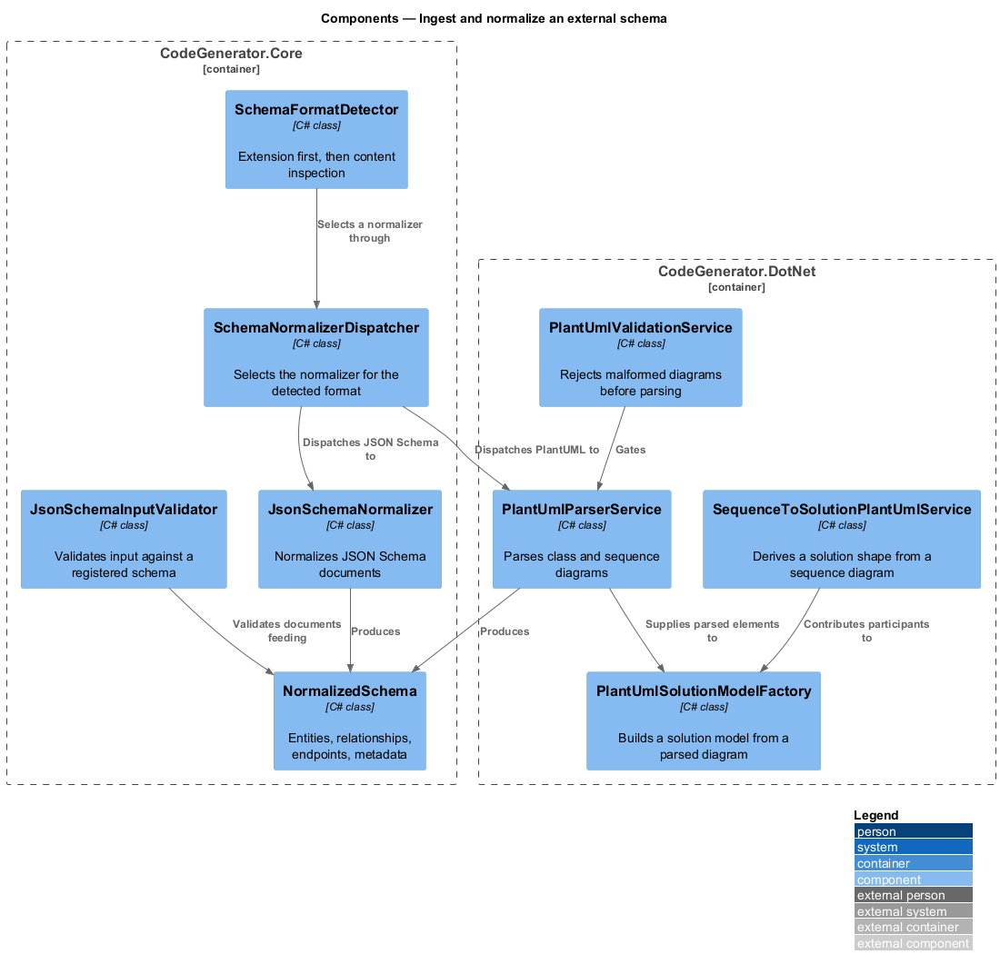
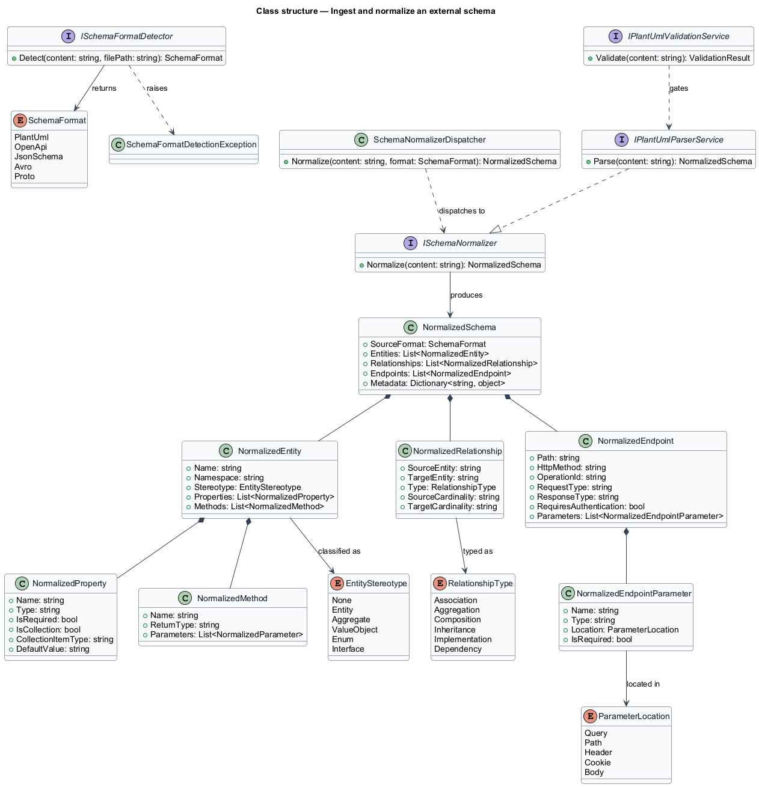
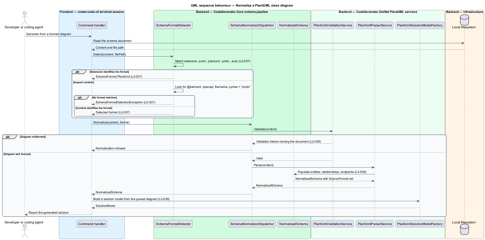

# Ingest and normalize an external schema

## Overview

A model does not have to be written by hand. A team that already has a PlantUML
class diagram, an OpenAPI document, or a JSON Schema has already described its
domain, and this feature turns that description into the models the generators
consume.

**schema** — external description of types, relationships, or endpoints

**normalization** — conversion of any supported schema format into one internal
representation

**stereotype** — classification of an entity as an entity, aggregate, value
object, enumeration, or interface

Five formats are recognized: PlantUML, OpenAPI, JSON Schema, Proto, and Avro.
Detection reads the file extension first and the content second, and fails
explicitly rather than guessing when neither identifies the format.

Everything downstream of detection works on `NormalizedSchema` alone. That is the
point of the design: adding a sixth input format means adding a normalizer, not
touching any generator. The normalized form carries entities with their
properties and methods, relationships with their type and cardinality, and
endpoints with their parameters, request and response types, and whether they
require authentication.

## Description

- **`ISchemaFormatDetector`** / **`SchemaFormatDetector`** — detection in
  `CodeGenerator.Core.Schema`. It maps `.puml` and `.plantuml` to PlantUML,
  `.proto` to Proto, and `.avsc` to Avro; otherwise it inspects the content for
  `@startuml`, `openapi`, a JSON Schema `$schema`, or a Proto `syntax`
  declaration. It raises `SchemaFormatDetectionException` when none matches.
- **`SchemaFormat`** — the enumeration `PlantUml`, `OpenApi`, `JsonSchema`,
  `Avro`, `Proto`.
- **`ISchemaNormalizer`** — the normalizer contract, implemented per format.
- **`JsonSchemaNormalizer`** — the JSON Schema implementation.
- **`SchemaNormalizerDispatcher`** — selection of the normalizer matching the
  detected format.
- **`NormalizedSchema`** — the internal representation, carrying
  `SourceFormat`, `Entities`, `Relationships`, `Endpoints`, and `Metadata`.
- **`NormalizedEntity`** / **`NormalizedProperty`** / **`NormalizedMethod`** /
  **`NormalizedParameter`** — the normalized type model. A property carries
  `IsRequired`, `IsCollection`, `CollectionItemType`, and `DefaultValue`.
- **`EntityStereotype`** — `None`, `Entity`, `Aggregate`, `ValueObject`, `Enum`,
  `Interface`.
- **`NormalizedRelationship`** / **`RelationshipType`** — a relationship and its
  kind: association, aggregation, composition, inheritance, implementation, or
  dependency, with optional cardinalities.
- **`NormalizedEndpoint`** / **`NormalizedEndpointParameter`** /
  **`ParameterLocation`** — an endpoint, its parameters, and whether each sits in
  the query, path, header, cookie, or body. `RequiresAuthentication` records the
  security requirement.
- **`IPlantUmlParserService`** / **`PlantUmlParserService`** — parsing of
  PlantUML class and sequence diagrams.
- **`IPlantUmlValidationService`** / **`PlantUmlValidationService`** — rejection
  of malformed diagrams before parsing.
- **`IPlantUmlSolutionModelFactory`** / **`PlantUmlSolutionModelFactory`** —
  conversion of a parsed diagram into a solution model.
- **`ISequenceToSolutionPlantUmlService`** — conversion of a sequence diagram into
  a solution shape.

## Requirements

The feature realizes the following level-2 (L2) requirements. Each L2
requirement refines a level-1 (L1) requirement, cited by identifier. Requirement
text is stated in `shall` form; every identifier resolves to `docs/specs/L2.md`.

| L2 ID | Refines (L1) | Requirement |
|-------|--------------|-------------|
| `L2-037` | `L1-008` | Detection shall identify PlantUML, OpenAPI, JSON Schema, Proto, and Avro from the file extension first and the content otherwise, and shall raise `SchemaFormatDetectionException` when no format can be determined. |
| `L2-038` | `L1-008` | Every supported format shall normalize into one `NormalizedSchema` carrying entities with stereotype, properties and methods, relationships with type and cardinality, endpoints with their parameters and authentication requirement, and the originating format. |
| `L2-039` | `L1-008` | PlantUML class and sequence diagrams shall be parsed, malformed diagrams shall be rejected before parsing, and a parsed diagram shall convert into a solution model. |

## Diagrams

### System context

The schema is authored outside CodeGenerator — in a diagram tool, an API design
tool, or by hand — and read as an input to generation.

### Containers

Detection and the normalized model live in `CodeGenerator.Core`; the PlantUML
parser lives in `CodeGenerator.DotNet` alongside the solution model it produces.

### Components

The detector selects a format, the dispatcher selects a normalizer, and every
generator downstream reads only `NormalizedSchema`.

### Class structure

`NormalizedSchema` aggregates entities, relationships, and endpoints, each with
its own normalized shape.

### Behaviour — normalize a PlantUML class diagram

Detection applies `L2-037`, validation and parsing apply `L2-039`, and the result
is expressed as the single normalized form required by `L2-038`.

