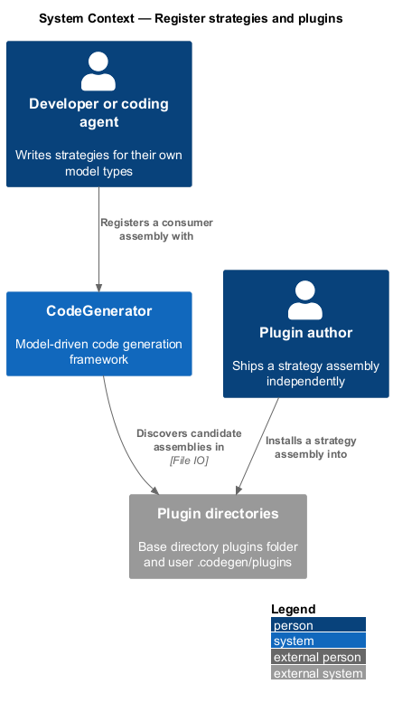
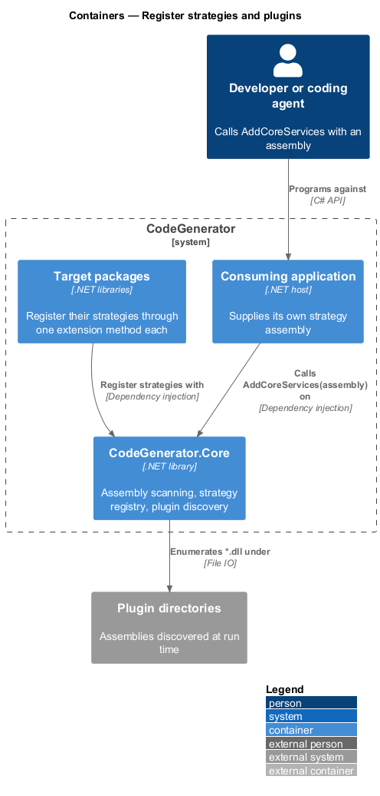
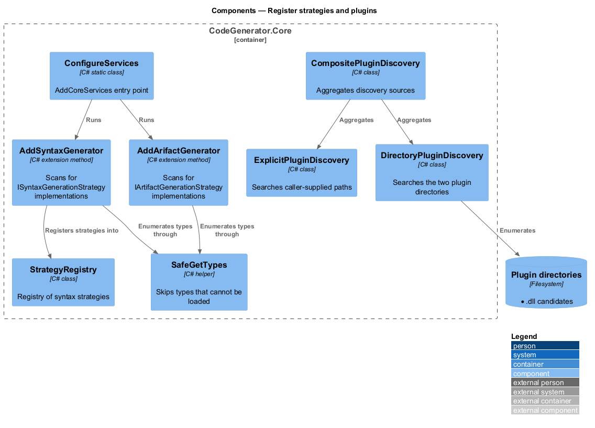
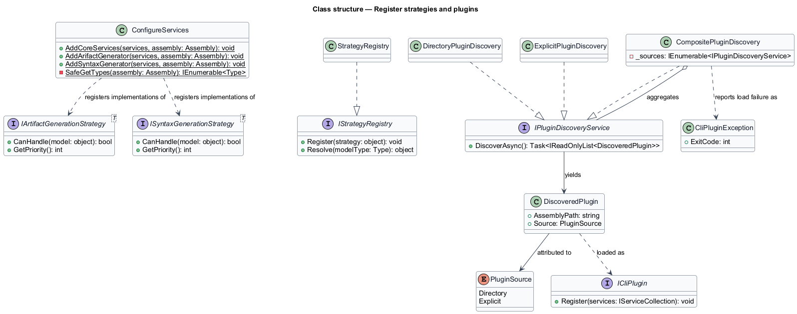
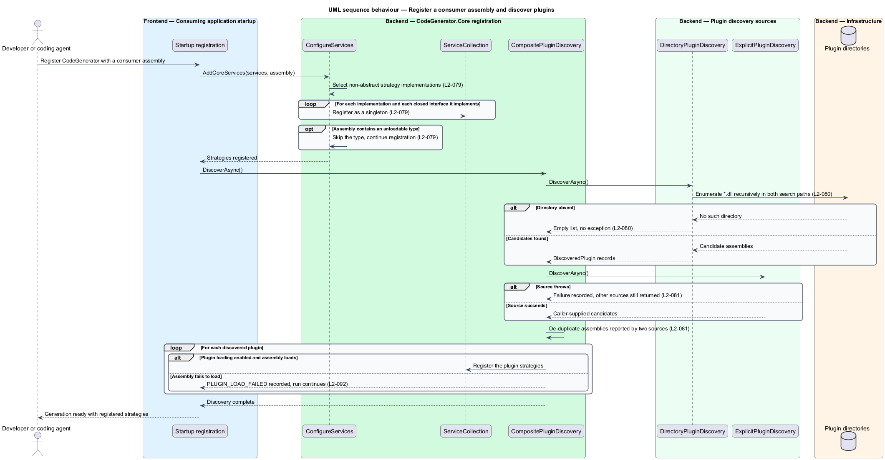

# Register strategies and plugins

## Overview

CodeGenerator has no registry of strategies to edit. A strategy becomes available
by existing in an assembly that has been scanned, which is what allows a
consuming project to add generation for its own model types without changing the
framework.

**strategy registration** — binding of a strategy implementation to the closed
generic interface the engine resolves

**assembly scanning** — reflection pass that finds every strategy implementation
in an assembly and registers it

**plugin** — assembly discovered at run time rather than referenced at compile
time

`AddCoreServices(assembly)` performs the scan. It finds every non-abstract type
implementing `IArtifactGenerationStrategy<>` or `ISyntaxGenerationStrategy<>` and
registers it as a singleton against each closed interface it implements — a
strategy implementing two closed interfaces is registered twice, once for each.
Types that fail to load are skipped, so one unloadable type does not cost the
whole assembly.

Plugin discovery extends the same idea to assemblies found on disk. Two
directories are searched, and the results of several discovery sources are
combined. Discovery enumerates candidates; loading them is the step that carries
trust implications, and the specification records an obligation the
implementation does not yet meet.

## Description

- **`ConfigureServices.AddCoreServices(IServiceCollection, Assembly)`** — the
  registration entry point in `CodeGenerator.Core`. It registers the core
  services, then calls `AddArifactGenerator` and `AddSyntaxGenerator` for the
  supplied assembly.
- **`AddArifactGenerator`** / **`AddSyntaxGenerator`** — the scanning passes.
  Each selects non-abstract types implementing the open generic strategy
  interface and registers them against every matching closed interface.
- **`SafeGetTypes`** — the guarded reflection call that skips types which cannot
  be loaded.
- **`IStrategyRegistry`** / **`StrategyRegistry`** — the registry of syntax
  strategies in `CodeGenerator.Core.Syntax`.
- **`IPluginDiscoveryService`** — the discovery contract, exposing
  `DiscoverAsync()`.
- **`DirectoryPluginDiscovery`** — discovery over
  `<AppContext.BaseDirectory>/plugins` and
  `<UserProfile>/.codegen/plugins`, searching recursively for `*.dll` and
  tolerating a missing directory.
- **`ExplicitPluginDiscovery`** — discovery over paths named by the caller.
- **`CompositePluginDiscovery`** — aggregation of several discovery sources.
- **`DiscoveredPlugin`** / **`PluginSource`** — a discovered assembly and the
  source that found it.
- **`ICliPlugin`** — the plugin contract in `CodeGenerator.Abstractions.Plugins`.
- **`ErrorCodes.Plugin`** — the codes `PLUGIN_LOAD_FAILED` and
  `PLUGIN_STRATEGY_NOT_FOUND`.

## Requirements

The feature realizes the following level-2 (L2) requirements. Each L2
requirement refines a level-1 (L1) requirement, cited by identifier. Requirement
text is stated in `shall` form; every identifier resolves to `docs/specs/L2.md`.

| L2 ID | Refines (L1) | Requirement |
|-------|--------------|-------------|
| `L2-079` | `L1-019` | `AddCoreServices` shall scan the supplied assembly for non-abstract strategy implementations, shall register each as a singleton against every matching closed interface, and shall skip types that cannot be loaded without aborting registration. |
| `L2-080` | `L1-019` | Directory discovery shall search `<AppContext.BaseDirectory>/plugins` and `<UserProfile>/.codegen/plugins` recursively for `*.dll` and shall tolerate a missing directory. |
| `L2-081` | `L1-019` | Composite discovery shall aggregate every registered source, a failure in one source shall not suppress the others, and an assembly reported by two sources shall not be loaded twice. |
| `L2-092` | `L1-023` | A plugin that fails to load shall be reported with code `PLUGIN_LOAD_FAILED` without terminating the run, a failing plugin strategy shall be attributed to that plugin, and assemblies in the plugin directories shall not be loaded unless plugin loading is explicitly enabled. |

`L2-092` states an obligation the implementation does not yet meet: discovery
enumerates the plugin directories with no opt-in and no integrity check. The
specification records it as a gap, and this design describes the intended control
rather than present behaviour.

## Diagrams

### System context

Strategies reach the framework from two directions: assemblies a consuming
project references, and assemblies found on disk at run time.

### Containers

Scanning happens inside `CodeGenerator.Core` at startup; discovery reaches
outside the framework to the plugin directories.

### Components

The two scanning passes register strategies with the service collection; the
three discovery sources are combined behind one contract.

### Class structure

`CompositePluginDiscovery` aggregates `DirectoryPluginDiscovery` and
`ExplicitPluginDiscovery` behind `IPluginDiscoveryService`, each yielding
`DiscoveredPlugin` records.

### Behaviour — register a consumer assembly and discover plugins

Startup scans the consumer assembly under `L2-079`, then aggregates discovery
sources under `L2-081`, isolating a load failure under `L2-092`.

