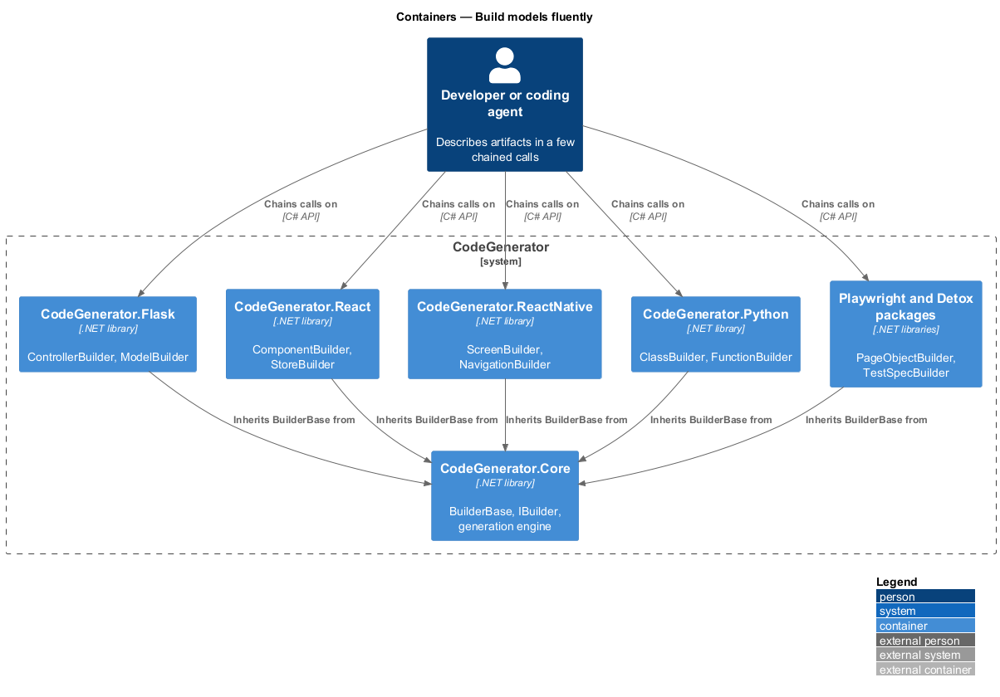
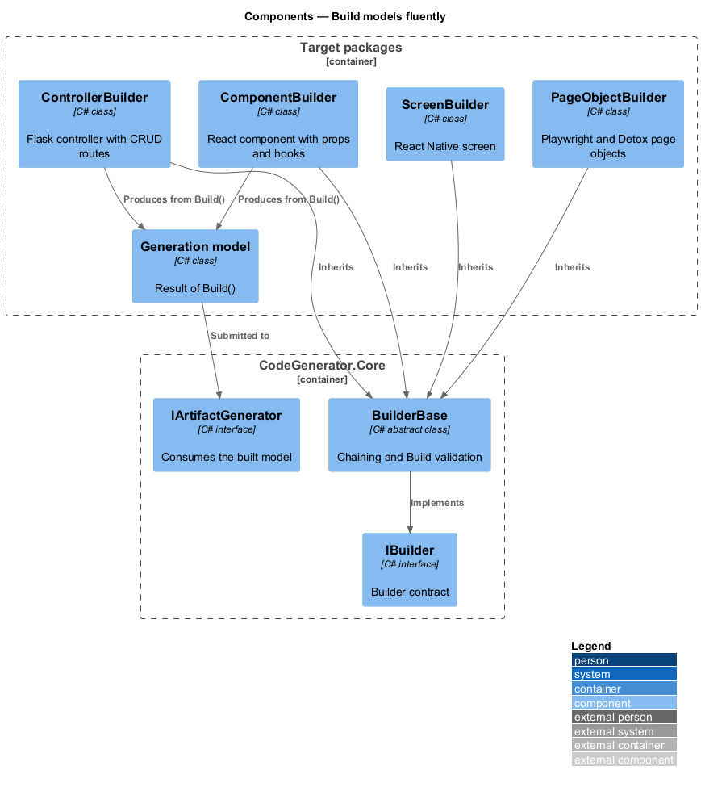
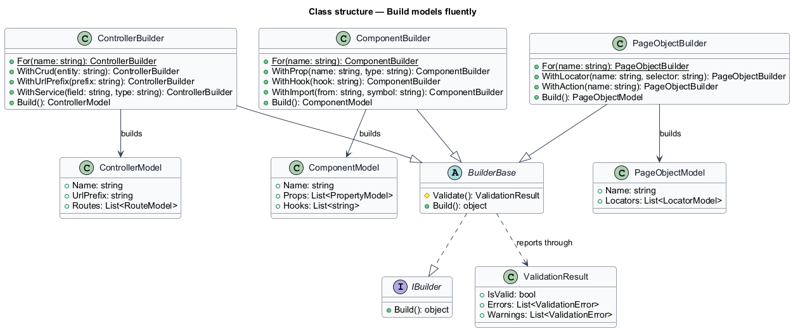
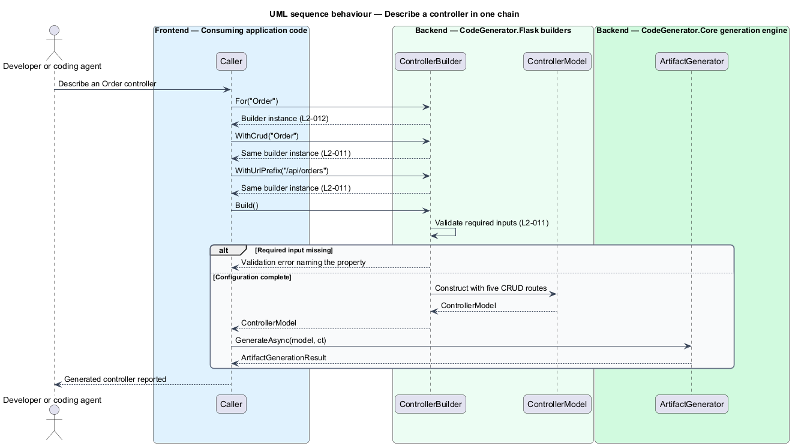

# Build models fluently

## Overview

A generation model is a plain object, and constructing one by assigning
properties is verbose. CodeGenerator ships fluent builders so that describing an
artifact costs a few chained calls rather than a block of assignments.

**builder** — object that accumulates configuration through chained calls and
produces a validated model from `Build()`

The economy matters most for the framework's primary caller. A coding agent
spends tokens on every line it emits, so the compact form is the difference
between describing a controller in three lines and writing the controller
itself in eighty. `ControllerBuilder.For("Order").WithCrud("Order")` describes
five routes; the generated Flask controller that results is far longer than its
description.

Each target package supplies builders for the constructs its users reach for
most often, rather than for every model type. Where no builder exists, the model
is constructed directly — builders are a convenience over the model layer, not a
replacement for it.

## Description

- **`IBuilder`** — the builder marker contract in `CodeGenerator.Core.Builders`.
- **`BuilderBase`** — shared base class supplying the chaining and validation
  behaviour every builder inherits. `Build()` returns the constructed model and
  reports missing required inputs as validation errors.
- **`ClassBuilder`, `FunctionBuilder`** — Python builders for class and function
  models.
- **`ControllerBuilder`, `ModelBuilder`** — Flask builders. `ControllerBuilder`
  carries `WithCrud`, `WithUrlPrefix`, and `WithService`, expanding one call into
  the five CRUD routes of a Blueprint controller.
- **`ComponentBuilder`, `StoreBuilder`** — React builders for component and
  Zustand store models. `ComponentBuilder` carries `WithProp`, `WithHook`, and
  `WithImport`.
- **`ScreenBuilder`, `NavigationBuilder`** — React Native builders for screen and
  navigator models.
- **`TypeScriptTypeBuilder`** — Angular builder for TypeScript type models.
- **`PageObjectBuilder`, `TestSpecBuilder`** — test builders, supplied by both
  the Playwright and Detox packages, for page object and specification models.

Every builder exposes a static `For(...)` entry point that returns a builder
instance, so a call chain starts from the type name rather than from a
constructor.

## Requirements

The feature realizes the following level-2 (L2) requirements. Each L2
requirement refines a level-1 (L1) requirement, cited by identifier. Requirement
text is stated in `shall` form; every identifier resolves to `docs/specs/L2.md`.

| L2 ID | Refines (L1) | Requirement |
|-------|--------------|-------------|
| `L2-011` | `L1-003` | A builder shall return itself from every configuration call, and `Build()` shall produce a model reflecting each chained call or report the missing required input as a validation error. |
| `L2-012` | `L1-003` | Each target package shall supply builders for its highest-frequency models, each exposing a static `For(...)` entry point. |

## Diagrams

This slice sits wholly inside the target packages and introduces no external
actor or deployment unit of its own, so the C4 context level would restate the
context given in
[generate-artifact-from-model](../generate-artifact-from-model/README.md)
without adding information. The container level is the highest level carrying
detail specific to the slice.

### Containers

Builders ship inside each target package and produce models that the generation
engine in `CodeGenerator.Core` consumes.

### Components

`BuilderBase` supplies chaining and validation to each package's concrete
builders, and every `Build()` call yields a model for the engine.

### Class structure

Concrete builders inherit `BuilderBase`, implement `IBuilder`, and produce their
package's model type.

### Behaviour — describe a controller in one chain

A caller chains configuration onto `ControllerBuilder`, calls `Build()` under
`L2-011`, and submits the resulting model to the generation engine.

