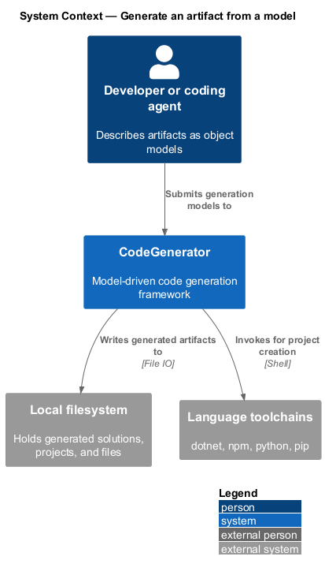
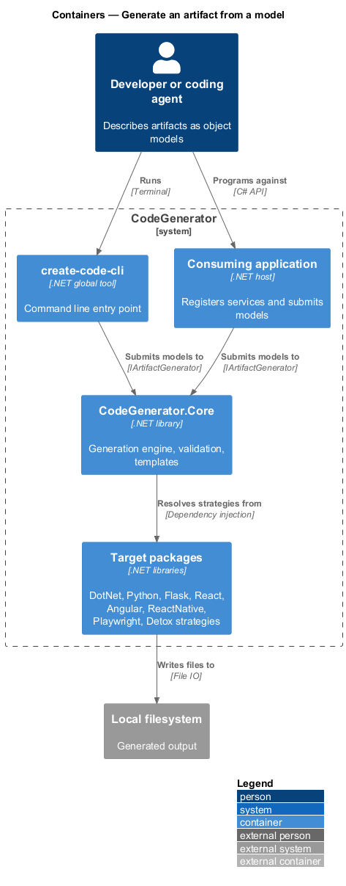
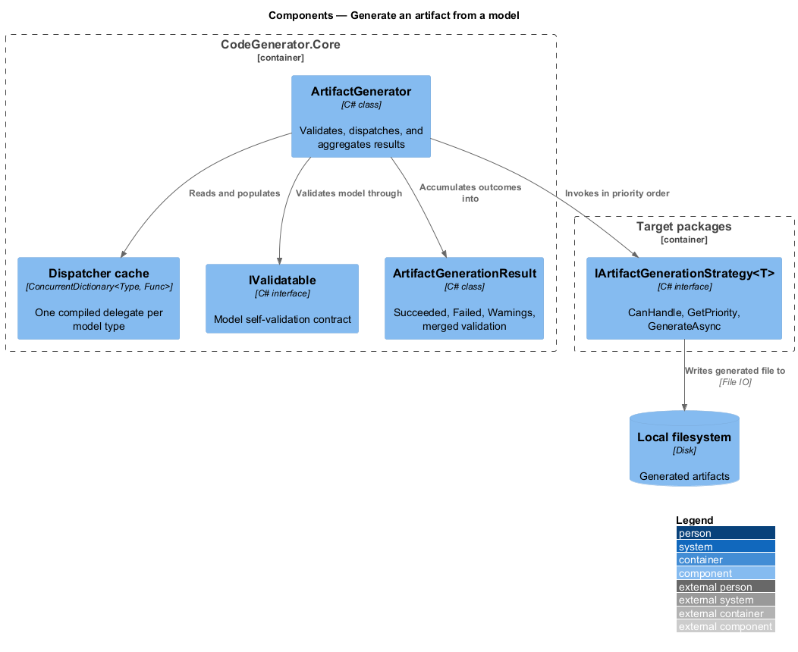
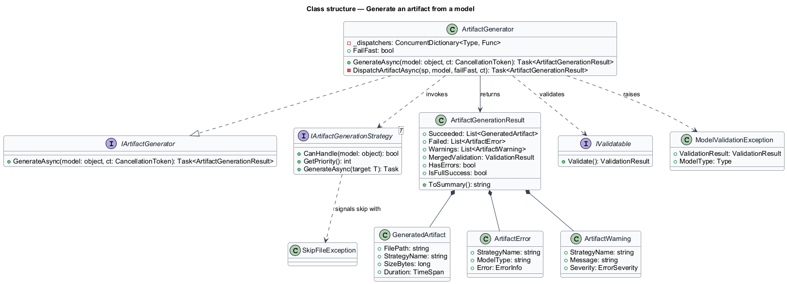
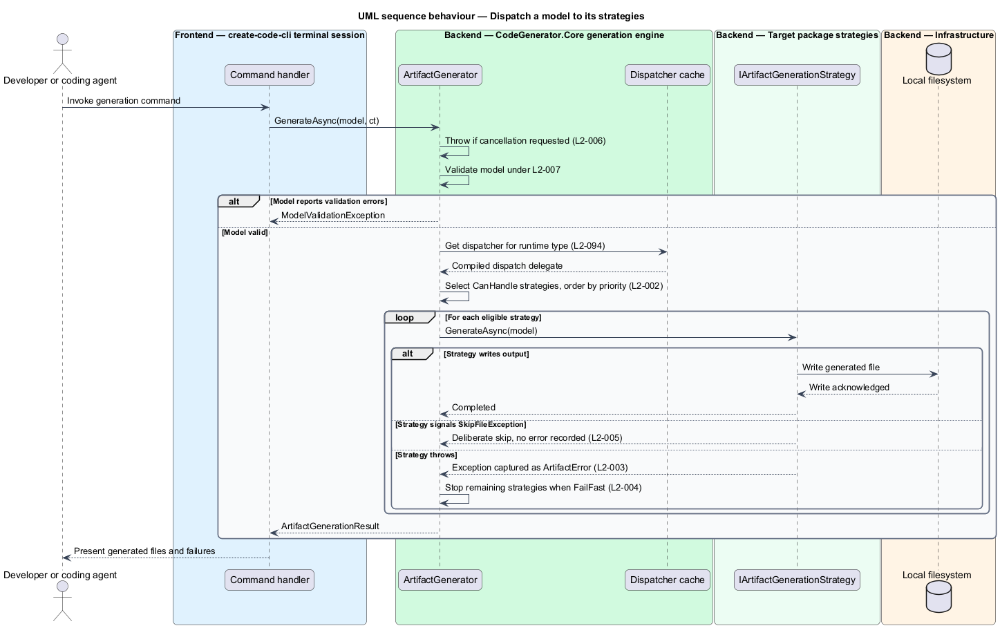

# Generate an artifact from a model

## Overview

CodeGenerator produces source files, projects, and solutions from object models
rather than from hand-written text. A caller — an application, or a coding agent
using the library — builds a small in-memory model that describes the artifact,
and the generation engine turns that model into files on disk.

**artifact** — file, project, or solution produced by a generation run

**model** — plain object describing an artifact, carrying no generation logic

**strategy** — class that knows how to turn one model type into output

This feature covers the entry point of that process. `IArtifactGenerator`
receives a model and dispatches it to every strategy registered for the model's
type. The caller names no strategy. The engine resolves them, orders them,
executes them, and returns a structured account of what succeeded and what
failed.

Dispatch is the busiest path in the system, so it is also where the engine
enforces three cross-cutting rules: a model that can validate itself is
validated before any file is written, a strategy that throws does not end the
run, and cancellation is honoured between steps.

## Description

The slice runs from the caller's model to the strategies that write files.

- **`IArtifactGenerator`** — the engine's public contract, declared in
  `CodeGenerator.Abstractions`. It exposes one method,
  `GenerateAsync(object model, CancellationToken)`.
- **`ArtifactGenerator`** — the implementation in
  `CodeGenerator.Core.Artifacts.Abstractions`. It validates, resolves the
  dispatcher, executes strategies, and aggregates results. Its `FailFast`
  property selects the failure policy.
- **`DispatchArtifactAsync<T>`** — private static generic method on
  `ArtifactGenerator`. Closing it over the model's runtime type is what lets a
  model passed as `object` reach the strategies registered for its concrete
  type.
- **`_dispatchers`** — `ConcurrentDictionary<Type, Func<...>>` on
  `ArtifactGenerator`. It holds one compiled delegate per model type, so the
  reflection cost of closing the generic method is paid once per type.
- **`IArtifactGenerationStrategy<T>`** — the strategy contract. It supplies
  default implementations of `CanHandle(object)`, which tests the model type,
  and `GetPriority()`, which returns `1`.
- **`ArtifactGenerationResult`** — the return value. It carries `Succeeded`
  (`GeneratedArtifact` records with strategy name and elapsed duration),
  `Failed` (`ArtifactError` records wrapping an `ErrorInfo`), `Warnings`, and
  the merged `ValidationResult`.
- **`IValidatable`** — optional interface on a model. A model implementing it is
  validated before dispatch.
- **`ModelValidationException`** — raised when a validatable model reports
  errors. It carries the failing `ValidationResult` and the model type.
- **`SkipFileException`** — raised by a strategy that declines to emit output.
  The engine treats it as a deliberate skip rather than a failure.
- **`ErrorCodes.Strategy.ExecutionFailed`** — the constant
  `PLUGIN_STRATEGY_EXEC_FAILED`, recorded against every strategy failure.

## Requirements

The feature realizes the following level-2 (L2) requirements. Each L2
requirement refines a level-1 (L1) requirement, cited by identifier. Requirement
text is stated in `shall` form; every identifier resolves to `docs/specs/L2.md`.

| L2 ID | Refines (L1) | Requirement |
|-------|--------------|-------------|
| `L2-001` | `L1-001` | The generator shall resolve generation strategies from the model's runtime type, and shall cache the dispatch delegate constructed for each type. |
| `L2-002` | `L1-001` | The generator shall execute every strategy whose `CanHandle` accepts the model, in descending order of `GetPriority`. |
| `L2-003` | `L1-001` | A strategy that throws shall not prevent the remaining strategies from running, and each outcome shall be recorded in the result. |
| `L2-004` | `L1-001` | When fail-fast is enabled, the first strategy failure shall stop execution of the remaining strategies for that model. |
| `L2-005` | `L1-001` | A strategy that raises `SkipFileException` shall be treated as a deliberate skip and shall not be recorded as an error. |
| `L2-006` | `L1-001` | Generation shall observe the cancellation token before dispatch and before each strategy invocation, and `OperationCanceledException` shall propagate unmodified. |
| `L2-007` | `L1-012` | A model implementing `IValidatable` shall be validated before any strategy executes; errors shall abort generation and warnings shall not. |
| `L2-094` | `L1-024` | The generic dispatch delegate for a model type shall be constructed at most once per process and served from a concurrent cache thereafter. |

## Diagrams

### System context

A developer or coding agent drives CodeGenerator, which writes generated output
to the local filesystem and calls language toolchains for project creation.

### Containers

The model enters through a consuming application or the `create-code-cli` tool,
reaches the generation engine in `CodeGenerator.Core`, and is realized by
strategies supplied by the target packages.

### Components

Inside the engine, `ArtifactGenerator` validates the model, obtains a cached
dispatcher keyed on the runtime type, and invokes each eligible strategy in
priority order, accumulating outcomes in `ArtifactGenerationResult`.

### Class structure

`ArtifactGenerator` implements `IArtifactGenerator`, depends on
`IArtifactGenerationStrategy<T>`, and returns an `ArtifactGenerationResult`
composed of `GeneratedArtifact`, `ArtifactError`, and `ArtifactWarning` records.

### Behaviour — dispatch a model to its strategies

The engine validates the model under `L2-007`, resolves the cached dispatcher
under `L2-094`, then runs each eligible strategy under `L2-002`, isolating
failures under `L2-003`.

