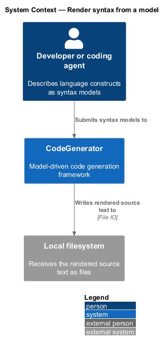
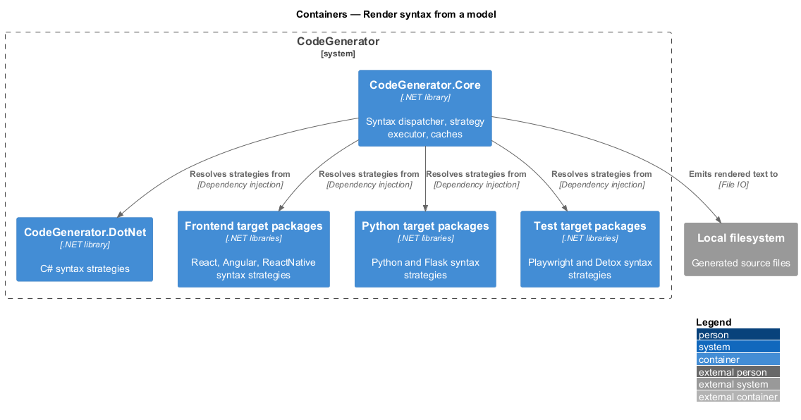
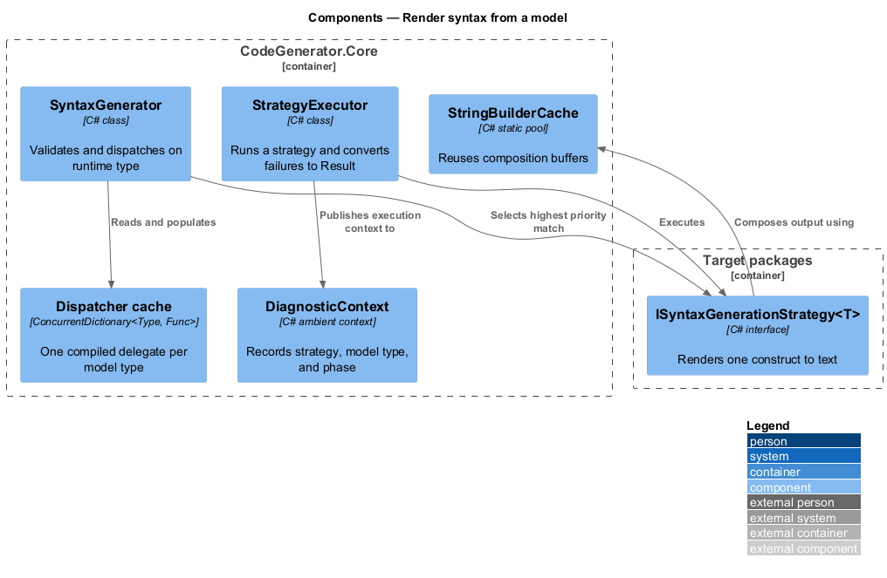
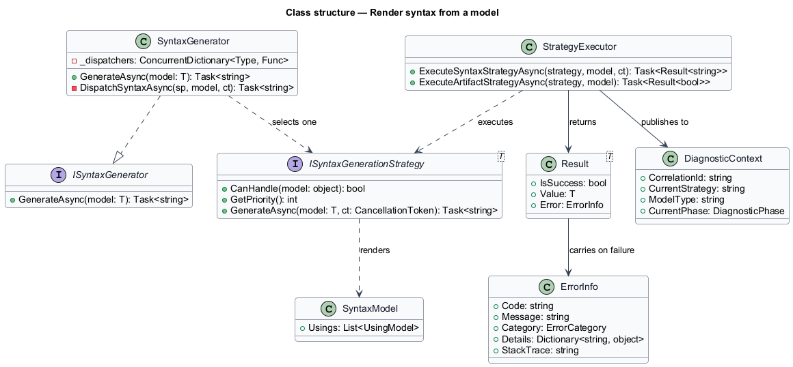
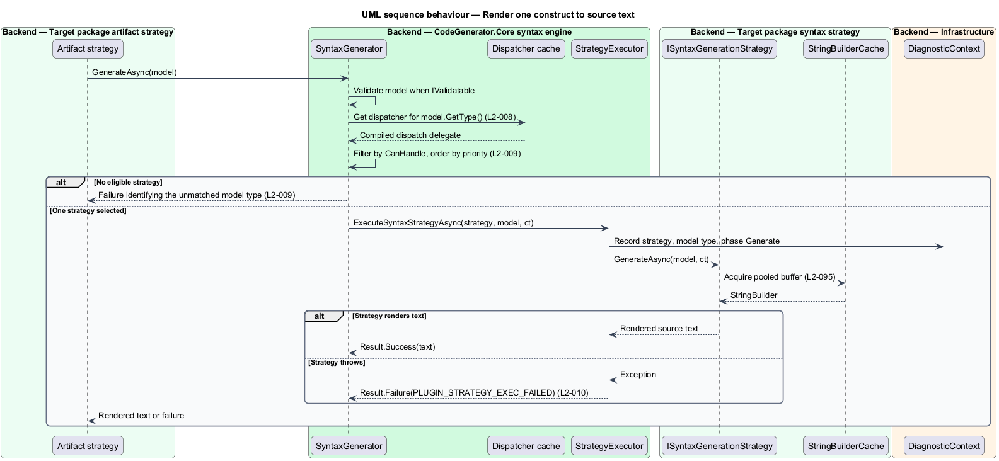

# Render syntax from a model

## Overview

Artifact generation writes files; syntax generation produces the text that goes
inside them. This feature covers the second engine in `CodeGenerator.Core`:
`ISyntaxGenerator` takes a syntax model and returns a string of source code in
the target language.

**syntax model** — object describing one language construct, such as a class, a
method, a React component, or a Flask route

**syntax strategy** — class that renders one syntax model type into source text

The two engines differ in one deliberate way. Artifact generation runs *every*
eligible strategy, because a single model can legitimately produce several files.
Syntax generation runs exactly *one* — the eligible strategy with the highest
priority — because a construct has one rendering, and a second strategy would
produce a competing string rather than an additional artifact.

Resolution is by runtime type. A `ClassModel` handed to the engine through a
variable declared as `SyntaxModel` still reaches the `ClassModel` strategy. That
behaviour is load-bearing: factories across the target packages return the base
`SyntaxModel` type, and dispatching on the compile-time type would send every one
of them to the wrong strategy.

## Description

- **`ISyntaxGenerator`** — the contract in `CodeGenerator.Abstractions`, exposing
  `GenerateAsync<T>(T model)`.
- **`SyntaxGenerator`** — the implementation in `CodeGenerator.Core.Syntax`. It
  validates the model, resolves a cached dispatcher from `model.GetType()`, and
  returns the selected strategy's output.
- **`DispatchSyntaxAsync<T>`** — private static generic method that resolves
  `IEnumerable<ISyntaxGenerationStrategy<T>>`, filters by `CanHandle`, orders by
  priority descending, and takes the first.
- **`ISyntaxGenerationStrategy<T>`** — the strategy contract, carrying
  `CanHandle`, `GetPriority`, and `GenerateAsync(T, CancellationToken)`.
- **`StrategyExecutor`** — wrapper in `CodeGenerator.Core.Artifacts` that runs a
  strategy under a diagnostic context and converts a thrown exception into a
  failed `Result<string>` rather than letting it escape. It records the strategy
  name, model type, and the phase (`SyntaxGeneration` or `ArtifactGeneration`)
  in the error details.
- **`Result<T>`** — the outcome type in `CodeGenerator.Abstractions.Results`,
  carrying either a value or an `ErrorInfo`.
- **`DiagnosticContext.Current`** — ambient context that records the executing
  strategy, model type, and `DiagnosticPhase` for observability.
- **`StringBuilderCache`** — pooled `StringBuilder` provider used by syntax
  strategies to compose output without allocating a new buffer per construct.
- **`IObjectCache`** — cache for resolved objects reused across artifacts within
  a run.

## Requirements

The feature realizes the following level-2 (L2) requirements. Each L2
requirement refines a level-1 (L1) requirement, cited by identifier. Requirement
text is stated in `shall` form; every identifier resolves to `docs/specs/L2.md`.

| L2 ID | Refines (L1) | Requirement |
|-------|--------------|-------------|
| `L2-008` | `L1-002` | The syntax generator shall resolve strategies from the model's runtime type, so a model passed as a base type reaches its concrete strategy. |
| `L2-009` | `L1-002` | The syntax generator shall select exactly one strategy — the eligible strategy of highest priority — and shall fail explicitly when no strategy matches. |
| `L2-010` | `L1-013` | A strategy executed through `StrategyExecutor` shall convert a thrown exception into a failed `Result` carrying code `PLUGIN_STRATEGY_EXEC_FAILED`, the strategy name, the model type, and the phase. |
| `L2-095` | `L1-024` | Syntax composition shall reuse pooled `StringBuilder` instances, and resolved objects shall be served from `IObjectCache` rather than recomputed per artifact. |

## Diagrams

### System context

The syntax engine sits inside the same system boundary as artifact generation;
its callers are the artifact strategies rather than the developer directly.

### Containers

Syntax strategies live in the target packages. `CodeGenerator.Core` holds the
dispatcher, the executor, and the caches they share.

### Components

`SyntaxGenerator` validates, resolves one strategy through the dispatcher cache,
and runs it through `StrategyExecutor`, which reports outcomes as `Result<string>`.

### Class structure

`SyntaxGenerator` implements `ISyntaxGenerator` and depends on
`ISyntaxGenerationStrategy<T>`; `StrategyExecutor` wraps execution and returns
`Result<string>` carrying an `ErrorInfo` on failure.

### Behaviour — render one construct

An artifact strategy asks the syntax engine for the text of a construct. The
engine applies `L2-008` runtime-type resolution, selects the single strategy
under `L2-009`, and returns either the rendered string or a failed result under
`L2-010`.

