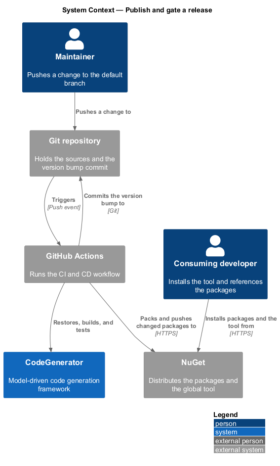
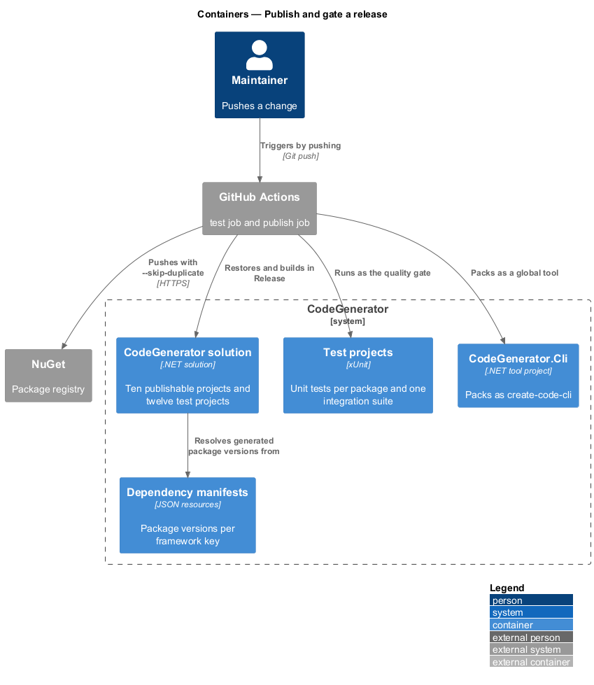
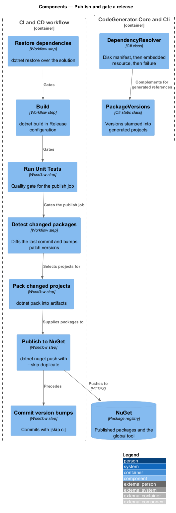
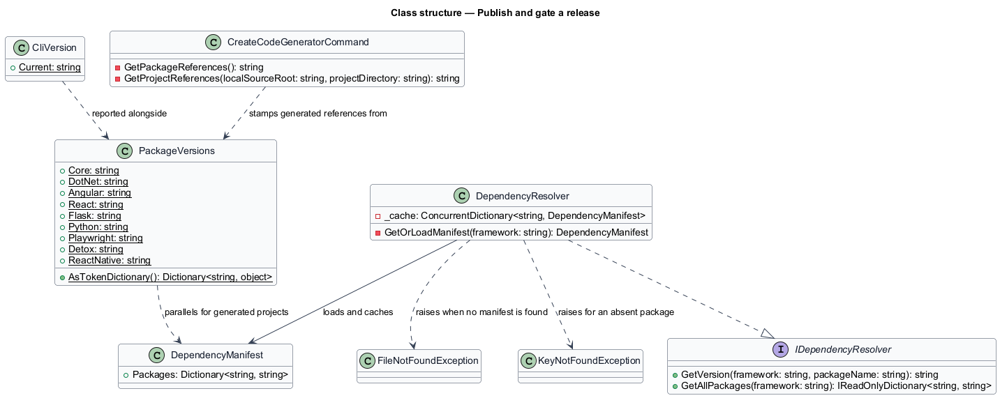
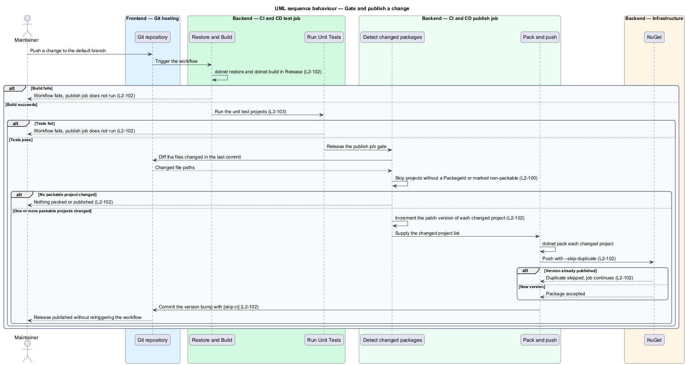

# Publish and gate a release

## Overview

CodeGenerator is consumed as ten NuGet packages and one .NET global tool. This
feature covers how a change reaches those consumers: the version a generated
project references, the packaging of each component, and the pipeline that
decides whether a change is published at all.

**packable project** — source project that ships as a NuGet package

**version bump** — automated increment of a package's patch version when its
sources change

**quality gate** — build or test step that a change passes before publication

The pipeline is a gate, not a conveyor. Restore, build, and unit tests run first,
and the publish job depends on them, so a change that does not build cannot
reach NuGet. Publication is per-package: only projects whose sources changed in
the pushed commit are bumped and packed, and a version already present on NuGet
is skipped rather than treated as a failure. The version-bump commit carries
`[skip ci]` so publication does not retrigger itself.

Two version concerns meet here. The version a package publishes under lives in
its `.csproj` and is bumped by the pipeline. The version a *generated* project
references lives in `PackageVersions`, and is not bumped by anything — which is
the source of the drift recorded in `L2-085`.

## Description

- **`IDependencyResolver`** / **`DependencyResolver`** — package version
  resolution in `CodeGenerator.Core.Dependencies`. `GetVersion(framework,
  packageName)` consults a manifest beside the executing assembly first, then an
  embedded resource, and raises `FileNotFoundException` naming both searched
  locations when neither exists. Manifests are cached per framework key in a
  `ConcurrentDictionary`, and an absent package raises `KeyNotFoundException`.
- **`DependencyManifest`** — the manifest shape: a package-name to version map.
- **`PackageVersions`** — the constants stamped into generated
  `PackageReference` entries, and `AsTokenDictionary()` exposing them as
  `package_version_*` template tokens.
- **`CliVersion`** — the running tool's version, read from the assembly's
  informational version.
- **`.github/workflows/ci-cd.yml`** — the pipeline. The `test` job restores,
  builds the solution in Release, and runs the unit tests; the `publish` job
  declares `needs: test`, detects changed packable projects from the last commit,
  bumps their patch version, packs, pushes to NuGet with `--skip-duplicate`, and
  commits the bump with `[skip ci]`.
- **Test projects** — one unit test project per package under `tests/`, plus
  `CodeGenerator.IntegrationTests` covering the cross-cutting features end to
  end. Each declares `IsPackable=false`.
- **`CodeGenerator.Cli.csproj`** — the tool package, declaring `PackAsTool`,
  `ToolCommandName` `create-code-cli`, and `PackageId`
  `QuinntyneBrown.CodeGenerator.Cli`.

## Requirements

The feature realizes the following level-2 (L2) requirements. Each L2
requirement refines a level-1 (L1) requirement, cited by identifier. Requirement
text is stated in `shall` form; every identifier resolves to `docs/specs/L2.md`.

| L2 ID | Refines (L1) | Requirement |
|-------|--------------|-------------|
| `L2-084` | `L1-021` | The resolver shall consult a manifest on disk beside the executing assembly first, then an embedded resource, shall raise `FileNotFoundException` naming both searched locations when neither exists, shall raise `KeyNotFoundException` for an absent package, and shall cache each manifest per framework key. |
| `L2-085` | `L1-021` | The versions stamped into generated package references shall be maintained in one location, shall be semantic-version formatted, and shall equal the versions the corresponding projects publish. |
| `L2-086` | `L1-021` | A generated project shall reference CodeGenerator by pinned `PackageReference` entries, or by `ProjectReference` paths relative to the generated project directory when a local source root is supplied. |
| `L2-100` | `L1-026` | Each publishable project shall declare a `PackageId` under the `QuinntyneBrown.` prefix and a version, each test project shall declare `IsPackable=false`, and the publish step shall skip projects lacking a `PackageId` or marked non-packable. |
| `L2-101` | `L1-026` | The CLI project shall pack as a .NET global tool named `create-code-cli` under the package identifier `QuinntyneBrown.CodeGenerator.Cli`. |
| `L2-102` | `L1-026` | The pipeline shall restore, build in Release, and run the unit tests, and shall perform no packing, publication, or version bump unless those steps pass; a bump commit shall contain `[skip ci]` and an already-published version shall be skipped. |
| `L2-103` | `L1-027` | Each package shall have a corresponding unit test project that compiles and runs in the pipeline, with the test framework resolvable in every test file, and the pipeline test step shall execute every unit test project. |
| `L2-104` | `L1-027` | Each cross-cutting feature area shall be covered by an integration test suite that runs against a temporary directory, modifies no repository file, and removes every temporary directory it creates. |
| `L2-105` | `L1-027` | Every acceptance test shall declare the L2 requirements it covers in a `Traces to:` comment header, each identifier shall resolve to a declared requirement, and every requirement not marked as a gap shall be covered by at least one acceptance test. |

`L2-085` and `L2-103` state obligations the implementation does not yet meet.
`PackageVersions.Core` is `1.3.0` while `CodeGenerator.Core.csproj` publishes
`1.3.1`, because the pipeline's bump step rewrites the `.csproj` without
updating `PackageVersions`. The pipeline test step runs only
`CodeGenerator.Core.UnitTests`, so a failure in any other test project surfaces
as a build error rather than a test failure. The specification records both as
gaps, and this design describes the intended controls rather than present
behaviour.

## Diagrams

### System context

A push to the default branch drives the pipeline, which publishes packages to
NuGet for downstream consumers.

### Containers

The pipeline builds and tests the solution, then packs and publishes each changed
package and installs the tool.

### Components

The `test` job gates the `publish` job; version detection, bump, pack, push, and
the bump commit run in sequence within the publish job.

### Class structure

`DependencyResolver` reads a `DependencyManifest` per framework key;
`PackageVersions` holds the versions stamped into generated projects.

### Behaviour — gate and publish a change

The pipeline runs the quality gate of `L2-102`, then bumps, packs, and pushes
only the changed packable projects required by `L2-100`.

