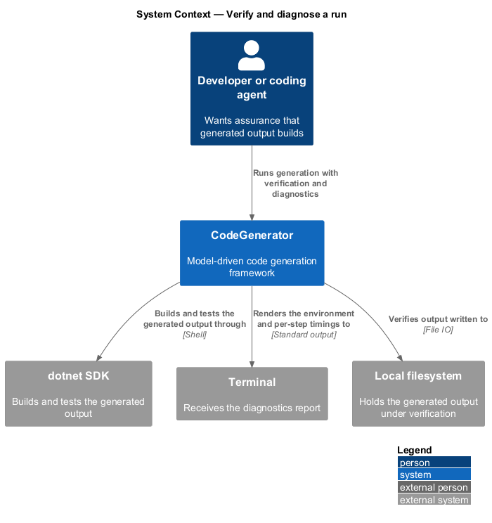
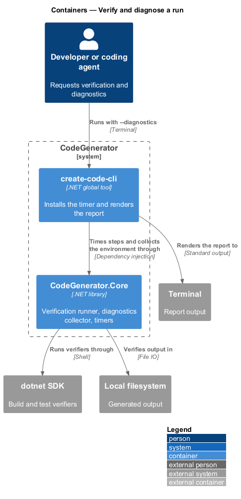
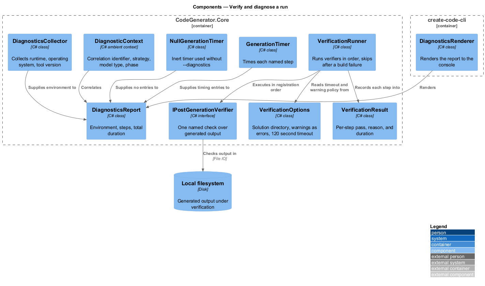
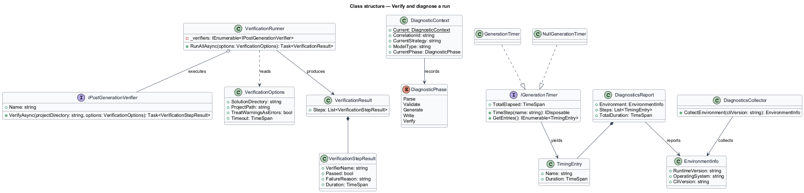
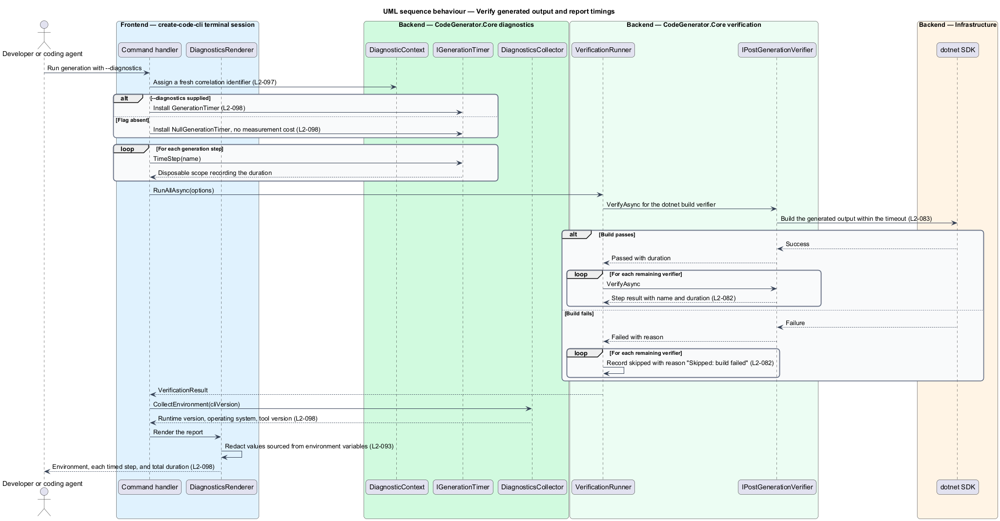

# Verify and diagnose a run

## Overview

Generated code that does not compile is worse than no generated code, because
the failure surfaces after the developer has already accepted the output. This
feature covers checking generated output before it is trusted, and reporting
enough about the run to diagnose it when something is wrong.

**verifier** — check run against generated output, reporting a pass or a failure
with a reason

**correlation identifier** — value identifying one invocation, attached to every
result it produces

**diagnostics report** — environment description and per-step timings for one run

Verification is ordered rather than parallel, because the checks depend on each
other. If the build fails, running the tests adds nothing but noise, so every
verifier after a failed `dotnet build` is recorded as skipped with that reason.
The record still exists, so the report shows what was not checked rather than
silently omitting it.

Diagnostics are opt-in and inert when not requested: without `--diagnostics` a
no-op timer is installed, so measurement costs nothing in the common case.

## Description

- **`IPostGenerationVerifier`** — the verifier contract in
  `CodeGenerator.Core.Verification`, exposing `Name` and
  `VerifyAsync(projectDirectory, options)`.
- **`VerificationRunner`** — the ordered runner. It executes each registered
  verifier, and once the verifier named `dotnet build` has failed, it records
  every subsequent verifier as failed with the reason `Skipped: build failed` and
  a zero duration.
- **`VerificationOptions`** — the run configuration: a required
  `SolutionDirectory`, an optional `ProjectPath`, `TreatWarningsAsErrors`
  defaulting to `true`, and a `Timeout` defaulting to 120 seconds.
- **`VerificationResult`** / **`VerificationStepResult`** — the outcome and its
  per-step entries, each carrying the verifier name, pass state, failure reason,
  and elapsed duration.
- **`DiagnosticContext`** — the ambient context carrying `CorrelationId`,
  `CurrentStrategy`, `ModelType`, and `CurrentPhase`.
- **`DiagnosticPhase`** — the phase enumeration used to place an event within a
  run.
- **`DiagnosticsCollector`** — `CollectEnvironment(cliVersion)`, which gathers the
  runtime, operating system, and tool version.
- **`EnvironmentInfo`** — the collected environment description.
- **`IGenerationTimer`** / **`GenerationTimer`** / **`NullGenerationTimer`** — the
  timing contract, the measuring implementation, and the inert implementation
  installed when `--diagnostics` is absent.
- **`TimingEntry`** — one timed step and its duration.
- **`DiagnosticsReport`** — the rendered report: environment, steps, and total
  duration.
- **`DiagnosticsRenderer`** — rendering of the report to the console.

## Requirements

The feature realizes the following level-2 (L2) requirements. Each L2
requirement refines a level-1 (L1) requirement, cited by identifier. Requirement
text is stated in `shall` form; every identifier resolves to `docs/specs/L2.md`.

| L2 ID | Refines (L1) | Requirement |
|-------|--------------|-------------|
| `L2-082` | `L1-020` | The runner shall execute every registered verifier and record a per-step result, and once the `dotnet build` verifier fails every subsequent verifier shall be recorded as skipped with the reason `Skipped: build failed` rather than executed. |
| `L2-083` | `L1-020` | Verification shall accept a required solution directory, an optional project path, a warnings-as-errors switch defaulting to enabled, and a timeout defaulting to 120 seconds, and a verifier exceeding the timeout shall be recorded as failed. |
| `L2-093` | `L1-023` | Values sourced from environment variables shall be redacted in diagnostic and verbose output, configuration values shall not be logged in cleartext, and generated environment files shall carry placeholder values for secret-bearing keys. |
| `L2-097` | `L1-025` | Every invocation shall generate a correlation identifier, publish it on the diagnostic context, and attach it to the results it produces, and two invocations shall not share one. |
| `L2-098` | `L1-025` | With `--diagnostics` the tool shall time each step and render a report containing the environment, the runtime version, the tool version, each timed step, and the total elapsed time; without the flag a no-op timer shall be used. |
| `L2-099` | `L1-025` | Progress, warnings, and failures shall be emitted through structured logging with named placeholders rather than pre-formatted strings. |

`L2-093` states an obligation the implementation does not yet meet: no redaction
is currently applied to configuration or diagnostics output. The specification
records it as a gap, and this design describes the intended control rather than
present behaviour.

## Diagrams

### System context

Verification runs the real toolchain against the generated output, and
diagnostics report what the run did and how long each step took.

### Containers

The verification runner and the diagnostics collector live in
`CodeGenerator.Core`; the report is rendered by `create-code-cli`.

### Components

`VerificationRunner` sequences the verifiers and short-circuits after a build
failure; `GenerationTimer` and `DiagnosticsCollector` feed the rendered report.

### Class structure

`VerificationRunner` produces a `VerificationResult` of `VerificationStepResult`
entries; `DiagnosticsReport` combines `EnvironmentInfo` with `TimingEntry`
values.

### Behaviour — verify generated output and report timings

The runner applies the ordering of `L2-082` under the options of `L2-083`, while
the run carries the correlation identifier of `L2-097` and renders the report of
`L2-098`.

