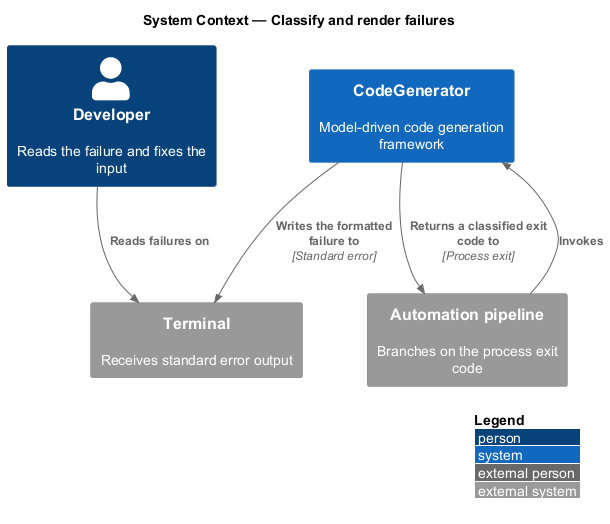
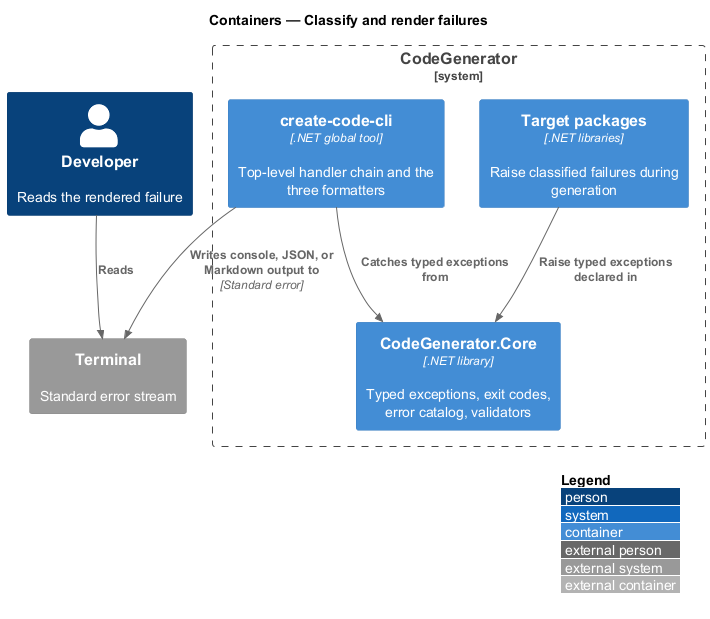
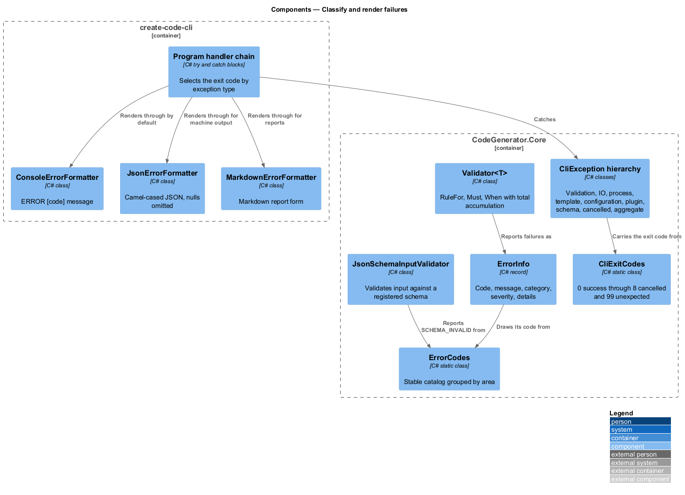
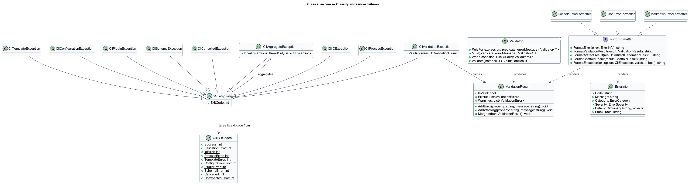
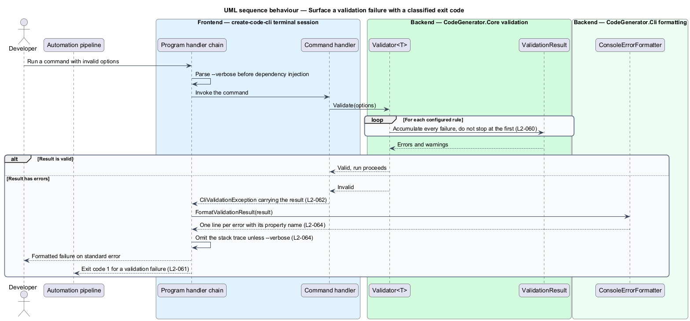

# Classify and render failures

## Overview

A code generator fails in many ways: a name that is not a valid identifier, a
template that will not parse, a plugin that throws, a schema that does not match.
Treating all of these as one undifferentiated error makes the tool hard to script
and hard to debug. This feature covers how failures are classified, coded, and
presented.

**exit code** — integer the process returns, identifying the class of failure

**error code** — stable string identifying a specific failure, independent of its
message text

**formatter** — component that renders a failure into one output shape

Classification happens at the point of failure and travels outward unchanged. A
typed exception carries the exit code that its class implies, so the process exit
code is decided by the failure rather than by the top-level handler guessing. An
aggregate of several failures takes the highest exit code among them.

Presentation is separated from classification. The same `ValidationResult` or
`ErrorInfo` renders as console text for a human, as JSON for a script, or as
Markdown for a report, and the caller selects the shape. Stack traces appear only
under `--verbose`.

Validation itself is total: every failure in a document or option set is
collected before reporting, so one run surfaces every problem rather than the
first.

## Description

- **`CliException`** — the abstract base in `CodeGenerator.Core.Errors`, carrying
  an `ExitCode`.
- **`CliValidationException`**, **`CliIOException`**, **`CliProcessException`**,
  **`CliTemplateException`**, **`CliConfigurationException`**,
  **`CliPluginException`**, **`CliSchemaException`**, **`CliCancelledException`**
  — the typed subtypes, each fixing its exit code.
- **`CliAggregateException`** — several failures reported together; its exit code
  is the maximum among its inner exceptions, or the unexpected-error code when it
  has none.
- **`CliExitCodes`** — the taxonomy: `Success` 0, `ValidationError` 1, `IoError`
  2, `ProcessError` 3, `TemplateError` 4, `ConfigurationError` 5, `PluginError`
  6, `SchemaError` 7, `Cancelled` 8, `UnexpectedError` 99.
- **`ErrorCodes`** — the stable code catalog, grouped as `Validation`, `Io`,
  `Template`, `Scaffold`, `Process`, `Plugin`, `Strategy`, `Schema`, and
  `Configuration`, plus `InternalUnexpected`.
- **`ErrorInfo`** / **`ErrorCategory`** / **`ErrorSeverity`** — the reported
  failure, its category, and its severity.
- **`IErrorFormatter`** — the rendering contract: `FormatError`,
  `FormatValidationResult`, `FormatArtifactResult`, `FormatScaffoldResult`, and
  `FormatException`.
- **`ConsoleErrorFormatter`**, **`JsonErrorFormatter`**,
  **`MarkdownErrorFormatter`** — the three renderings. The console form writes
  `ERROR [<code>] <message>`; the JSON form emits camel-cased members and omits
  nulls.
- **`Validator<T>`** — the fluent validation engine supporting `RuleFor` over a
  property expression, `Must` over the whole object, and `When` for conditional
  groups, accumulating every failure.
- **`ValidationResult`** / **`ValidationError`** / **`ValidationSeverity`** — the
  accumulated outcome, its entries, and their severity.
- **`IInputValidator`** / **`JsonSchemaInputValidator`** / **`ISchemaRegistry`** —
  validation of structured input against a registered JSON Schema.
- **`Program`** — the top-level handler chain. It catches
  `CliAggregateException`, `CliValidationException`, `CliException`,
  `OperationCanceledException`, and finally any exception, returning the
  corresponding exit code.

## Requirements

The feature realizes the following level-2 (L2) requirements. Each L2
requirement refines a level-1 (L1) requirement, cited by identifier. Requirement
text is stated in `shall` form; every identifier resolves to `docs/specs/L2.md`.

| L2 ID | Refines (L1) | Requirement |
|-------|--------------|-------------|
| `L2-059` | `L1-012` | Structured input shall be validated against a registered JSON Schema, each violation shall name the offending property path, and a schema failure shall map to code `SCHEMA_INVALID`. |
| `L2-060` | `L1-012` | `Validator<T>` shall support property rules, whole-object rules, and conditional rule groups, and shall accumulate every failure rather than stopping at the first. |
| `L2-061` | `L1-013` | The tool shall terminate with a stable exit code identifying the failure class, from `0` for success through `8` for cancellation to `99` for an unexpected error. |
| `L2-062` | `L1-013` | Every anticipated failure shall be expressed as a `CliException` subtype carrying its exit code, and an aggregate's exit code shall be the maximum among its inner exceptions. |
| `L2-063` | `L1-013` | Every reported error shall carry a stable code from the published catalog and a category from `ErrorCategory`. |
| `L2-064` | `L1-013` | Errors, validation results, artifact results, and scaffold results shall be renderable as plain console text, JSON, and Markdown through a common formatter contract, and stack traces shall appear only in verbose mode. |

## Diagrams

### System context

Failures leave the tool through two channels: a human-readable stream for a
developer and an exit code for the automation that invoked it.

### Containers

Classification lives in `CodeGenerator.Core`; the formatters and the top-level
handler chain live in `create-code-cli`.

### Components

Typed exceptions carry their exit code outward, and one of three formatters
renders the failure into the requested shape.

### Class structure

Every typed exception derives from `CliException`; the three formatters implement
`IErrorFormatter` over the same result types.

### Behaviour — surface a validation failure

Validation accumulates every failure under `L2-060`, the handler chain selects an
exit code under `L2-061` and `L2-062`, and the formatter renders under `L2-064`.

