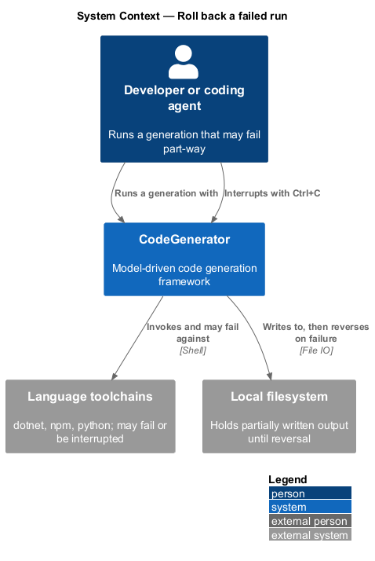
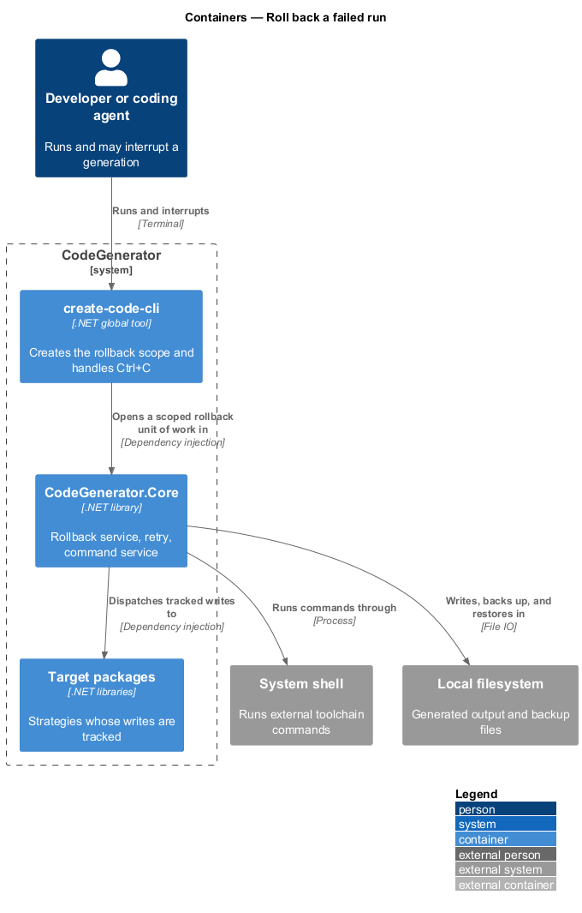
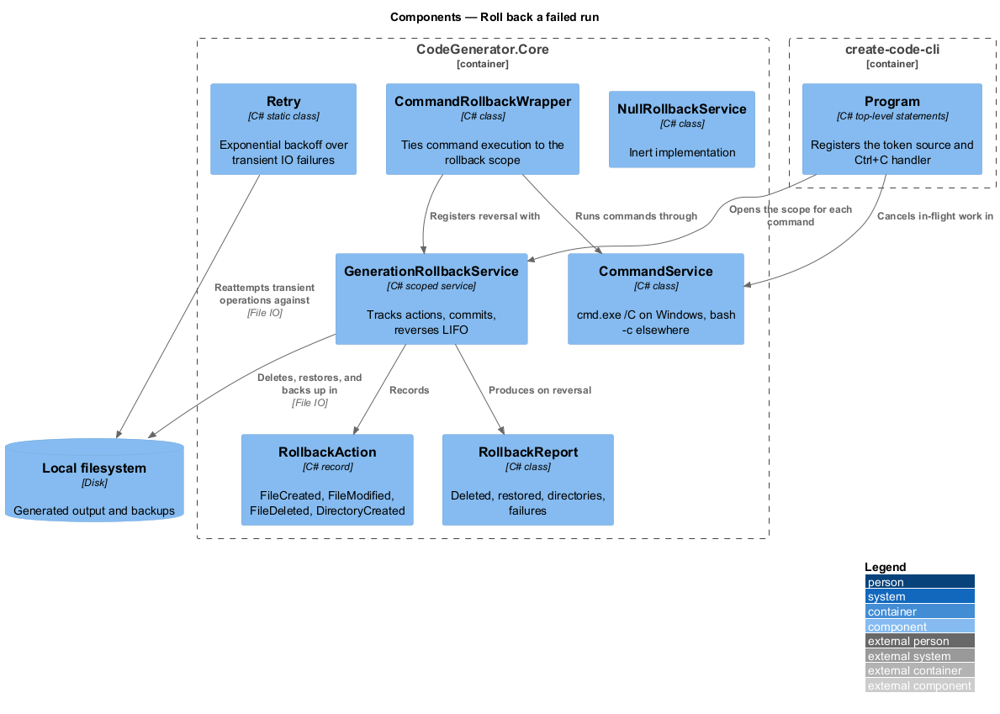
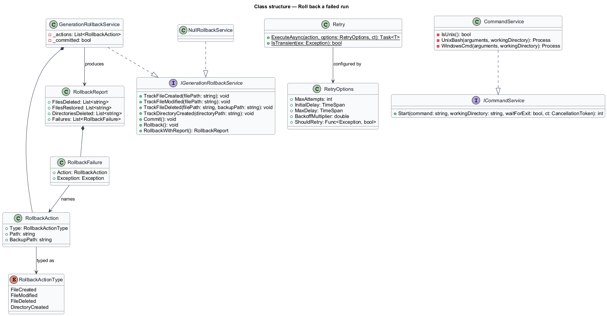
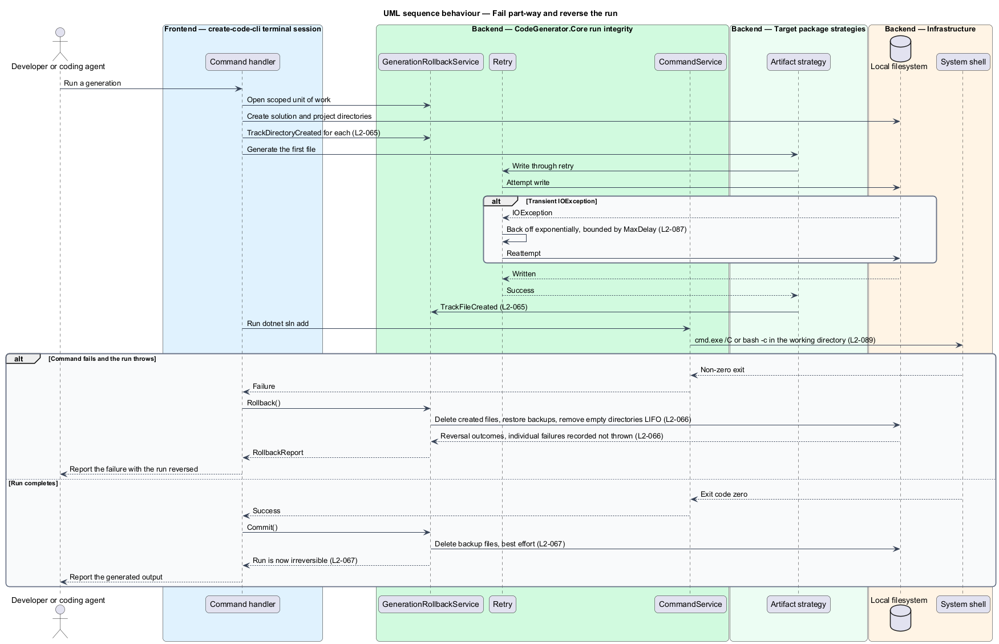

# Roll back a failed run

## Overview

A generation run creates many files and directories, often after invoking
external toolchains. A failure part-way through leaves a half-built tree that is
worse than no tree at all, because it is neither usable nor visibly broken.
This feature treats a run as a unit of work and undoes it on failure.

**unit of work** — set of filesystem changes that succeed or are reversed
together

**rollback action** — record of one reversible change: a file created, a file
modified, a file deleted, or a directory created

**commit** — point after which the run is irreversible and its undo state is
discarded

The service records intent as the run proceeds. Creating a file records a
deletion to perform on failure; modifying a file copies its prior content to a
backup first, so the original can be restored. Reversal runs last-in-first-out,
which is what allows a directory created before the files inside it to be removed
after them.

Two adjacent concerns share this design because they decide when a rollback is
appropriate. Transient filesystem contention is retried rather than treated as
failure, and cancellation is treated as neither success nor failure: the
`OperationCanceledException` filter on the command handlers deliberately excludes
cancellation from rollback, so an interrupted run leaves its partial output in
place.

## Description

- **`IGenerationRollbackService`** / **`GenerationRollbackService`** — the unit of
  work in `CodeGenerator.Core.Errors`, registered scoped so each command handler
  receives its own instance. It exposes `TrackFileCreated`, `TrackFileModified`,
  `TrackFileDeleted`, `TrackDirectoryCreated`, `Commit`, `Rollback`, and
  `RollbackWithReport`.
- **`RollbackAction`** / **`RollbackActionType`** — one recorded change and its
  kind: `FileCreated`, `FileModified`, `FileDeleted`, or `DirectoryCreated`.
- **`RollbackReport`** / **`RollbackFailure`** — the reversal outcome, carrying
  `FilesDeleted`, `FilesRestored`, `DirectoriesDeleted`, and `Failures`.
- **`NullRollbackService`** — the inert implementation used where reversal does
  not apply.
- **`CommandRollbackWrapper`** — wrapper that ties command execution to the
  rollback scope.
- **`Retry`** / **`RetryOptions`** — retry with exponential backoff in
  `CodeGenerator.IO`. `IsTransient` treats `IOException` as transient except for
  `FileNotFoundException` and `DirectoryNotFoundException`; delays are bounded by
  `MaxDelay`, and cancellation between attempts raises rather than retries.
- **`ICommandService`** / **`CommandService`** — external command execution
  through `cmd.exe /C` on Windows and `bash -c` on Linux and macOS, defaulting the
  working directory to the current directory and observing cancellation before
  launch.
- **`CancellationTokenSource`** — registered as a singleton in `Program` and
  cancelled from the `Console.CancelKeyPress` handler, which suppresses the
  default terminate behaviour.

## Requirements

The feature realizes the following level-2 (L2) requirements. Each L2
requirement refines a level-1 (L1) requirement, cited by identifier. Requirement
text is stated in `shall` form; every identifier resolves to `docs/specs/L2.md`.

| L2 ID | Refines (L1) | Requirement |
|-------|--------------|-------------|
| `L2-065` | `L1-014` | The service shall track created files, modified files with a backup of their prior content, deleted files with their backup, and created directories, so that each can be reversed. |
| `L2-066` | `L1-014` | Rollback shall reverse tracked actions last-in-first-out, shall return a report of files deleted, files restored, directories deleted, and failures, and a failure to reverse one action shall not abort the others. |
| `L2-067` | `L1-014` | `Commit` shall make the run irreversible, shall delete every backup on a best-effort basis without throwing, and a handler shall commit on success and roll back before rethrowing on failure. |
| `L2-087` | `L1-022` | Retry shall reattempt transient failures with exponential backoff bounded by a maximum delay up to the attempt limit, shall not retry non-transient failures, and shall raise on cancellation between attempts. |
| `L2-088` | `L1-022` | The tool shall intercept Ctrl+C, suppress the default terminate behaviour, cancel the shared token, exit with code `8`, and leave already-created files in place. |
| `L2-089` | `L1-022` | Command execution shall use `cmd.exe /C` on Windows and `bash -c` on Linux and macOS, shall default the working directory to the current directory, shall return the process exit code when waiting, and shall observe cancellation before launch. |

## Diagrams

### System context

The run touches the filesystem and external toolchains; a failure in either is
what rollback exists to reverse.

### Containers

The rollback scope is created by the command in `create-code-cli` and honoured by
the engine and strategies in `CodeGenerator.Core`.

### Components

`GenerationRollbackService` records actions as the run proceeds; `Retry` absorbs
transient contention; `CommandService` runs external tools under the same
cancellation token.

### Class structure

`GenerationRollbackService` owns an ordered list of `RollbackAction` records and
produces a `RollbackReport` on reversal.

### Behaviour — fail part-way and reverse

The handler tracks each change under `L2-065`, retries transient failures under
`L2-087`, and on failure reverses last-in-first-out under `L2-066` before
rethrowing.

