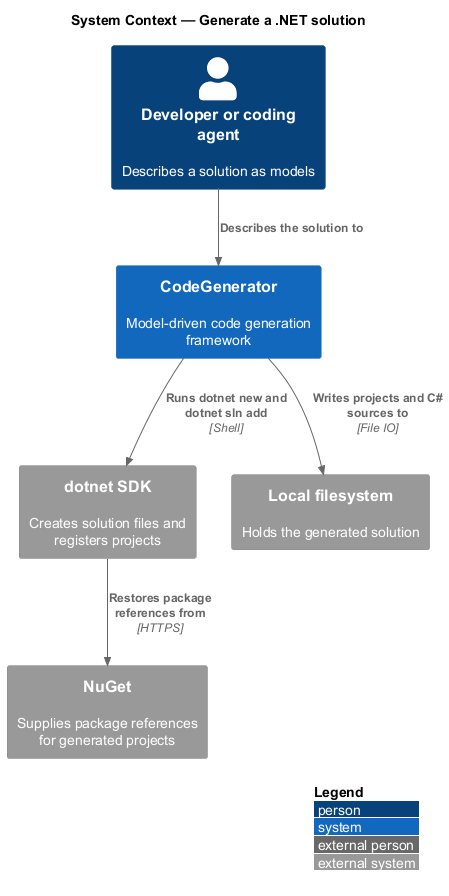
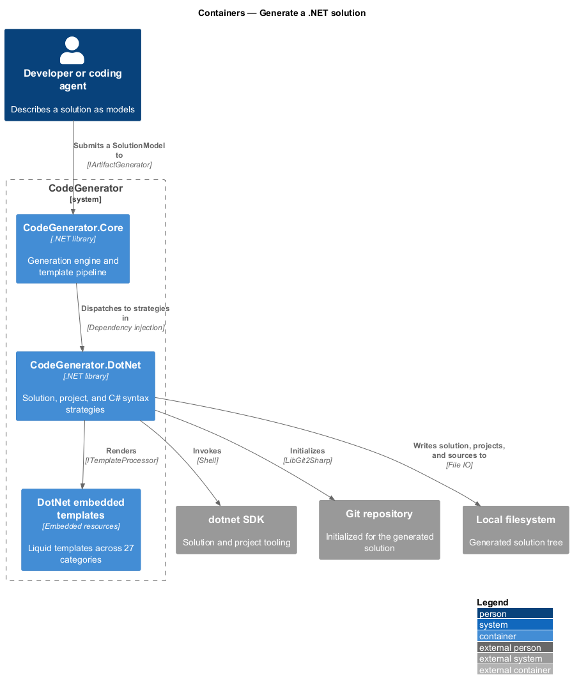
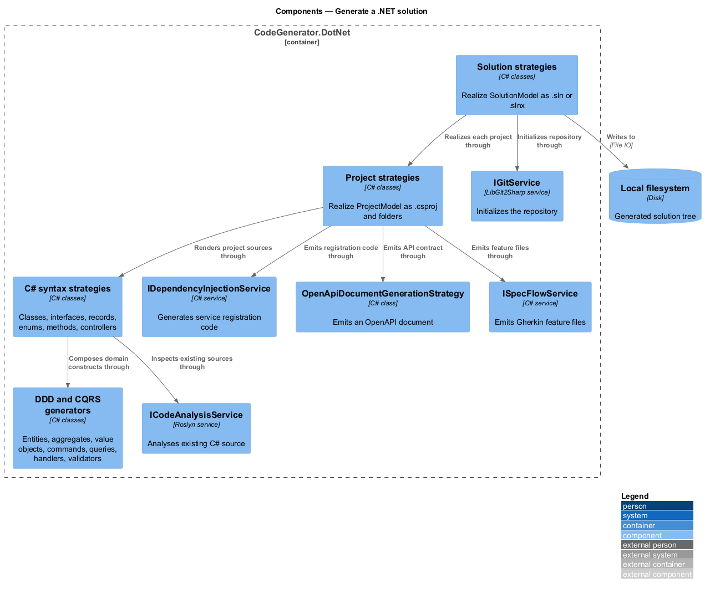
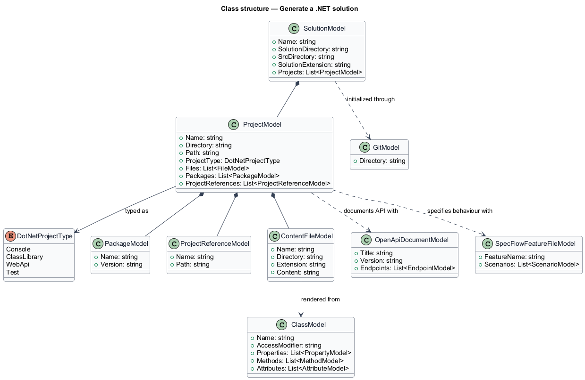
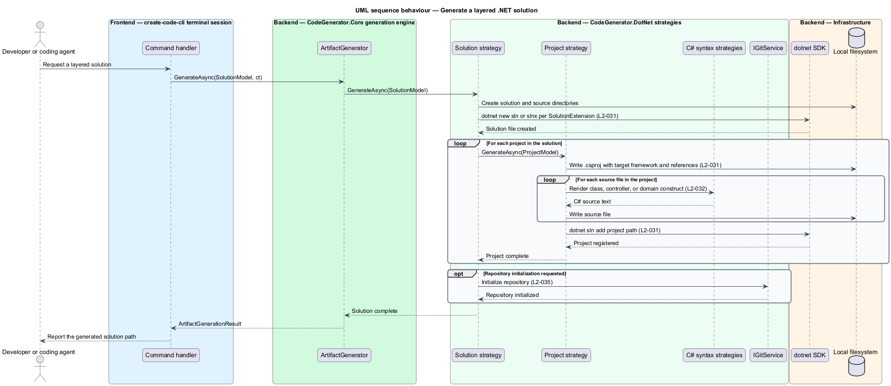

# Generate a .NET solution

## Overview

The .NET target is the largest in CodeGenerator and the one the framework was
built around. This feature covers producing a .NET solution: the solution file,
its projects, the references between them, and the C# source inside them.

**solution** — .NET container file listing projects, written as `.sln` or as the
XML-based `.slnx`

**layered architecture** — arrangement of projects where each layer references
only the layers beneath it

**CQRS** — separation of command handling from query handling, realized here as
MediatR requests, handlers, and validators

**DDD** — domain-driven design constructs: entities, aggregates, value objects,
domain events, and specifications

A generated solution is not a skeleton. `CodeGenerator.DotNet` renders C# for
classes, interfaces, records, enums, methods, constructors, properties, fields,
parameters, attributes, namespaces, expressions, controllers, and controller
methods, and composes those into the CQRS and DDD shapes a clean-architecture
solution expects. The package also generates artifacts that sit alongside the
code: OpenAPI documents, SpecFlow feature files, SignalR hubs and clients, and
an initialized Git repository.

## Description

The package is organized into `Artifacts` (files, projects, solutions, and
composite scaffolds) and `Syntax` (the C# constructs).

- **`SolutionModel`** — the solution artifact model in
  `CodeGenerator.DotNet.Artifacts.Solutions`. It carries the solution directory,
  the source directory, the project list, and `SolutionExtension`, which selects
  `.sln` or `.slnx`.
- **`ProjectModel`** — project artifact model in
  `CodeGenerator.DotNet.Artifacts.Projects`, carrying the project type, name,
  directory, files, packages, and project references.
- **`DotNetProjectType`** — enumeration of project kinds, including `Console`
  and the web and class-library kinds.
- **`ProjectReferenceModel`** / **`PackageModel`** / **`DependsOnModel`** — the
  reference and dependency models a project declares.
- **Solution and project strategies and factories** — the
  `Artifacts/Solutions/Strategies`, `Artifacts/Projects/Strategies`, and matching
  `Factories` folders hold the strategies that realize a solution or project and
  the factories that assemble the models.
- **Syntax generators** — `Syntax/Classes`, `Syntax/Interfaces`,
  `Syntax/Records`, `Syntax/Enums`, `Syntax/Methods`, `Syntax/Constructors`,
  `Syntax/Properties`, `Syntax/Fields`, `Syntax/Params`, `Syntax/Attributes`,
  `Syntax/Namespaces`, `Syntax/Expressions`, `Syntax/Documents`,
  `Syntax/Controllers`, `Syntax/Entities`, and `Syntax/Microservices` each hold a
  model and its strategy.
- **`ICodeAnalysisService`** — Roslyn-based analysis of existing C# source.
- **`IDependencyInjectionService`** — generation of service-registration code.
- **`IGitService`** / **`GitGenerationStrategy`** / **`GitModel`** — repository
  initialization through LibGit2Sharp.
- **`OpenApiDocumentModel`** / **`OpenApiDocumentGenerationStrategy`** — OpenAPI
  document generation.
- **`ISpecFlowService`** / **`SpecFlowFeatureFileModel`** — Gherkin feature file
  generation.

## Requirements

The feature realizes the following level-2 (L2) requirements. Each L2
requirement refines a level-1 (L1) requirement, cited by identifier. Requirement
text is stated in `shall` form; every identifier resolves to `docs/specs/L2.md`.

| L2 ID | Refines (L1) | Requirement |
|-------|--------------|-------------|
| `L2-031` | `L1-007` | The system shall generate a solution file, its projects, and their project references, supporting both `.sln` and `.slnx` formats and stamping the requested target framework. |
| `L2-032` | `L1-007` | The .NET package shall generate C# classes, interfaces, records, enums, methods, constructors, properties, fields, parameters, attributes, namespaces, expressions, documents, controllers, and controller methods, and shall support DDD and CQRS constructs. |
| `L2-035` | `L1-007` | The system shall initialize a Git repository for generated output when repository initialization is requested, and shall not initialize one otherwise. |
| `L2-036` | `L1-007` | The .NET package shall generate OpenAPI documents, SpecFlow feature files, and SignalR hubs and clients from their models. |

## Diagrams

### System context

A developer describes a solution; CodeGenerator writes it to the filesystem and
calls the .NET SDK to create the solution file and register projects.

### Containers

`CodeGenerator.DotNet` supplies the solution, project, and syntax strategies that
the engine in `CodeGenerator.Core` dispatches to.

### Components

Solution and project strategies create the directory structure and files;
Roslyn-backed syntax strategies render the C# inside them; the Git, OpenAPI, and
SpecFlow strategies produce the artifacts that sit alongside the code.

### Class structure

`SolutionModel` owns its `ProjectModel` list; each project owns its files,
packages, and references.

### Behaviour — generate a layered solution

The engine realizes the solution under `L2-031`, renders each layer's C# under
`L2-032`, and initializes a repository under `L2-035`.

