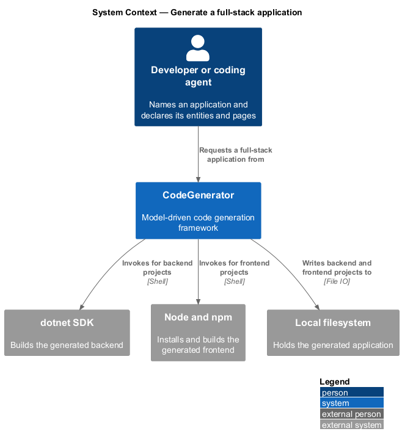
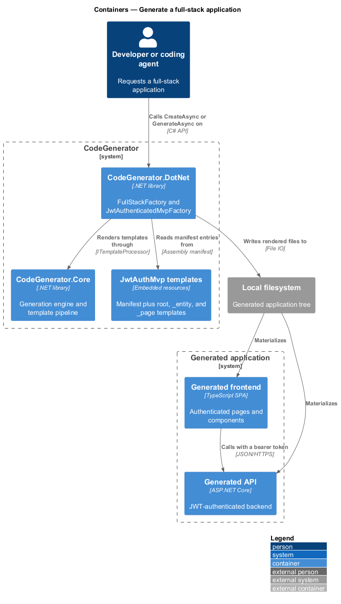
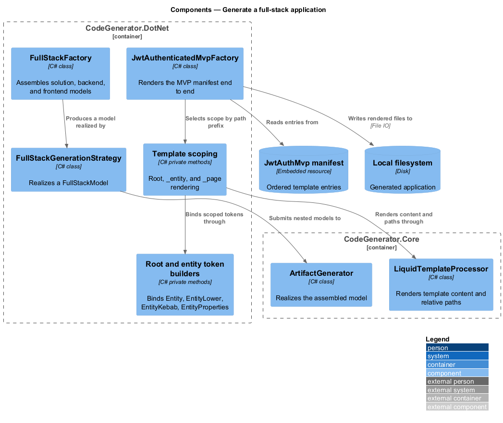
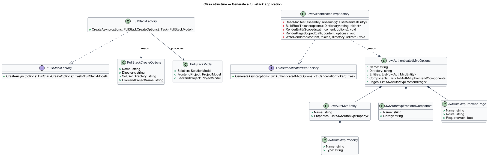
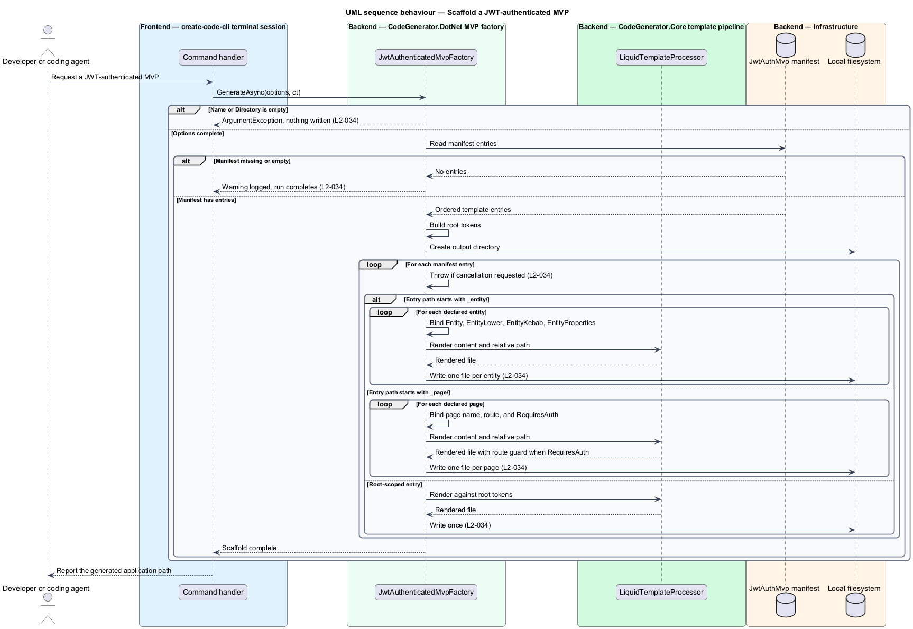

# Generate a full-stack application

## Overview

The composite scaffolds sit one level above solution generation. Rather than
describing every project, the caller supplies a name and an output directory and
receives a complete application with a backend, a frontend, and the wiring
between them.

**full-stack model** — solution plus its backend and frontend projects, produced
as one unit

**MVP scaffold** — opinionated starter application, generated from a fixed
template manifest rather than from a caller-supplied project list

**manifest** — ordered list of embedded template resources and the relative
output path each one produces

Two composites exist. `IFullStackFactory` assembles a `FullStackModel` from a
name and directory, which the caller then hands to the generation engine.
`IJwtAuthenticatedMvpFactory` goes further: it renders a JWT-authenticated
application end to end, expanding one template set across the caller's declared
entities and pages.

The MVP factory introduces template scoping. A template under `_entity/` renders
once per declared entity with entity-scoped tokens bound; a template under
`_page/` renders once per declared page; every other template renders once
against the root tokens. The scoping prefix in the manifest path is what selects
the behaviour.

## Description

- **`IFullStackFactory`** / **`FullStackFactory`** — the composite factory in
  `CodeGenerator.DotNet.Artifacts.FullStack`. `CreateAsync(FullStackCreateOptions)`
  returns a `FullStackModel`.
- **`FullStackCreateOptions`** — the input, carrying `Name`, `Directory`,
  `SolutionDirectory`, and `FrontendProjectName`.
- **`FullStackModel`** — the output, carrying the `Solution` and the optional
  `FrontendProject` and `BackendProject`.
- **`FullStackGenerationStrategy`** — the strategy that realizes a
  `FullStackModel` through the generation engine.
- **`IJwtAuthenticatedMvpFactory`** / **`JwtAuthenticatedMvpFactory`** — the MVP
  scaffold in `CodeGenerator.DotNet.Artifacts.JwtAuthMvp`. It reads the manifest
  at `CodeGenerator.DotNet.Templates.JwtAuthMvp.manifest.txt`, renders each entry
  with DotLiquid, and writes the result under the output directory. It rejects an
  empty `Name` or `Directory` with `ArgumentException`, logs a warning and
  returns when the manifest is missing or empty, and observes the cancellation
  token between entries.
- **`JwtAuthenticatedMvpOptions`** — the MVP input, carrying `Name`,
  `Directory`, `Entities`, `Components`, and `Pages`.
- **`JwtAuthMvpEntity`** / **`JwtAuthMvpProperty`** — a declared entity and its
  typed properties. Each entity binds the tokens `Entity`, `EntityLower`,
  `EntityKebab`, and `EntityProperties`.
- **`JwtAuthMvpFrontendComponent`** — a declared frontend component and the
  library it belongs to.
- **`JwtAuthMvpFrontendPage`** — a declared page, carrying `Name`, `Route`, and
  `RequiresAuth`, which defaults to `true`.

## Requirements

The feature realizes the following level-2 (L2) requirements. Each L2
requirement refines a level-1 (L1) requirement, cited by identifier. Requirement
text is stated in `shall` form; every identifier resolves to `docs/specs/L2.md`.

| L2 ID | Refines (L1) | Requirement |
|-------|--------------|-------------|
| `L2-033` | `L1-007` | `IFullStackFactory.CreateAsync` shall produce a `FullStackModel` carrying a solution and its optional backend and frontend projects from a name and output directory alone. |
| `L2-034` | `L1-007` | The JWT MVP factory shall reject an empty name or directory, shall render root-scoped templates once, `_entity/` templates once per declared entity, and `_page/` templates once per declared page, shall guard pages declaring `RequiresAuth`, shall observe cancellation between entries, and shall warn and return when the manifest is missing or empty. |

## Diagrams

### System context

A developer names an application; CodeGenerator produces a running backend and
frontend pair on the filesystem, using the .NET and Node toolchains.

### Containers

The composite factories sit in `CodeGenerator.DotNet` and compose the solution,
backend, and frontend containers of the generated application.

### Components

`FullStackFactory` assembles a model for the engine; `JwtAuthenticatedMvpFactory`
reads the manifest and renders root-, entity-, and page-scoped templates.

### Class structure

`FullStackCreateOptions` produces a `FullStackModel`;
`JwtAuthenticatedMvpOptions` aggregates the entities, components, and pages that
drive scoped rendering.

### Behaviour — scaffold a JWT-authenticated MVP

The factory validates its options and manifest under `L2-034`, then renders each
manifest entry at root, entity, or page scope.

