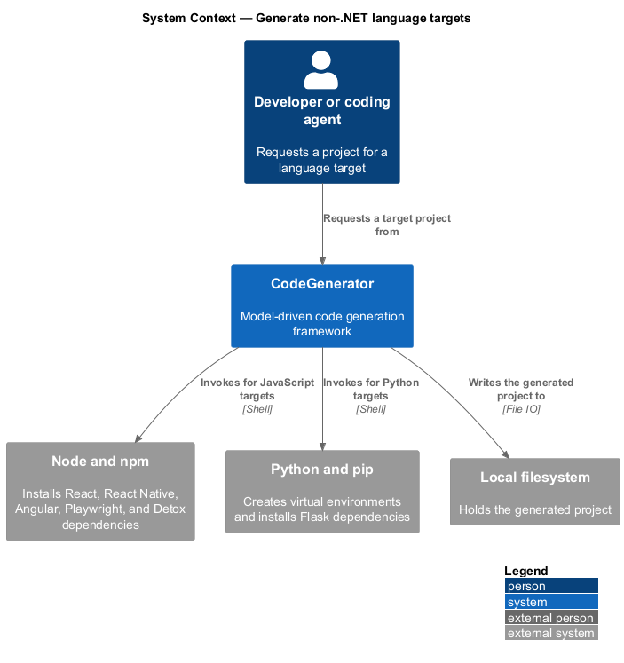
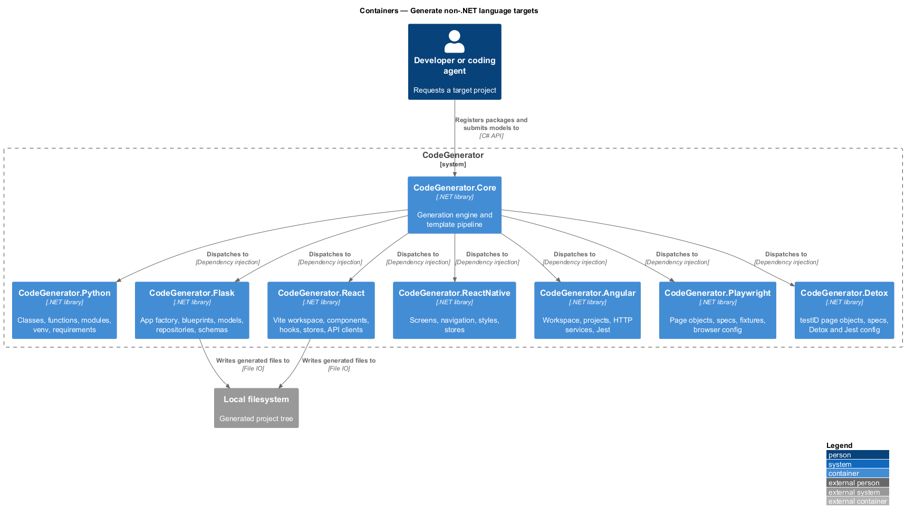
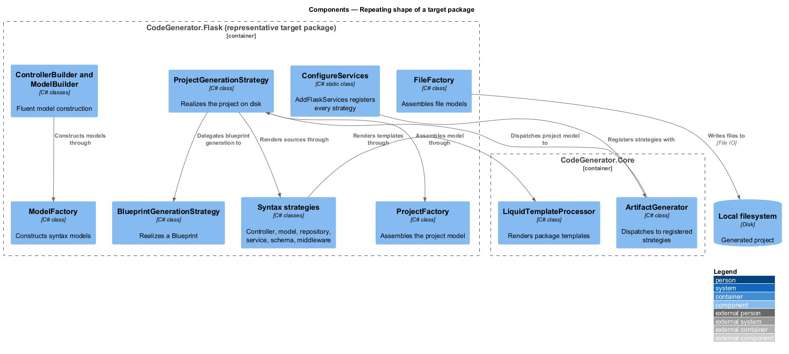
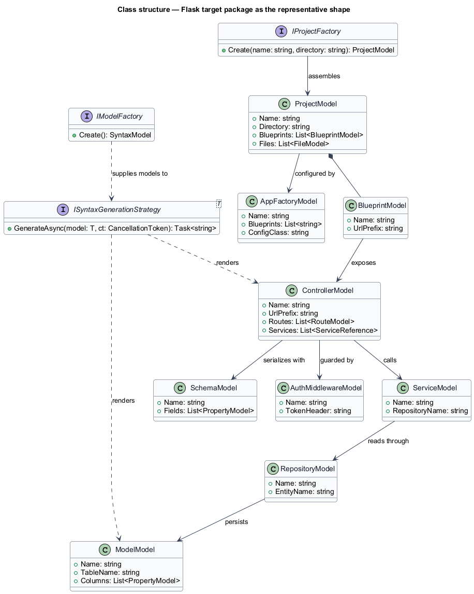
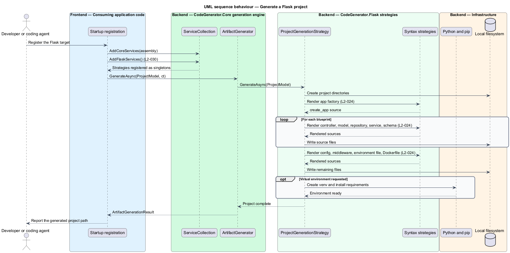

# Generate non-.NET language targets

## Overview

CodeGenerator generates seven targets outside .NET: Python, Flask, React,
React Native, Angular, Playwright, and Detox. Each ships as its own NuGet
package, and each follows the same internal shape, so a reader who understands
one understands the others.

**target package** — library supplying the artifact and syntax strategies for
one language or framework

**model factory** — service in a target package that constructs that package's
syntax models

**project factory** — service that assembles a whole project model for the
target

Every package contains an `Artifacts` folder holding the project and workspace
models and their strategies, a `Syntax` folder holding one model and one strategy
per language construct, a `Builders` folder holding the fluent builders, and a
`ConfigureServices` class exposing one registration method. Registering a package
is a single call, and registration is what makes its strategies visible to the
engine.

The packages differ only in the constructs they generate. Playwright and Detox
both generate page objects and specifications, but Playwright selects elements by
locator and Detox selects them by `testID`; that difference lives in the
strategies, not in the framework.

## Description

- **`CodeGenerator.Python`** — `ClassModel`, `MethodModel`, `FunctionModel`,
  `ParamModel`, `PropertyModel`, `ModuleModel`, `ImportModel`, `DecoratorModel`,
  and `TypeHintModel` with their strategies. Its `Artifacts` folder adds
  `ProjectModel`, `PackageModel`, `RequirementsModel` and
  `RequirementsGenerationStrategy`, and `VirtualEnvironmentModel` with
  `VirtualEnvironmentGenerationStrategy`.
- **`CodeGenerator.Flask`** — `AppFactoryModel`, `ControllerModel`, `ModelModel`,
  `RepositoryModel`, `BaseRepositoryModel`, `ServiceModel`, `SchemaModel`,
  `ConfigModel`, `MiddlewareModel`, `AuthMiddlewareModel`,
  `CorsMiddlewareModel`, `EnvModel`, and `DockerfileModel`, plus `BlueprintModel`
  and `BlueprintGenerationStrategy`.
- **`CodeGenerator.React`** — `ComponentModel`, `HookModel`, `StoreModel`,
  `ApiClientModel`, `ContextProviderModel`, `ErrorBoundaryModel`, `RouterModel`,
  `TypeScriptInterfaceModel`, `TypeScriptTypeModel`, `FunctionModel`,
  `ImportModel`, `TestModel`, `EnvModel`, and `DockerfileModel`, plus
  `WorkspaceModel`, `ProjectModel`, and the barrel-file strategy.
- **`CodeGenerator.ReactNative`** — `ScreenModel`, `ComponentModel`,
  `NavigationModel`, `StyleModel`, `HookModel`, `StoreModel`, `ImportModel`, and
  `TypeScriptTypeModel`, plus the project model and strategy.
- **`CodeGenerator.Angular`** — `WorkspaceModel` and
  `AngularWorkspaceGenerationStrategy`, `ProjectModel`, `ProjectReferenceModel`,
  `FileReplacementModel`, `NgHttpServiceModel`, `TypeScriptTypeModel`,
  `FunctionModel`, and `ImportModel`.
- **`CodeGenerator.Playwright`** — `BasePageModel`, `PageObjectModel`,
  `LocatorModel`, `TestSpecModel`, `FixtureModel`, and `ConfigModel`, plus the
  test project model and strategy.
- **`CodeGenerator.Detox`** — `BasePageModel`, `PageObjectModel`,
  `TestSpecModel`, `DetoxConfigModel`, and `JestConfigModel`, plus the test
  project model and strategy.
- **`IModelFactory`** / **`ModelFactory`** — present in every package,
  constructing that package's syntax models.
- **`IProjectFactory`** / **`ProjectFactory`** and **`IFileFactory`** /
  **`FileFactory`** — present in every package, assembling project and file
  models.
- **`ConfigureServices`** — one per package, exposing `AddPythonServices`,
  `AddFlaskServices`, `AddReactServices`, `AddReactNativeServices`,
  `AddAngularServices`, `AddPlaywrightServices`, and `AddDetoxServices`.

## Requirements

The feature realizes the following level-2 (L2) requirements. Each L2
requirement refines a level-1 (L1) requirement, cited by identifier. Requirement
text is stated in `shall` form; every identifier resolves to `docs/specs/L2.md`.

| L2 ID | Refines (L1) | Requirement |
|-------|--------------|-------------|
| `L2-023` | `L1-006` | The Python package shall generate classes, methods, functions, parameters, properties, modules, imports, decorators, and type hints, and shall scaffold projects including virtual environment creation and requirements files. |
| `L2-024` | `L1-006` | The Flask package shall generate app factories, Blueprint controllers, SQLAlchemy models, repositories, services, Marshmallow schemas, auth and CORS middleware, config classes, environment files, and Dockerfiles. |
| `L2-025` | `L1-006` | The React package shall generate a Vite and TypeScript workspace and projects, components including client-directive and `forwardRef` variants, hooks, Zustand stores, Axios API clients, context providers, error boundaries, routers, types, tests, and barrel files. |
| `L2-026` | `L1-006` | The React Native package shall scaffold projects with React Navigation and shall generate screens, components carrying `testID`, navigation configuration, `StyleSheet` definitions, hooks, stores, and types. |
| `L2-027` | `L1-006` | The Angular package shall generate workspaces and projects with Jest configured as the test runner, shall apply file replacements, and shall generate types, functions, imports, and HTTP services. |
| `L2-028` | `L1-006` | The Playwright package shall scaffold a test project and shall generate base page objects, page objects with locators, actions and queries, test specifications, custom fixtures, and a multi-browser configuration. |
| `L2-029` | `L1-006` | The Detox package shall scaffold a mobile test project and shall generate base page objects, page objects selecting by `testID`, Jest specifications, `.detoxrc.js`, and `jest.config.js`. |
| `L2-030` | `L1-006` | Each target package shall expose one service-registration extension method that registers all of its strategies and services, and repeated registration shall not break resolution. |

## Diagrams

### System context

A developer requests a project for one of the seven targets; CodeGenerator writes
it and calls the matching toolchain to install dependencies.

### Containers

Each target ships as its own package. All seven register against the same engine
in `CodeGenerator.Core` and write into the generated project tree.

### Components

The internal shape repeats across packages: `ConfigureServices` registers the
strategies, `ProjectFactory` assembles the project, `ModelFactory` builds the
syntax models, and one strategy per construct renders the output.

### Class structure

The Flask package is shown as the representative target: `ProjectModel` owns its
blueprints, and each syntax model has one strategy.

### Behaviour — generate a Flask project

Registration under `L2-030` makes the Flask strategies resolvable; the project
strategy then generates the app factory, controllers, models, repositories,
services, and schemas required by `L2-024`.

