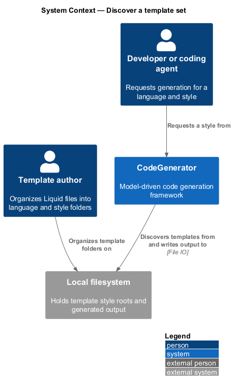
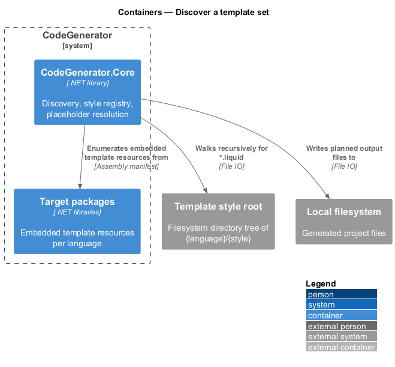
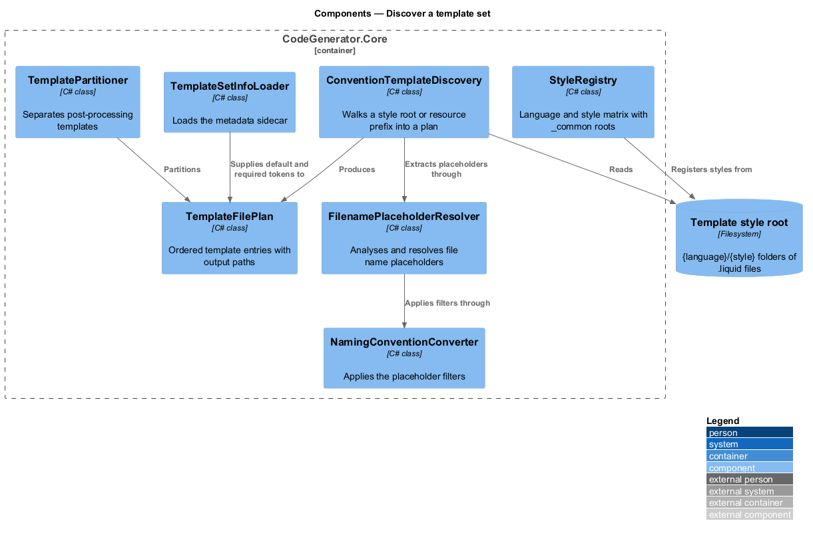
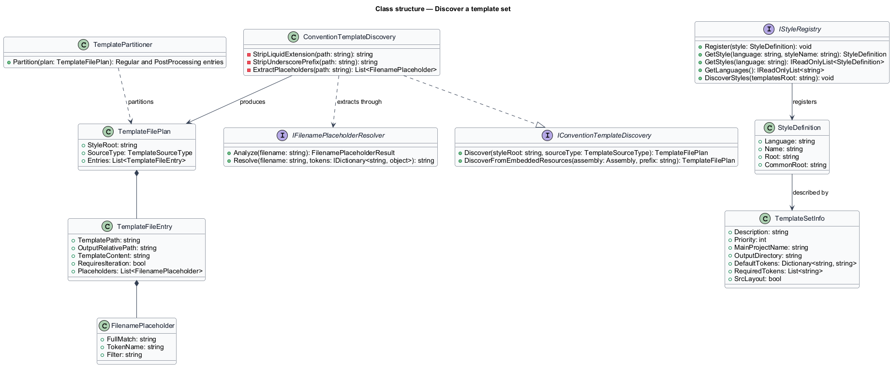
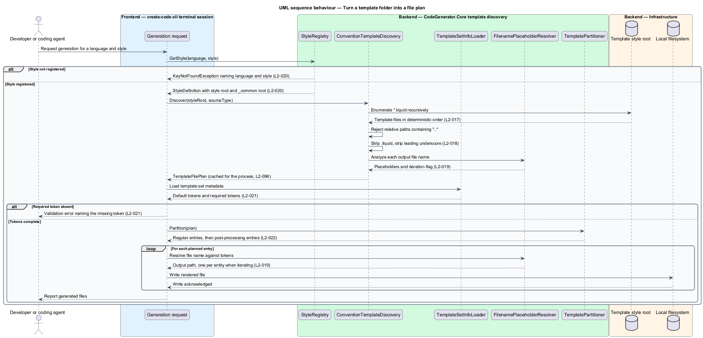

# Discover a template set

## Overview

A template set is a folder of Liquid files that together describe a whole
project. Nothing in that folder is registered, listed, or configured: the layout
of the folder *is* the configuration. This feature covers the conventions that
turn a directory tree into an executable generation plan.

**template set** — folder of `.liquid` files describing one whole project shape

**style** — named variant of a language's templates, such as
`csharp/clean-architecture`

**placeholder** — `{{Token}}` marker in a *file name*, distinct from the
placeholders inside file content

**iteration token** — placeholder that causes one output file per entity or
feature, rather than one output file in total

Four conventions do the work. A file's path under the style root becomes its
output path with `.liquid` removed. A leading underscore sorts a file early and
is stripped from the output name. Placeholders in a file name are resolved
against the token dictionary, and `{{EntityName}}` or `{{FeatureName}}` expand
the single template into one file per entity or feature. A `_common` folder
inside a language holds templates shared by every style of that language.

The result is that adding a file to a template folder adds a file to every
generated project, with no code change anywhere.

## Description

- **`IConventionTemplateDiscovery`** / **`ConventionTemplateDiscovery`** —
  discovery in `CodeGenerator.Core.Templates`. `Discover(styleRoot, sourceType)`
  walks a directory recursively for `*.liquid`;
  `DiscoverFromEmbeddedResources(assembly, prefix)` does the same over manifest
  resources. Both order entries deterministically, strip the `.liquid`
  extension, strip a leading underscore, and reject any relative path containing
  `..`.
- **`TemplateFilePlan`** / **`TemplateFileEntry`** — the discovery result. Each
  entry carries the template path, the output relative path, the template
  content, the extracted placeholders, and whether it requires iteration.
- **`IFilenamePlaceholderResolver`** / **`FilenamePlaceholderResolver`** —
  analysis and resolution of `{{Token}}` and `{{Token|filter}}` in file names.
  Supported filters are `pascal`, `camel`, `snake`, `kebab`, `pascalPlural`,
  `camelPlural`, `lower`, and `upper`. `IsIterationToken` treats `EntityName`
  and `FeatureName` as iteration tokens.
- **`IStyleRegistry`** / **`StyleRegistry`** — the language-and-style matrix.
  `DiscoverStyles(templatesRoot)` registers each `{language}/{style}` folder and
  treats `{language}/_common` as the language's shared root. `GetStyle` raises
  `KeyNotFoundException` naming both language and style when the pair is not
  registered.
- **`StyleDefinition`** / **`StyleResolver`** — the registered style and the
  service that selects one for a request.
- **`ITemplateSetInfoLoader`** / **`TemplateSetInfoLoader`** / **`TemplateSetInfo`**
  — the metadata sidecar. It declares description, priority, main project name,
  output directory, default tokens, required tokens, and whether the set uses a
  `src/` layout.
- **`TemplatePartitioner`** — splits a plan into regular entries and
  post-processing entries, so templates depending on earlier output render last.
- **`NamingFilterParser`** — parses the filter suffix of a placeholder.
- **`ConventionGenerationRequest`** / **`GeneratedFileInfo`** — the request that
  drives a plan and the record of each file it produced.

## Requirements

The feature realizes the following level-2 (L2) requirements. Each L2
requirement refines a level-1 (L1) requirement, cited by identifier. Requirement
text is stated in `shall` form; every identifier resolves to `docs/specs/L2.md`.

| L2 ID | Refines (L1) | Requirement |
|-------|--------------|-------------|
| `L2-017` | `L1-005` | Discovery shall find `*.liquid` templates recursively from a style root and from embedded resources, shall derive each output path from the template path with `.liquid` removed, and shall be deterministic. |
| `L2-018` | `L1-005` | A template file name beginning with `_` shall sort earlier during discovery and shall emit an output file name with the underscore removed. |
| `L2-019` | `L1-005` | File names shall support `{{Token}}` and `{{Token\|filter}}` placeholders, and a name containing `{{EntityName}}` or `{{FeatureName}}` shall produce one output file per entity or feature. |
| `L2-020` | `L1-005` | The style registry shall organize templates as `{language}/{style}`, shall treat `_common` as shared across a language's styles, and shall fail explicitly for an unknown language or style. |
| `L2-021` | `L1-005` | A template set shall be able to declare description, priority, main project name, output directory, default tokens, required tokens, and `src/` layout through a metadata sidecar. |
| `L2-022` | `L1-005` | The partitioner shall split a discovered plan into regular and post-processing templates so that templates depending on earlier output render last. |
| `L2-096` | `L1-024` | Discovered template plans, registered styles, and dependency manifests shall be resolved once and reused for the remainder of the process. |

## Diagrams

### System context

A template author organizes files on disk or embeds them in a package; discovery
turns that layout into the plan that produces a generated project.

### Containers

Discovery reads templates from a filesystem style root and from the embedded
resources of the target packages, producing a plan consumed by the generation
engine.

### Components

`ConventionTemplateDiscovery` builds the plan, `FilenamePlaceholderResolver`
expands names, `StyleRegistry` supplies the style roots, `TemplateSetInfoLoader`
supplies metadata, and `TemplatePartitioner` orders the result.

### Class structure

`TemplateFilePlan` aggregates `TemplateFileEntry` values, each carrying the
placeholders resolved by `FilenamePlaceholderResolver` and the metadata declared
in `TemplateSetInfo`.

### Behaviour — turn a template folder into a file plan

Discovery walks the style root under `L2-017`, applies underscore ordering under
`L2-018`, expands iteration placeholders under `L2-019`, enforces required
tokens under `L2-021`, and partitions post-processing entries under `L2-022`.

