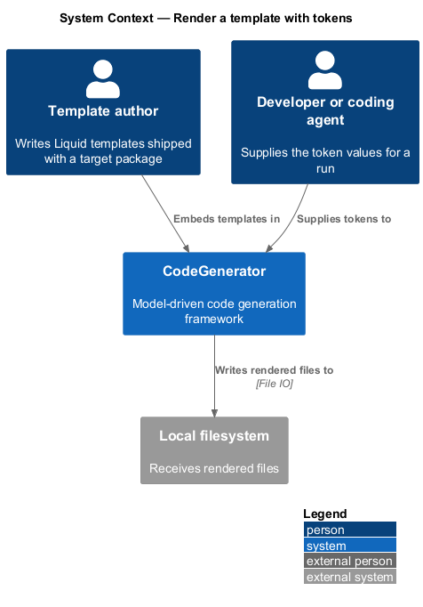
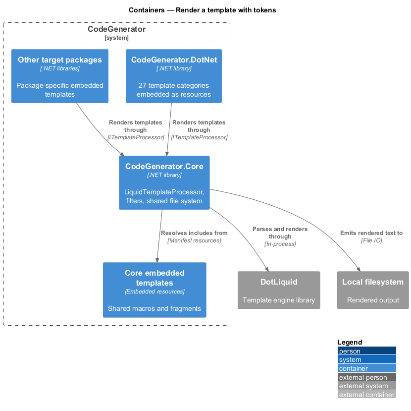
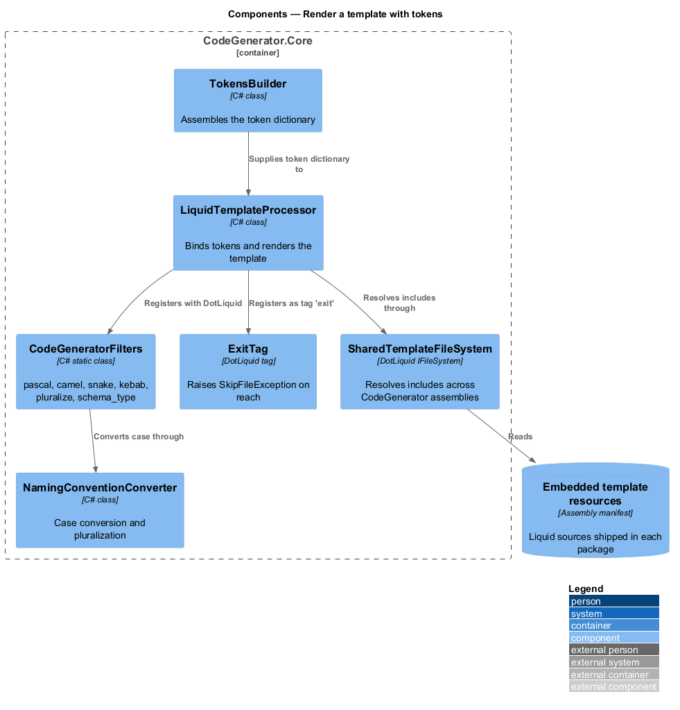
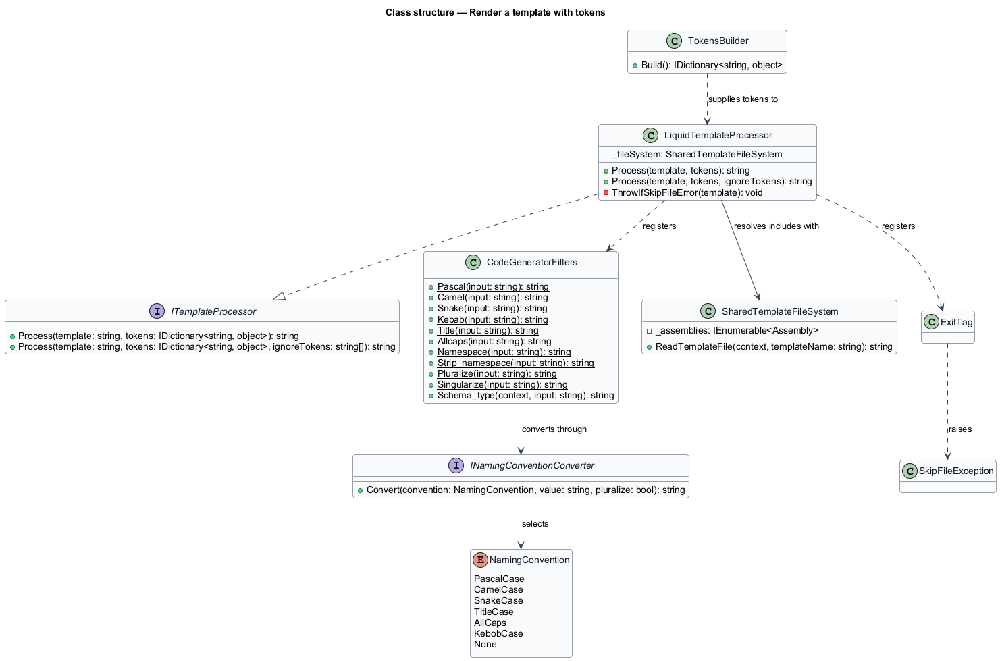
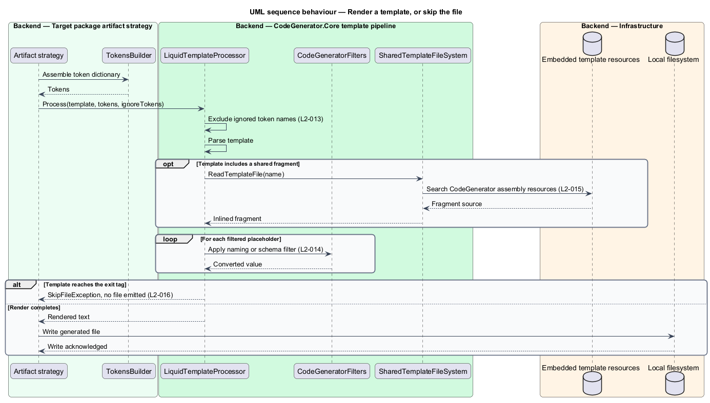

# Render a template with tokens

## Overview

Not every artifact is best described as a syntax model. Whole files with a fixed
shape and a few substituted names — project files, configuration, scripts — are
described more directly as templates. CodeGenerator renders these with DotLiquid.

**template** — text carrying `{{ placeholder }}` markers and control tags

**token** — named value bound into a template at render time

**filter** — function applied to a value inside a template, written
`{{ value | filter }}`

This feature covers the rendering step: a template and a token dictionary go in,
rendered text comes out. Three concerns make the step more than a string
substitution. Template authors need naming-convention helpers, because the same
entity name appears as `OrderLine`, `orderLine`, `order_line`, and `order-line`
within a single generated project. Templates in one package need to include
shared fragments embedded in another. And a template needs a way to decide that
it should produce no file at all.

## Description

- **`ITemplateProcessor`** — the rendering contract in
  `CodeGenerator.Abstractions`, with a `Process` overload that takes an optional
  list of token names to exclude from the render context.
- **`LiquidTemplateProcessor`** — the implementation in
  `CodeGenerator.Core.Services`. Its static constructor registers the `exit` tag
  and the filter set once per process; its instance constructor installs the
  shared template file system.
- **`CodeGeneratorFilters`** — the filter set registered with DotLiquid. It
  supplies `pascal`, `camel`, `snake`, `kebab`, `title`, `allcaps`, `namespace`,
  `strip_namespace`, `pluralize`, `singularize`, and `schema_type`. It delegates
  casing to `INamingConventionConverter` and pluralization to Humanizer.
- **`INamingConventionConverter`** / **`NamingConventionConverter`** — conversion
  between the `NamingConvention` values `PascalCase`, `CamelCase`, `SnakeCase`,
  `TitleCase`, `AllCaps`, `KebobCase`, and `None`, with optional pluralization.
- **`SharedTemplateFileSystem`** — DotLiquid `IFileSystem` implementation. It
  resolves an `include` against the embedded resources of every loaded assembly
  whose name begins with `CodeGenerator`, which is what lets a DotNet template
  include a macro shipped in Core.
- **`ExitTag`** — custom DotLiquid tag registered as `exit`. Reaching it during a
  render raises `SkipFileException`, and the calling strategy emits no file.
- **`TokensBuilder`** / **`ITokenBuilder`** — assembles the token dictionary
  passed to the processor.
- **`TypeMapper`** — maps schema types to language types for the `schema_type`
  filter.

## Requirements

The feature realizes the following level-2 (L2) requirements. Each L2
requirement refines a level-1 (L1) requirement, cited by identifier. Requirement
text is stated in `shall` form; every identifier resolves to `docs/specs/L2.md`.

| L2 ID | Refines (L1) | Requirement |
|-------|--------------|-------------|
| `L2-013` | `L1-004` | `ITemplateProcessor.Process` shall render a template against a supplied token dictionary and shall support an optional list of token names excluded from the render context. |
| `L2-014` | `L1-004` | The engine shall register the filters `pascal`, `camel`, `snake`, `kebab`, `title`, `allcaps`, `namespace`, `strip_namespace`, `pluralize`, `singularize`, and `schema_type`. |
| `L2-015` | `L1-004` | A template shall be able to include a template embedded in any loaded assembly whose name begins with `CodeGenerator`. |
| `L2-016` | `L1-004` | The engine shall register an `exit` tag, and reaching it during a render shall raise `SkipFileException` so the calling strategy emits no file. |

## Diagrams

### System context

Templates are embedded in the framework's own assemblies, so rendering reads no
external service; the rendered text reaches the local filesystem as generated
files.

### Containers

`CodeGenerator.Core` holds the processor and filters. Each target package ships
its own embedded templates and resolves shared fragments across the package set.

### Components

`LiquidTemplateProcessor` binds the token hash, renders through DotLiquid,
resolves includes through `SharedTemplateFileSystem`, and converts an `exit` tag
into `SkipFileException`.

### Class structure

`LiquidTemplateProcessor` implements `ITemplateProcessor`, uses
`SharedTemplateFileSystem` for includes, and registers `CodeGeneratorFilters`
and `ExitTag` with the DotLiquid `Template` type.

### Behaviour — render a template, or skip the file

The processor binds tokens under `L2-013`, applies filters under `L2-014`,
resolves cross-assembly includes under `L2-015`, and propagates a skip signalled
by the `exit` tag under `L2-016`.

